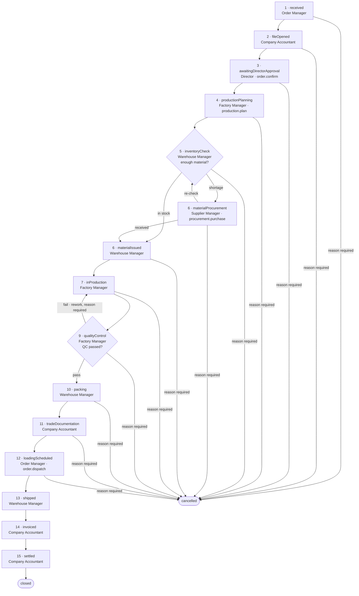

# Sales Order Workflow

Status: authoritative description of the sales-order state machine encoded in `src/domains/orders/workflow.ts`. Approval subjects come from `src/domains/approvals/contracts.ts`; role keys from `src/domains/identity/role-definitions.ts`; permissions from `src/domains/identity/permissions.ts`.

The company's confirmed process chart has fifteen steps. The state machine encodes those fifteen steps as fifteen numbered stages plus two terminal stages, `closed` and `cancelled`, which carry no step number.

## 1. The fifteen steps

Each step names the position accountable for moving the order out of the stage, the permission required to leave it, and whether a Director decision must exist first.

1. **`received` — Customer order received** (_Nhận đơn hàng từ khách hàng_). Owned by `ORDER_MANAGER`. Leaving requires `orders.updateDraft`. Goes to `fileOpened`, or to `cancelled`.
2. **`fileOpened` — Company Accountant opens the order file** (_Kế toán công ty mở hồ sơ đơn hàng_). Owned by `COMPANY_ACCOUNTANT`. The order number, customer record, proforma, payment terms, and the import/export document checklist are created here. Leaving requires `orders.submitForApproval`. Goes to `awaitingDirectorApproval`, or to `cancelled`.
3. **`awaitingDirectorApproval` — Director approves the order, price, and terms** (_Giám đốc phê duyệt đơn hàng, giá và điều khoản_). Owned by `DIRECTOR`. Leaving requires `orders.confirm` **and** an approved decision on subject `order.confirm`. Goes to `productionPlanning`, or to `cancelled`.
4. **`productionPlanning` — Factory Manager plans production** (_Quản đốc nhà máy lập kế hoạch sản xuất_). Owned by `FACTORY_MANAGER`. Leaving requires `production.createPlan` **and** an approved decision on subject `production.plan`. Goes to `inventoryCheck`, or to `cancelled`.
5. **`inventoryCheck` — Storekeeper checks inventory** (_Thủ kho kiểm tra tồn kho_). Owned by `WAREHOUSE_MANAGER`. Leaving requires `inventory.read`. This is the branch point described in step 6.
6. **The material decision.** Enough material on hand issues it to production: `inventoryCheck` → **`materialIssued` — Material issued to production** (_Xuất nguyên liệu cho sản xuất_), owned by `WAREHOUSE_MANAGER`, leaving on `inventory.issue`. Not enough material sends the order to **`materialProcurement` — Purchase material** (_Đặt mua nguyên liệu_), owned by `WAREHOUSE_MANAGER`, leaving on `procurement.receive` **and** an approved decision on subject `procurement.purchase`. Procurement returns to `inventoryCheck` for a re-check, or goes straight to `materialIssued`. Both stages carry step number 6.
7. **`inProduction` — Production, printing, moulding, and sub-workshops** (_Sản xuất, in ấn, ép khuôn và xưởng phụ_). Owned by `FACTORY_MANAGER`. Leaving requires `production.completeWork`. Goes to `qualityControl`, or to `cancelled`.
8. **Factory Accountant cost tracking.** Step 8 of the printed chart has no stage of its own. Cost capture runs alongside production rather than blocking it, so it is recorded against the order while the order sits in `inProduction`. No stage in `orderStageDefinitions` carries step number 8.
9. **`qualityControl` — Inspection and quality control** (_Kiểm tra và kiểm soát chất lượng_). Owned by `FACTORY_MANAGER`. Leaving requires `production.approveQc`. Goes to `packing` on a pass, back to `inProduction` for rework on a failure, or to `cancelled`.
10. **`packing` — Packing** (_Đóng gói_). Owned by `WAREHOUSE_MANAGER`. Leaving requires `packing.complete`. Goes to `tradeDocumentation`, or to `cancelled`.
11. **`tradeDocumentation` — Import and export documentation** (_Hồ sơ xuất nhập khẩu_). Owned by `COMPANY_ACCOUNTANT`. Leaving requires `tradeDocuments.manage`. Goes to `loadingScheduled`, or to `cancelled`.
12. **`loadingScheduled` — Loading schedule** (_Lịch đóng hàng_). Owned by `WAREHOUSE_MANAGER`. Leaving requires `shipments.dispatch` **and** an approved decision on subject `order.dispatch`. Goes to `shipped`, or to `cancelled`. This is the last stage from which an order can be cancelled.
13. **`shipped` — Delivery and shipment** (_Giao hàng và xuất lô_). Owned by `WAREHOUSE_MANAGER`. Leaving requires `documents.generate`. Goes to `invoiced` only.
14. **`invoiced` — Invoice and incoming cash** (_Hóa đơn và tiền thu về_). Owned by `COMPANY_ACCOUNTANT`. Leaving requires `payments.record`. A partially paid order stays here until the receivable clears. Goes to `settled` only.
15. **`settled` — Final cost and profit report** (_Báo cáo chi phí và lợi nhuận cuối cùng_). Owned by `DIRECTOR`, on the report the Company Accountant produces. Leaving requires `orders.close`. Goes to `closed` only.

The two terminal stages are **`closed`** (_Đã đóng hồ sơ đơn hàng_) and **`cancelled`** (_Đã hủy_). Both are owned by `DIRECTOR` and have no outgoing transitions. `terminalOrderStages` names exactly these two, and `orderProgressStages` is the stage list with both removed, for progress display.

## 2. Stage graph

`shipped`, `invoiced`, and `settled` have no cancellation edge. Once a shipment has left, the order runs to `closed`; a commercial reversal is handled by payment reversal, refund, and credit documents, not by cancelling the order record.

## 3. Stage reference

| Stage                      | Step | Owning role          | Permission to advance      | Director approval subject | Next stages                                          |
| -------------------------- | ---- | -------------------- | -------------------------- | ------------------------- | ---------------------------------------------------- |
| `received`                 | 1    | `ORDER_MANAGER`      | `orders.updateDraft`       | none                      | `fileOpened`, `cancelled`                            |
| `fileOpened`               | 2    | `COMPANY_ACCOUNTANT` | `orders.submitForApproval` | none                      | `awaitingDirectorApproval`, `cancelled`              |
| `awaitingDirectorApproval` | 3    | `DIRECTOR`           | `orders.confirm`           | `order.confirm`           | `productionPlanning`, `cancelled`                    |
| `productionPlanning`       | 4    | `FACTORY_MANAGER`    | `production.createPlan`    | `production.plan`         | `inventoryCheck`, `cancelled`                        |
| `inventoryCheck`           | 5    | `WAREHOUSE_MANAGER`  | `inventory.read`           | none                      | `materialIssued`, `materialProcurement`, `cancelled` |
| `materialProcurement`      | 6    | `WAREHOUSE_MANAGER`  | `procurement.receive`      | `procurement.purchase`    | `inventoryCheck`, `materialIssued`, `cancelled`      |
| `materialIssued`           | 6    | `WAREHOUSE_MANAGER`  | `inventory.issue`          | none                      | `inProduction`, `cancelled`                          |
| `inProduction`             | 7    | `FACTORY_MANAGER`    | `production.completeWork`  | none                      | `qualityControl`, `cancelled`                        |
| `qualityControl`           | 9    | `FACTORY_MANAGER`    | `production.approveQc`     | none                      | `packing`, `inProduction`, `cancelled`               |
| `packing`                  | 10   | `WAREHOUSE_MANAGER`  | `packing.complete`         | none                      | `tradeDocumentation`, `cancelled`                    |
| `tradeDocumentation`       | 11   | `COMPANY_ACCOUNTANT` | `tradeDocuments.manage`    | none                      | `loadingScheduled`, `cancelled`                      |
| `loadingScheduled`         | 12   | `WAREHOUSE_MANAGER`  | `shipments.dispatch`       | `order.dispatch`          | `shipped`, `cancelled`                               |
| `shipped`                  | 13   | `WAREHOUSE_MANAGER`  | `documents.generate`       | none                      | `invoiced`                                           |
| `invoiced`                 | 14   | `COMPANY_ACCOUNTANT` | `payments.record`          | none                      | `settled`                                            |
| `settled`                  | 15   | `DIRECTOR`           | `orders.close`             | none                      | `closed`                                             |
| `closed`                   | —    | `DIRECTOR`           | `orders.close`             | none                      | terminal                                             |
| `cancelled`                | —    | `DIRECTOR`           | `orders.cancel`            | none                      | terminal                                             |

There is no stage with step number 8; see step 8 in section 1. Step 6 is carried by two stages, `materialProcurement` and `materialIssued`, because the printed chart's step 6 is a decision with two outcomes.

Four stages carry a Director approval subject: `order.confirm`, `production.plan`, `procurement.purchase`, and `order.dispatch`. These are the gates the state machine itself enforces. They are a subset of the seventeen approval subjects in `approvalSubjects`; the remaining subjects — including `order.sellingPrice`, `order.priceAdjustment`, `order.cancel`, `expense.incurred`, and `inventory.adjustment` — gate actions that are not stage transitions and are enforced by their own services.

## 4. Guard rules

`assertTransition({ from, to, hasApproval, qcPassed, reason })` is the single place a stage change is judged. It throws `OrderTransitionError` with one of five codes, checked in this order:

| Code                 | Condition                                                                                                            | Message                                                                  |
| -------------------- | -------------------------------------------------------------------------------------------------------------------- | ------------------------------------------------------------------------ |
| `TERMINAL_STAGE`     | `from` is `closed` or `cancelled`                                                                                    | A closed or cancelled order cannot move to another stage.                |
| `INVALID_TRANSITION` | `to` is not listed in the `next` array of the `from` stage                                                           | An order cannot move from _from_ to _to_.                                |
| `APPROVAL_REQUIRED`  | the `from` stage declares an `approvalSubject` and `hasApproval` is false                                            | This stage requires an approved Director decision before it can advance. |
| `QC_NOT_PASSED`      | `from` is `qualityControl`, `to` is `packing`, and `qcPassed` is false                                               | Packing is blocked until the required quality check passes.              |
| `REASON_REQUIRED`    | `to` is `cancelled`, or `from` is `qualityControl` and `to` is `inProduction`, and `reason` is null, empty, or blank | Cancelling an order or returning it for rework must record a reason.     |

Notes on each:

- **Terminal first.** The terminal check runs before the transition check, so an attempt to move a closed order reports that the order is closed rather than that the transition is unknown.
- **Invalid transition.** The graph is closed: only the edges in section 2 exist. Skipping a stage — `fileOpened` straight to `packing`, for example — is rejected regardless of the actor's permissions.
- **Approval required.** `hasApproval` must be true for the four gated stages. It is set from an approval request whose status is `approved` and whose `expectedRevision` still matches the order (see `assertApproved` in `src/domains/approvals/policy.ts`). An approval raised against an older revision fails with `REVISION_CONFLICT` from the approvals layer before the transition is even attempted.
- **QC before packing.** Quality control is mandatory. `qualityControl` → `packing` is refused while `qcPassed` is false, which blocks packing and everything downstream of it. There is no path into `packing` that bypasses `qualityControl`.
- **Reason required.** Two moves are destructive or costly enough that the process refuses to record them silently: cancelling from any stage, and returning the order from `qualityControl` to `inProduction` for rework. A whitespace-only reason is treated as absent.

## 5. Permission is not authorisation

`assertTransition` deliberately does not check permissions. It answers one question — does the process permit this move — and the caller's policy layer answers the other. Both must pass.

A stage change is therefore authorised only when all of the following hold:

1. The actor holds the stage's `advancePermission` from an active, unexpired `AccessGrant`.
2. The grant's scope covers the order and every affected business unit (`docs/RBAC.md` section 4).
3. `assertTransition` permits the move: not terminal, edge exists, approval present where required, QC passed where required, reason present where required.
4. Separation of duties holds — in particular, the person who raised an approval request can never be the person who decides it (`assertDecidable` throws `SELF_APPROVAL`).

Holding `orders.confirm` does not confirm an order. Holding `packing.complete` does not move a failed inspection into packing. Holding every permission in the catalog does not move a cancelled order. The Director, who holds all but three permissions, is still bound by the graph, by the reason requirement, and by the self-approval rule.

## 6. Implementation status

The workflow is live (2026-08-27). `src/domains/orders/workflow.ts` remains the pure definition and guard module, covered by `tests/unit/order-workflow.test.ts`; around it now sit:

- `src/domains/orders/persistence/` — the `SalesOrder` model (optimistic-concurrency `revision`, redactable `sellingPrice`, stage history) and a Mongo store whose transition, QC, and price writes are conditional on the revision the actor judged.
- `src/domains/orders/service.ts` — `OrderCommandService`, the single caller of `assertTransition`: it re-asserts the current stage's advance permission against the access context, demands an `assertApproved` Director decision for the four gated stages, resets the QC flag on entering production or quality control, redacts the selling price for readers without `orders.readSellingPrice`, and audits every mutation. Unit-tested with fake stores in `tests/unit/order-command-service.test.ts`.
- `src/domains/approvals/model.ts`, `mongo-repository.ts`, `service.ts` — the approval gate's persistence and orchestration. A partial unique index enforces the single-pending rule at the database, and `decide` is a conditional update so concurrent deciders cannot both win.
- `/admin/orders`, `/admin/orders/new`, `/admin/orders/[orderId]` — the order board, intake form, and detail screen (stage rail, transition forms with mandatory reason fields, QC card, price card, approval gate). `/admin/approvals` now renders the live pending queue with approve/reject above the reference table.

Verified end-to-end on 2026-08-27: a 34-step Playwright walk against live MongoDB created an order and drove it `received` → `closed` through all three Director gates on this path, confirming `APPROVAL_MISSING`, `SELF_APPROVAL`, and `QC_NOT_PASSED` block as specified and that the Order Manager sees no selling price.

Not yet built: the five order-file documents of the printed chart (detailed production plan, cost report, delivery file, profit report), cancellation/rework UI polish beyond the reason-gated forms, approval withdrawal, and any grant-administration screen. `docs/IMPLEMENTATION_STATUS.md` records the exact state.

### Resolved: every stage owner holds its advance permission

`ownerRole` and `advancePermission` are independent fields, so nothing in the
type system forces them to agree. Four stages originally named an owner that the
seeds in `src/domains/identity/role-definitions.ts` did not grant the advance
permission to, which would have left those orders advanceable only by
`SUPER_ADMIN` or `DIRECTOR`. Each was resolved deliberately rather than by
widening a role until the check passed:

| Stage                 | Was                                        | Now                                    | Why                                                                                                                   |
| --------------------- | ------------------------------------------ | -------------------------------------- | --------------------------------------------------------------------------------------------------------------------- |
| `fileOpened`          | `COMPANY_ACCOUNTANT` lacked the permission | seed grants `orders.submitForApproval` | Step 2 is the accountant opening the file and submitting it for the Director's decision.                              |
| `materialProcurement` | owned by `SUPPLIER_MANAGER`                | owned by `WAREHOUSE_MANAGER`           | The purchase is raised by procurement, but goods receipt releases the order, and the buyer must not confirm delivery. |
| `loadingScheduled`    | owned by `ORDER_MANAGER`                   | owned by `WAREHOUSE_MANAGER`           | Order management agrees the schedule; the warehouse confirms the vehicle and releases the shipment.                   |
| `settled`             | owned by `COMPANY_ACCOUNTANT`              | owned by `DIRECTOR`                    | The accountant produces the final cost and profit report; closing the file against it is the Director's decision.     |

`tests/unit/order-workflow.test.ts` now asserts the invariant for every stage, so
a future stage or seed change that breaks it fails the suite rather than
surfacing as a stalled order.
