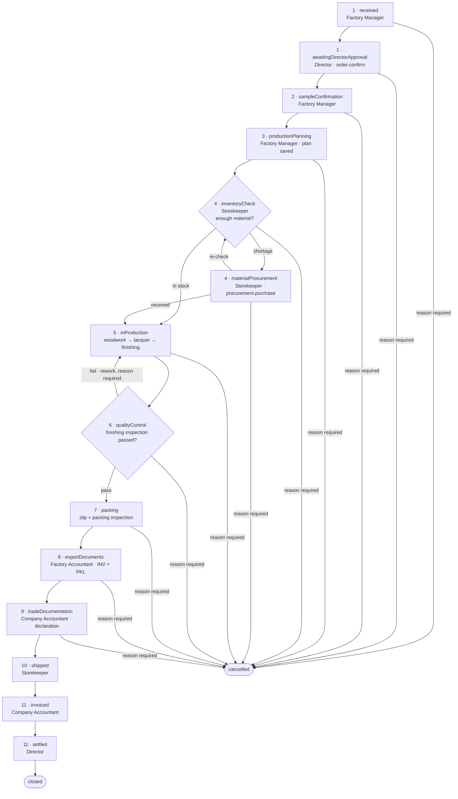

# Sales Order Workflow

Status: authoritative description of the sales-order state machine encoded in `src/domains/orders/workflow.ts`. Approval subjects come from `src/domains/approvals/contracts.ts`; role keys from `src/domains/identity/role-definitions.ts`; permissions from `src/domains/identity/permissions.ts`.

The state machine encodes the company's production procedure **SOP-SX-001 Rev.1 (09/2026)** — eleven steps from the customer's order to receivables — as the Director answered it on 2026-09-14. Three of the eleven steps hold two states each, so the machine has fourteen working stages plus two terminal stages, `closed` and `cancelled`, which carry no step number.

Until 2026-09-14 the machine encoded an earlier fifteen-step chart. Three of its keys were retired (`fileOpened`, `materialIssued`, `loadingScheduled`); `normalizeOrderStage` reads records written under them forward to `received`, `inventoryCheck` and `shipped`, and nothing in the database is rewritten.

## 1. The eleven steps

Each step names the position accountable for moving the order out of the stage, the permission required to leave it, whether a Director decision must exist first, and the **output** the SOP expects — which the guard demands before the stage may be left.

1. **Customer order.** `received` (_Khách hàng đặt hàng_) — the Factory Manager records the order (item lines, production site per line, shipping mark, promised delivery date, order targets); the Company Accountant may record one too and enters the selling price. Leaving requires `orders.submitForApproval` → `awaitingDirectorApproval` (_Giám đốc xác nhận đơn hàng_), owned by `DIRECTOR`, leaving on `orders.confirm` **and** an approved `order.confirm` decision.
2. **Sample and technical confirmation.** `sampleConfirmation` — Design develops the sample in the weekly sample report; the Factory Manager confirms it and leaves on `samples.recordInternalReview`. Output: the technical file (document kind `technical`).
3. **Production plan.** `productionPlanning` — the Factory Manager saves the plan (due dates per workshop stage, assignment) and leaves on `production.createPlan`. **Guard: `PLAN_MISSING`** until `productionPlan` is saved. No Director gate (the Director approves sales and spending, not the plan).
4. **Material supply.** `inventoryCheck` (_Kho cấp vật tư_) — the Storekeeper issues material and leaves on `inventory.issue`; a shortage branches to `materialProcurement` (_Đặt mua vật tư_), owned by the Storekeeper, leaving on `procurement.receive` **and** an approved `procurement.purchase` decision (buying is spending).
5. **Production.** `inProduction` — three workshop stages tracked on the order: `woodwork → lacquer → finishing`. Entering production for the first time sets `productionStage = woodwork`. Moving past woodwork requires the latest **woodwork inspection** to pass (`WOODWORK_NOT_PASSED` otherwise). Leaving on `production.completeWork` **requires `productionStage = finishing`** (`PRODUCTION_INCOMPLETE`).
6. **Quality control.** `qualityControl` — the **finishing inspection**; a pass sets `qcPassed`, which unlocks `packing` (`QC_NOT_PASSED`). A failure returns the order to `inProduction` with a mandatory reason; the workshop stage is kept so the Factory Manager chooses where to resume.
7. **Packing.** `packing` — the Storekeeper records the packing slip (cartons, pallets, container, photos) and the Factory Manager records the **packing inspection**. Leaving on `packing.complete` **requires both** (`PACKING_NOT_READY`). The goods go straight onto pallets or into the container; there is no finished-goods warehouse. Leaving also **requires the labels to be settled** (`LABELS_NOT_APPROVED`): a `customerLabelSpec` document on file, or a `labelProof` document the Director approved (see §6). Director's answer of 2026-09-14: labels and shipping marks print as the customer requires; without a customer template the company's own template is used and the Director approves it before it is printed.
8. **Export documents.** `exportDocuments` — the Factory Accountant (or the Company Accountant) files the INV and PKL (and labels). Leaving on `tradeDocuments.manage` **requires documents of kind `invoice` and `packingList`** (`EXPORT_DOCUMENTS_MISSING`). Deadline: the Director asked for INV and PKL 2–3 weeks before shipping; the checklist uses **21 days** before the booking date.
9. **Customs.** `tradeDocumentation` — the Company Accountant files the customs declaration. Leaving on `tradeDocuments.manage` **requires a `customsDeclaration` document** (`CUSTOMS_DECLARATION_MISSING`).
10. **Dispatch.** `shipped` (_Xuất hàng – Giao khách_) — the Storekeeper records the goods leaving, on `shipments.dispatch`. No Director gate. B/L, fumigation, phyto and C/O follow within seven days of dispatch and are tracked on the document checklist (`tradeDocumentStatuses`), never as a stage guard.
11. **Receivables and report.** `invoiced` (_Theo dõi công nợ & báo cáo_) — the Company Accountant collects on `payments.record` → `settled` (_Đã thu đủ – Giám đốc đóng hồ sơ_), owned by `DIRECTOR`, leaving on `orders.close` → `closed`. The profit line (invoices minus expense entries, VND via the stored rate snapshots; `src/domains/finance/profit.ts`) is rendered only for `finance.readProfit`, which the Director alone holds.

Cancellation is possible from every stage up to and including `tradeDocumentation`, always with a reason, and never blocked on a missing output.

## 2. Stage graph

```mermaid
flowchart TD
  received["1 · received<br/>Factory Manager"]
  awaitingDirectorApproval["1 · awaitingDirectorApproval<br/>Director · order.confirm"]
  sampleConfirmation["2 · sampleConfirmation<br/>Factory Manager"]
  productionPlanning["3 · productionPlanning<br/>Factory Manager · plan saved"]
  inventoryCheck{"4 · inventoryCheck<br/>Storekeeper<br/>enough material?"}
  materialProcurement["4 · materialProcurement<br/>Storekeeper · procurement.purchase"]
  inProduction["5 · inProduction<br/>woodwork → lacquer → finishing"]
  qualityControl{"6 · qualityControl<br/>finishing inspection passed?"}
  packing["7 · packing<br/>slip + packing inspection"]
  exportDocuments["8 · exportDocuments<br/>Factory Accountant · INV + PKL"]
  tradeDocumentation["9 · tradeDocumentation<br/>Company Accountant · declaration"]
  shipped["10 · shipped<br/>Storekeeper"]
  invoiced["11 · invoiced<br/>Company Accountant"]
  settled["11 · settled<br/>Director"]
  closed(["closed"])
  cancelled(["cancelled"])

  received --> awaitingDirectorApproval
  awaitingDirectorApproval --> sampleConfirmation
  sampleConfirmation --> productionPlanning
  productionPlanning --> inventoryCheck
  inventoryCheck -- "shortage" --> materialProcurement
  inventoryCheck -- "in stock" --> inProduction
  materialProcurement -- "re-check" --> inventoryCheck
  materialProcurement -- "received" --> inProduction
  inProduction --> qualityControl
  qualityControl -- "pass" --> packing
  qualityControl -- "fail · rework, reason required" --> inProduction
  packing --> exportDocuments
  exportDocuments --> tradeDocumentation
  tradeDocumentation --> shipped
  shipped --> invoiced
  invoiced --> settled
  settled --> closed

  received -- "reason required" --> cancelled
  awaitingDirectorApproval -- "reason required" --> cancelled
  sampleConfirmation -- "reason required" --> cancelled
  productionPlanning -- "reason required" --> cancelled
  inventoryCheck -- "reason required" --> cancelled
  materialProcurement -- "reason required" --> cancelled
  inProduction -- "reason required" --> cancelled
  qualityControl -- "reason required" --> cancelled
  packing -- "reason required" --> cancelled
  exportDocuments -- "reason required" --> cancelled
  tradeDocumentation -- "reason required" --> cancelled
```

`shipped`, `invoiced`, and `settled` have no cancellation edge. Once a shipment has left, the order runs to `closed`; a commercial reversal is handled by payment reversal, refund, and credit documents, not by cancelling the order record.

## 3. Stage reference

| Stage                      | Step | Owning role          | Permission to advance          | Director approval subject | Output guard                               | Next stages                                        |
| -------------------------- | ---- | -------------------- | ------------------------------ | ------------------------- | ------------------------------------------ | -------------------------------------------------- |
| `received`                 | 1    | `FACTORY_MANAGER`    | `orders.submitForApproval`     | none                      | —                                          | `awaitingDirectorApproval`, `cancelled`            |
| `awaitingDirectorApproval` | 1    | `DIRECTOR`           | `orders.confirm`               | `order.confirm`           | —                                          | `sampleConfirmation`, `cancelled`                  |
| `sampleConfirmation`       | 2    | `FACTORY_MANAGER`    | `samples.recordInternalReview` | none                      | —                                          | `productionPlanning`, `cancelled`                  |
| `productionPlanning`       | 3    | `FACTORY_MANAGER`    | `production.createPlan`        | none                      | `PLAN_MISSING`                             | `inventoryCheck`, `cancelled`                      |
| `inventoryCheck`           | 4    | `WAREHOUSE_MANAGER`  | `inventory.issue`              | none                      | —                                          | `inProduction`, `materialProcurement`, `cancelled` |
| `materialProcurement`      | 4    | `WAREHOUSE_MANAGER`  | `procurement.receive`          | `procurement.purchase`    | —                                          | `inventoryCheck`, `inProduction`, `cancelled`      |
| `inProduction`             | 5    | `FACTORY_MANAGER`    | `production.completeWork`      | none                      | `PRODUCTION_INCOMPLETE`                    | `qualityControl`, `cancelled`                      |
| `qualityControl`           | 6    | `FACTORY_MANAGER`    | `production.approveQc`         | none                      | `QC_NOT_PASSED`                            | `packing`, `inProduction`, `cancelled`             |
| `packing`                  | 7    | `WAREHOUSE_MANAGER`  | `packing.complete`             | none                      | `PACKING_NOT_READY`, `LABELS_NOT_APPROVED` | `exportDocuments`, `cancelled`                     |
| `exportDocuments`          | 8    | `FACTORY_ACCOUNTANT` | `tradeDocuments.manage`        | none                      | `EXPORT_DOCUMENTS_MISSING`                 | `tradeDocumentation`, `cancelled`                  |
| `tradeDocumentation`       | 9    | `COMPANY_ACCOUNTANT` | `tradeDocuments.manage`        | none                      | `CUSTOMS_DECLARATION_MISSING`              | `shipped`, `cancelled`                             |
| `shipped`                  | 10   | `WAREHOUSE_MANAGER`  | `shipments.dispatch`           | none                      | —                                          | `invoiced`                                         |
| `invoiced`                 | 11   | `COMPANY_ACCOUNTANT` | `payments.record`              | none                      | —                                          | `settled`                                          |
| `settled`                  | 11   | `DIRECTOR`           | `orders.close`                 | none                      | —                                          | `closed`                                           |
| `closed`                   | —    | `DIRECTOR`           | `orders.close`                 | none                      | —                                          | terminal                                           |
| `cancelled`                | —    | `DIRECTOR`           | `orders.cancel`                | none                      | —                                          | terminal                                           |

Two stages carry a Director approval subject: `order.confirm` and `procurement.purchase`. The Director's rule of 2026-09-14 — everything to do with selling and paying — also names payments to production sites, counter sales and material sales; those gates live in their own modules and are not stage transitions.

## 4. Guard rules

`assertTransition({ from, to, hasApproval, qcPassed, reason, readiness })` is the single place a stage change is judged. `readiness` is computed once per record by `orderReadiness` (`src/domains/orders/contracts.ts`) from the plan, workshop stage, inspections, packing slip and documents on file. Codes, checked in this order:

| Code                          | Condition                                                                                   |
| ----------------------------- | ------------------------------------------------------------------------------------------- |
| `TERMINAL_STAGE`              | `from` is `closed` or `cancelled`                                                           |
| `INVALID_TRANSITION`          | `to` is not listed in the `next` array of the `from` stage                                  |
| `APPROVAL_REQUIRED`           | the `from` stage declares an `approvalSubject` and `hasApproval` is false                   |
| `REASON_REQUIRED`             | `to` is `cancelled`, or `qualityControl → inProduction`, and `reason` is blank              |
| `PLAN_MISSING`                | leaving `productionPlanning` forward without a saved plan                                   |
| `PRODUCTION_INCOMPLETE`       | leaving `inProduction` forward while `productionStage ≠ finishing`                          |
| `QC_NOT_PASSED`               | `qualityControl → packing` while `qcPassed` is false                                        |
| `PACKING_NOT_READY`           | leaving `packing` forward without a packing slip or a passed packing inspection             |
| `LABELS_NOT_APPROVED`         | leaving `packing` forward without a `customerLabelSpec` or a Director-approved `labelProof` |
| `EXPORT_DOCUMENTS_MISSING`    | leaving `exportDocuments` forward without `invoice` and `packingList` documents             |
| `CUSTOMS_DECLARATION_MISSING` | leaving `tradeDocumentation` forward without a `customsDeclaration` document                |

A cancellation is judged only by the first four rows: a missing output never blocks stopping an order.

## 5. Permission is not authorisation

`assertTransition` deliberately does not check permissions. It answers one question — does the process permit this move — and the caller's policy layer answers the other. Both must pass.

A stage change is therefore authorised only when all of the following hold:

1. The actor holds the stage's `advancePermission` from an active, unexpired `AccessGrant`.
2. The grant's scope covers the order and every affected business unit (`docs/RBAC.md` section 4).
3. `assertTransition` permits the move.
4. Separation of duties holds — the person who raised an approval request can never be the person who decides it (`assertDecidable` throws `SELF_APPROVAL`).

## 6. What the record holds

Beyond the stage, `OrderRecordDto` carries the SOP outputs: `lineItems` (code, quantity, unit, production site), `shippingMark`, `deliveryDueAt`, `targets`, `productionPlan`, `productionStage`, `qcChecks` (checkpoint × pass/fail × defect count), `packingRecord`, and `documents` typed by `OrderDocumentKind`. Each document kind maps to the permission of the position that produces it (`orderDocumentPermissions`), which the upload signature, the attach action and the remove action all share. Payment evidence stays in its own `paymentDocuments` list under `payments.record`.

Labels and shipping marks: two document kinds, both filed under `orders.updateDraft` (Factory Manager, Company Accountant) on the order page's "Mẫu tem & shipping mark" card — `customerLabelSpec` (the customer's template; nothing to approve) and `labelProof` (the company's own proof). `labelApproval: { documentId, approvedBy, approvedAt } | null` records the Director's approval of one exact proof: `OrderCommandService.approveLabelProof` requires `approvals.decide` held at scope `all`, an open order, the newest document of kind `labelProof`, and an approver who is not the uploader (`SELF_APPROVAL`); it is audited as `order.labelApproved`. Removing the approved file clears `labelApproval` in the same write; a newer proof is not covered by an approval of an older one, even while the older file stays on file. `labelStatus` derives `customerSpec` / `proofApproved` / `proofPending` / `missing` from the newest `labelProof`; `labelsReady` is `customerSpec` or `proofApproved`. The approvals page lists open orders whose latest proof awaits approval ("Mẫu tem chờ duyệt") for a global `approvals.decide` reader. This is not an approval-queue subject: there is no rejection, the Director asks for a new proof instead.

Derived, never stored: time in the current stage (`stageEnteredAt`), on-time delivery (`deliveryLateness`, dispatch vs. `deliveryDueAt`), the per-order defect rate (`defectRate`), and the export-document deadlines (`tradeDocumentStatuses`: INV/PKL/labels 21 days before booking, declaration before booking, B/L/fumigation/phyto/C/O 7 days after dispatch).

## 7. Positions (2026-09-14)

- **Factory Manager** — receives the order, confirms the sample, plans, runs the three workshop stages, records the three inspections. Never reads the selling price.
- **Storekeeper** — issues material, raises purchases, packs (slip + photos), dispatches.
- **Factory Accountant** — INV, PKL, labels; reads the selling price and manages invoices; never reads what the customer paid.
- **Company Accountant** — customs declaration and the post-shipment set, customer money and receivables; no longer reads profit.
- **Director** — confirms orders, approves purchases, closes the file, reads profit.
