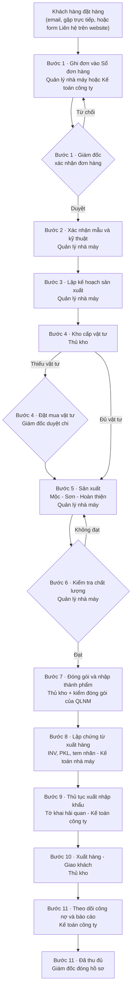

# RED DOOR LACQUERWARES

## Hướng dẫn hệ thống theo từng bộ phận

> Nếu bạn là nhân viên Red Door, hãy tìm đúng vai trò của mình bên dưới để biết chính xác những chức năng bạn được sử dụng.

Tài liệu này **không phải tài liệu kỹ thuật**. Đây là sổ tay sử dụng website nội bộ của Red Door, viết cho người không biết công nghệ. Bạn không cần đọc từ đầu đến cuối: tìm phần của vai trò mình, đọc khoảng 10 phút là đủ để bắt đầu làm việc.

Mọi điều viết ở đây được lấy từ chính mã nguồn của website (danh sách vai trò, danh sách quyền, menu, quy trình đơn hàng, từng nút bấm trên màn hình). Chỗ nào mã nguồn chưa đủ căn cứ, tài liệu ghi rõ **“Chưa xác định được từ source code hiện tại.”**

---

## Bạn là ai? — Bảng tra nhanh

| Bạn là ai?                 | Role trong hệ thống  | Công việc chính trên website                                                                                    | Xem phần                                                                |
| -------------------------- | -------------------- | --------------------------------------------------------------------------------------------------------------- | ----------------------------------------------------------------------- |
| Giám đốc                   | `DIRECTOR`           | Duyệt nhân sự, duyệt đơn hàng và chi tiền, giao việc, xem mọi số liệu kể cả lợi nhuận                           | [→ Giám đốc](#role-giám-đốc-director)                                   |
| Thủ kho / Quản lý kho      | `WAREHOUSE_MANAGER`  | Kho sơn, kho nguyên vật liệu, bán sơn tại quầy, công nợ quầy, cấp vật tư – đóng gói – xuất hàng theo đơn        | [→ Thủ kho](#role-thủ-kho--quản-lý-kho-warehouse_manager)               |
| Quản lý nhà máy            | `FACTORY_MANAGER`    | Nhận đơn, xác nhận mẫu, lập kế hoạch sản xuất, điều phối cơ sở, ghi 3 lần kiểm chất lượng, hợp đồng cơ sở       | [→ Quản lý nhà máy](#role-quản-lý-nhà-máy-factory_manager)              |
| Kế toán nhà máy & mua hàng | `FACTORY_ACCOUNTANT` | Nhà cung cấp, ghi chi phí theo đơn, lập INV/PKL/tem nhãn, kiểm và ghi chi thanh toán cơ sở                      | [→ Kế toán nhà máy](#role-kế-toán-nhà-máy--mua-hàng-factory_accountant) |
| Kế toán công ty            | `COMPANY_ACCOUNTANT` | Khách hàng, hóa đơn, tiền khách trả, công nợ, thu – chi, tỷ giá, tờ khai hải quan, hàng nhập khẩu, đơn cửa hàng | [→ Kế toán công ty](#role-kế-toán-công-ty-company_accountant)           |
| Biên tập nội dung          | `CONTENT_CREATOR`    | Tin tức, sản phẩm, bộ sưu tập, cửa hàng online, nội dung trang, báo cáo tiến độ mẫu hằng tuần                   | [→ Biên tập nội dung](#role-biên-tập-nội-dung-content_creator)          |

**Hệ thống chỉ có đúng 6 vai trò trên.** Mỗi người giữ **một** vai trò, do Giám đốc chọn.

### Những vai trò KHÔNG tồn tại (hay bị hỏi nhầm)

Trước đây hệ thống từng có thêm 7 vai trò. Tất cả đã bị gỡ và gộp vào 6 vai trò hiện tại:

| Vai trò cũ đã bỏ   | Nay do ai làm       | Nghĩa là                                                                                     |
| ------------------ | ------------------- | -------------------------------------------------------------------------------------------- |
| `SUPER_ADMIN`      | Giám đốc            | Không có “quản trị viên kỹ thuật” riêng trong hệ thống.                                      |
| `REPORT_VIEWER`    | Giám đốc            | Không có tài khoản “chỉ xem báo cáo”.                                                        |
| `CONTENT_EDITOR`   | Giám đốc            | Đã nghỉ hẳn; vai trò biên tập hiện nay là `CONTENT_CREATOR` (mới, không phải bản hồi sinh).  |
| `PRODUCT_DESIGNER` | **Quản lý nhà máy** | **Không có role “Designer / Thiết kế” riêng.** Xem [phần Designer](#designer--thiết-kế-mẫu). |
| `PRODUCTION_UNIT`  | **Quản lý nhà máy** | Các cơ sở sản xuất **không đăng nhập hệ thống**; Quản lý nhà máy ghi thay họ.                |
| `SUPPLIER_MANAGER` | **Kế toán nhà máy** | Không có role “mua hàng” riêng.                                                              |
| `ORDER_MANAGER`    | **Kế toán công ty** | Không có role “quản lý đơn hàng” riêng.                                                      |

Và cũng **không có role “Xuất nhập khẩu”** riêng: công việc XNK được chia cho Kế toán nhà máy (bước 8) và Kế toán công ty (bước 9, 11). Xem [phần Xuất nhập khẩu](#xuất-nhập-khẩu-không-có-role-riêng).

---

# Hệ thống Red Door hoạt động như thế nào?

Website Red Door có **hai phần tách biệt**:

1. **Website cho khách** (`/vi`, `/en`, `/fr`, `/de`, `/ja`, `/zh-CN`) — ai cũng xem được: giới thiệu, sản phẩm, bộ sưu tập, kỹ thuật sơn mài, tin tức, cửa hàng bán lẻ, liên hệ.
2. **Cổng quản trị** (`/vi/admin`) — chỉ nhân viên đăng nhập bằng Gmail công việc và được Giám đốc duyệt mới vào được. Toàn bộ tài liệu này chủ yếu nói về phần 2.

## Luồng một đơn hàng đi qua công ty



### Giải thích lại bằng chữ

1. **Khách đặt hàng.** Khách gửi yêu cầu qua email, gặp trực tiếp, hoặc điền form **Liên hệ** trên website. Yêu cầu từ website rơi vào mục **Yêu cầu báo giá** — chỉ Giám đốc đọc được.
2. **Ghi đơn.** Quản lý nhà máy (hoặc Kế toán công ty) mở **Sổ đơn hàng**, bấm **Tạo đơn hàng**, nhập khách, hàng đặt, shipping mark, ngày giao cam kết. Kế toán công ty là người nhập **giá bán**.
3. **Giám đốc xác nhận.** Người ghi đơn bấm **Trình Giám đốc phê duyệt**. Giám đốc quyết định ở mục **Phê duyệt**. Không có phê duyệt thì đơn đứng yên.
4. **Chốt mẫu.** Quản lý nhà máy chốt mẫu với bộ phận mẫu, tải **Hồ sơ kỹ thuật mẫu** lên đơn, rồi chuyển sang lập kế hoạch.
5. **Lập kế hoạch sản xuất.** Quản lý nhà máy điền ngày xong từng công đoạn và phân công cơ sở, bấm **Lưu kế hoạch**. Chưa lưu kế hoạch thì không rời bước được.
6. **Kho cấp vật tư.** Thủ kho đối chiếu tồn ở **Nguyên vật liệu**, xuất kho, tải **Phiếu xuất kho**. Thiếu vật tư thì bấm **Đặt mua vật tư** và trình Giám đốc duyệt (vì mua là chi tiền).
7. **Sản xuất.** Hàng đi qua **Mộc → Sơn → Hoàn thiện**. Quản lý nhà máy ghi **Kiểm mộc** trước khi sang Sơn.
8. **Kiểm tra chất lượng.** Quản lý nhà máy ghi **Kiểm hoàn thiện**. Không đạt thì trả đơn về sản xuất kèm lý do.
9. **Đóng gói.** Thủ kho lưu **phiếu đóng gói** (số thùng, pallet, container), tải **ảnh đóng gói**; Quản lý nhà máy ghi **Kiểm đóng gói**. Ngoài ra đơn phải có **mẫu tem / shipping mark** của khách, hoặc mẫu công ty đã được Giám đốc duyệt.
10. **Chứng từ xuất hàng.** Kế toán nhà máy lập **INV** và **PKL** (hạn: 3 tuần trước ngày đóng hàng) và tem nhãn.
11. **Thủ tục hải quan.** Kế toán công ty tải **Tờ khai hải quan**, rồi chuyển đơn sang xuất hàng.
12. **Xuất hàng.** Thủ kho bàn giao hàng cho vận chuyển và chuyển đơn sang bước theo dõi công nợ.
13. **Theo dõi tiền.** Kế toán công ty lập hóa đơn, ghi tiền khách trả, theo dõi còn thiếu; trong 7 ngày sau khi hàng đi thì tải **B/L, hun trùng, Phyto, C/O**.
14. **Đóng hồ sơ.** Khi khách trả đủ, Kế toán công ty bấm **Đã thu đủ – Giám đốc đóng hồ sơ**. Giám đốc đọc **lợi nhuận** của đơn (chỉ Giám đốc thấy) rồi đóng hồ sơ.

### Ba luồng chạy song song, không nằm trong 11 bước

- **Kho sơn & bán sơn tại quầy** — Thủ kho: **Bảng xuất kho sơn**, **Hóa đơn bán hàng**, **Công nợ bán sơn**. Đây là mảng bán lẻ sơn cho cơ sở, thợ; không liên quan đơn xuất khẩu.
- **Nội dung website** — Biên tập nội dung: **Tin tức**, **Sản phẩm**, **Bộ sưu tập**, **Cửa hàng**, **Nội dung**, **Theo dõi tiến độ mẫu**.
- **Hợp đồng cơ sở & thanh toán cơ sở** — Quản lý nhà máy ký hợp đồng và đề nghị thanh toán → Kế toán nhà máy kiểm tra → Kế toán công ty duyệt → Giám đốc duyệt → Kế toán nhà máy ghi đã chi.

---

# Những điều chung cho mọi vai trò

## Đăng nhập

- Hệ thống **chỉ đăng nhập bằng Gmail** (nút **Tiếp tục với Google**). Không có mật khẩu riêng, không có OTP, không đăng nhập bằng số điện thoại.
- Lần đầu đăng nhập, bạn thấy màn hình **“Tài khoản đang chờ Giám đốc duyệt”**. Báo Giám đốc; khi được duyệt thì **tải lại trang**.
- Màn hình **“Tài khoản đã bị khoá”** nghĩa là Giám đốc đã khoá tài khoản. Liên hệ Giám đốc.
- Màn hình **“Phiên đăng nhập cần làm mới”** hiện khi quyền vừa thay đổi — bấm **Đăng nhập lại**.
- Quyền mới (đổi role, khoá, mở khoá) có hiệu lực **từ lần tải trang kế tiếp**; hệ thống **không** gửi thông báo cho bạn.

## Menu

- Máy tính: menu ở cột trái. Điện thoại: menu là hàng ngang dưới thanh trên cùng, vuốt trái/phải để xem thêm.
- Menu **chỉ hiện những mục vai trò của bạn được dùng**. Không thấy một mục nghĩa là mục đó thuộc vị trí khác — **không phải lỗi**.
- Bốn mục đầu luôn có với mọi vai trò: **Hướng dẫn sử dụng website**, **Tổng quan**, **Trợ lý AI**, **Công việc được giao**.
- Một số mục nằm dưới tiêu đề nhỏ **Tài chính**.
- **Menu của Giám đốc khác mọi người:** trên cùng là 4 mục chung, bên dưới là các **nhóm mang tên từng vai trò** (Giám đốc, Thủ kho / Quản lý kho, Quản lý nhà máy, Kế toán nhà máy & mua hàng, Kế toán công ty, Biên tập nội dung). Một màn hình nhiều vai trò cùng dùng sẽ lặp lại dưới mỗi nhóm.

## Trang Tổng quan

Chào bạn theo tên, ghi vai trò, và có phần **Bắt đầu làm việc** gồm các thẻ lối tắt đến đúng các mục trong menu của bạn. Trang này không có số liệu, không có nút thao tác.

## Thông báo trên màn hình

| Màu                                          | Nghĩa                                                                                                            |
| -------------------------------------------- | ---------------------------------------------------------------------------------------------------------------- |
| Khung vàng nhạt / xanh lá                    | Thao tác đã xong và đã lưu: “Đã lưu.”, “Đã ghi phiếu.”, “Đã đánh dấu xong.”                                      |
| Khung đỏ “Thao tác không thành công:”        | **Chưa có gì được lưu.** Đọc lý do, sửa rồi làm lại.                                                             |
| “Bạn không có quyền thực hiện thao tác này.” | Việc đó thuộc vị trí khác. Đừng thử lại nhiều lần; hỏi người phụ trách.                                          |
| “Hệ thống tạm thời không phản hồi.”          | Máy chủ bận hoặc mất mạng. Đợi một lát rồi thử lại.                                                              |
| “Bản ghi đã thay đổi…”                       | Người khác vừa sửa đúng bản ghi đó trước bạn. Hệ thống **không ghi đè** lên họ: đọc lại số liệu mới rồi làm lại. |
| Trang 404 “Không tìm thấy trang quản trị”    | Đường dẫn sai, hoặc màn hình đó không thuộc vai trò của bạn.                                                     |

## Quy tắc chung khi lưu dữ liệu

- Bấm nút **một lần** và chờ. Đừng bấm liên tiếp hay tải lại trang giữa chừng.
- Ở các màn hình dạng bảng (**Bảng xuất kho sơn**, **Nguyên vật liệu**, **Hóa đơn bán hàng**), mỗi dòng được ghi ngay khi bấm **Áp dụng**.
- Ở nội dung website, phải bấm **Lưu bản nháp** rồi **Xuất bản** mới lên web.
- Ở **Theo dõi tiến độ mẫu**, phải bấm **Áp dụng vào bảng** rồi **Lưu báo cáo**.
- **Số thập phân dùng dấu chấm** (0.3); dấu phẩy chỉ phân cách hàng nghìn. Số tiền gõ liền, không dấu phân cách (1500000).
- **Phiếu ghi sai hầu như không bao giờ bị xóa hẳn** — nó được **hủy kèm lý do** và vẫn nằm trong sổ để đối chiếu.

## Ba quy tắc xem tiền của toàn công ty

Đây là quy tắc gốc chi phối mọi màn hình:

1. **Giá bán, biên lợi nhuận và lợi nhuận là quyền riêng, không bao giờ đi kèm quyền xem bản ghi.** Ai được xem giá bán thì phải được cấp riêng.
2. **Giá mua và các dữ liệu vận hành còn lại thì mọi vai trò đều xem được.** Xem thì rộng, sửa thì hẹp.
3. **Sửa phải được cấp riêng, và mọi việc trọng yếu về bán hàng – chi tiền đều cần Giám đốc duyệt.**

Cụ thể:

| Loại số liệu                                   | Ai được xem                                                         |
| ---------------------------------------------- | ------------------------------------------------------------------- |
| **Lợi nhuận đơn hàng**                         | **Chỉ Giám đốc**                                                    |
| Giá bán của đơn hàng                           | Giám đốc, Kế toán công ty, Kế toán nhà máy                          |
| Hóa đơn (INV)                                  | Giám đốc, Kế toán công ty, Kế toán nhà máy                          |
| Tiền khách trả, tiền cọc, công nợ khách        | **Giám đốc, Kế toán công ty** (Kế toán nhà máy **không** xem)       |
| Giá bán sơn tại quầy & công nợ quầy            | Giám đốc, Kế toán công ty, Thủ kho                                  |
| Chi phí đã ghi theo đơn                        | Giám đốc, Kế toán công ty, Kế toán nhà máy, Quản lý nhà máy         |
| Giá trị tồn kho                                | Giám đốc, Kế toán công ty, Kế toán nhà máy                          |
| Lương                                          | Giám đốc, Kế toán công ty, Kế toán nhà máy (chưa có màn hình lương) |
| Giá mua / đơn giá nhà cung cấp, hợp đồng cơ sở | Mọi vai trò có quyền đọc dữ liệu vận hành                           |
| Tồn kho, tiến độ, hàng đặt, chứng từ           | Mọi vai trò vận hành                                                |

## Nguyên tắc tách bạch trách nhiệm

- **Người trình không bao giờ là người duyệt** — kể cả Giám đốc. Nếu Giám đốc tự bấm **Trình Giám đốc phê duyệt**, hệ thống sẽ báo _“Người trình không thể tự quyết định yêu cầu của mình.”_
- **Từ chối luôn bắt buộc ghi lý do.**
- **Nếu hồ sơ gốc thay đổi sau khi trình/duyệt thì phê duyệt mất hiệu lực** và phải trình lại.

---

# ROLE: GIÁM ĐỐC (`DIRECTOR`)

## Giám đốc – đọc nhanh trong 30 giây

| Nội dung            | Thông tin                                                                                                                                               |
| ------------------- | ------------------------------------------------------------------------------------------------------------------------------------------------------- |
| Mục đích role       | Điều hành chung, duyệt mọi việc trọng yếu về bán hàng và chi tiền, quản trị nhân sự, quản lý nội dung website                                           |
| Menu riêng          | Giao việc, Phê duyệt, Cơ cấu tổ chức, Danh sách nhân sự, Yêu cầu báo giá — **cộng toàn bộ màn hình của 5 vai trò còn lại**                              |
| Dữ liệu được xem    | **Mọi thứ**: đơn hàng, giá bán, giá mua, chi phí, hóa đơn, tiền khách trả, công nợ, kho, lương, nội dung website, **lợi nhuận từng đơn (chỉ Giám đốc)** |
| Dữ liệu được sửa    | Mọi thứ trong hệ thống, trong giới hạn của quy trình và nguyên tắc tách bạch trách nhiệm                                                                |
| Import Excel        | Có — mọi module có nhập Excel (kho sơn, nguyên vật liệu, công nợ bán sơn, phiếu bán hàng, tiến độ mẫu, kiểm tra bảng biểu)                              |
| Export Excel        | Có — toàn bộ                                                                                                                                            |
| Xem tài chính       | Có, đầy đủ                                                                                                                                              |
| Xem lợi nhuận       | **Có — duy nhất**                                                                                                                                       |
| Công việc chính     | Duyệt, quyết định, giao việc, theo dõi                                                                                                                  |
| Phối hợp với        | Tất cả 5 vai trò                                                                                                                                        |
| Giới hạn quan trọng | Không tự duyệt yêu cầu do chính mình trình; không đọc được hội thoại Trợ lý AI của người khác                                                           |

## 1. Bạn là ai?

Giám đốc là người điều hành chung của Red Door. Trên hệ thống, bạn là **cửa duyệt cuối cùng** cho mọi việc liên quan đến bán hàng và chi tiền, và là người **mở cửa hệ thống cho nhân sự**.

Hai việc chỉ mình bạn làm được:

- **Duyệt tài khoản và chọn vai trò cho từng người.** Ai đăng nhập Gmail lần đầu đều nằm chờ cho tới khi bạn duyệt.
- **Xem lợi nhuận từng đơn hàng.** Không vị trí nào khác thấy con số này.

Bạn cũng là người duy nhất **giao việc** cho nhân viên và **đọc yêu cầu báo giá** khách gửi từ website.

## 2. Khi đăng nhập, bạn nhìn thấy gì?

Menu của bạn dài nhất. Trên cùng là 4 mục chung, bên dưới là các nhóm mang tên từng vai trò.

### Mục chung (ngoài mọi nhóm)

**Hướng dẫn sử dụng website** — Hướng dẫn trong chính website, chỉ hiện phần của vai trò bạn.
**Tổng quan** — Trang chào, các thẻ lối tắt. Thẻ **Danh sách nhân sự** có nhãn đỏ “… đang chờ duyệt” khi có người mới.
**Trợ lý AI** — Hỏi nhanh bằng tiếng Việt về đơn hàng, công việc, công nợ, nội dung; nhờ trợ lý nháp kế hoạch việc.
**Công việc được giao** — Hộp việc của riêng bạn (việc bạn tự giao cho mình).

### Nhóm “Giám đốc” — các mục chỉ bạn có

**Giao việc** — Giao việc cho từng người kèm hạn, theo dõi ai đang làm gì, trả lời xin gia hạn, duyệt đề xuất của Trợ lý AI, kiểm tra nhắc việc đã gửi.
**Phê duyệt** — Bàn quyết định: các yêu cầu đang chờ bạn **Phê duyệt** hoặc **Từ chối**, và khung **Mẫu tem chờ duyệt**.
**Cơ cấu tổ chức** — Trang tra cứu chỉ để đọc: 5 thẻ vị trí với trách nhiệm và dữ liệu phụ trách, quy tắc xem giá, bảng biểu mẫu công ty.
**Danh sách nhân sự** — Duyệt người mới, chọn role, đổi role, khoá, mở khoá.
**Yêu cầu báo giá** — Hộp thư yêu cầu khách gửi từ form Liên hệ trên website.

### Nhóm “Thủ kho / Quản lý kho”

Bảng xuất kho sơn · Nguyên vật liệu · Hóa đơn bán hàng · Công nợ bán sơn · Sổ đơn hàng · (Tài chính) Kiểm tra bảng biểu

### Nhóm “Quản lý nhà máy”

Sổ đơn hàng · Hợp đồng cơ sở · Quy trình đơn hàng · (Tài chính) Kiểm tra bảng biểu, Chi phí đơn hàng

### Nhóm “Kế toán nhà máy & mua hàng”

Sổ đơn hàng · Nhà cung cấp · Hợp đồng cơ sở · (Tài chính) Hóa đơn (INV), Kiểm tra bảng biểu, Chi phí đơn hàng

### Nhóm “Kế toán công ty”

Hóa đơn bán hàng · Công nợ bán sơn · Sổ đơn hàng · Khách hàng · Hợp đồng cơ sở · Hàng nhập khẩu · Quy trình đơn hàng · Đơn cửa hàng · Thiết lập · (Tài chính) Tổng quan tài chính, Hóa đơn (INV), Tiền khách trả, Công nợ khách hàng, Kiểm tra bảng biểu, Thu – Chi, Chi phí đơn hàng, Tỷ giá USD

### Nhóm “Biên tập nội dung”

Nội dung · Theo dõi tiến độ mẫu · Sản phẩm · Tin tức · Bộ sưu tập · Cửa hàng

> Bấm vào tiêu đề nhóm để mở hoặc đóng nhóm. Nhóm chứa trang bạn đang mở sẽ tự mở sẵn.

## 3. Bạn được xem những gì?

- **Mọi dữ liệu trong hệ thống** — không có số liệu nào của công ty bị ẩn với Giám đốc.
- Đơn hàng: mã đơn, khách, hàng đặt, shipping mark, ngày giao cam kết, bước hiện tại, tiến trình 11 bước, 3 lần kiểm, tỷ lệ lỗi, nhật ký chuyển bước.
- **Giá bán** của từng đơn, **hóa đơn (INV)**, **tiền khách trả**, **tiền cọc**, **công nợ khách**, **tiền khách trả dư**.
- **Lợi nhuận từng đơn** (thẻ **Lợi nhuận đơn hàng** trên trang đơn): doanh thu theo INV trừ chi phí đã ghi, quy về VND theo tỷ giá chốt trên từng chứng từ. **Chỉ bạn thấy thẻ này.**
- Chi phí đơn hàng, thu – chi toàn công ty, tỷ giá USD.
- Kho sơn, kho nguyên vật liệu, tồn kho và giá trị tồn kho, phiếu bán sơn, công nợ bán sơn.
- Hợp đồng cơ sở, đề nghị thanh toán cơ sở, công nợ cơ sở.
- Hàng nhập khẩu và toàn bộ chứng từ nhập.
- Nội dung website: tin tức, sản phẩm, bộ sưu tập, mặt hàng cửa hàng, nội dung trang, báo cáo tiến độ mẫu.
- Danh sách mọi tài khoản đã đăng nhập bằng Gmail, kèm role và thời điểm đăng nhập.
- Mọi việc đã giao, ai đang làm, việc nào quá hạn, mọi yêu cầu xin gia hạn.
- Hàng đợi phê duyệt toàn công ty.
- Yêu cầu báo giá từ website: nhu cầu, thông tin liên hệ khách, trạng thái gửi email.

## 4. Bạn được làm những gì?

**Nhân sự**

- Duyệt tài khoản mới và chọn role (**Duyệt**), từ chối tài khoản lạ (**Từ chối** → **Xác nhận từ chối**).
- Đổi role người đang làm (**Lưu role**), khoá (**Khoá** → **Xác nhận khoá**), mở khoá (**Mở khoá**).

**Phê duyệt**

- **Phê duyệt** hoặc **Từ chối** (bắt buộc ghi lý do) từng yêu cầu trong hàng đợi.
- **Duyệt mẫu tem này** trên trang đơn, cho mẫu tem / shipping mark theo mẫu công ty.

**Giao việc**

- Tạo việc (**Lưu việc**) kèm hạn, mã đơn, ưu tiên, người làm, ghi chú.
- Sửa việc đang mở (**Lưu thay đổi**), đánh dấu **Xong**, **Mở lại**, **Hủy** kèm lý do.
- **Duyệt gia hạn** / **Từ chối** yêu cầu xin dời hạn, kèm ghi chú cho người xin.
- **Duyệt và tạo việc** / **Từ chối** đề xuất của Trợ lý AI.
- **Chạy nhắc việc ngay**, **Gửi lại** tin nhắc bị lỗi.
- **Lấy mã liên kết** / **Gỡ liên kết** Zalo của chính mình.

**Yêu cầu báo giá**

- **Bắt đầu xử lý**, **Trả lời qua email**, **Đã gửi báo giá**, **Đóng yêu cầu**, **Đánh dấu spam**, **Khôi phục**, kèm **Ghi chú nội bộ (tuỳ chọn)**.

**Đơn hàng và tiền**

- Mọi thao tác của 5 vai trò còn lại: tạo/sửa đơn, chuyển bước, ghi kiểm, lưu kế hoạch, tải và gỡ chứng từ, lập và hủy hóa đơn, ghi và hủy phiếu thu/chi, phân bổ tiền, nhập tỷ giá.
- **Hủy đơn hàng** (`orders.cancel`) và **đóng hồ sơ đơn hàng** (`orders.close`) — hai việc này chỉ Giám đốc.
- **Ghi phiếu Chi phí chung** (khoản chi không gắn đơn) — chỉ Giám đốc.
- **Lưu trữ / Khôi phục** khách hàng và nhà cung cấp — chỉ Giám đốc.

**Nội dung & cửa hàng**

- Viết, sửa, xuất bản, lưu trữ mọi nội dung; quản lý mặt hàng cửa hàng và xử lý đơn cửa hàng.
- Sửa và lưu **Theo dõi tiến độ mẫu** như Biên tập nội dung.

**Thiết lập**

- Xem trạng thái cấu hình mọi dịch vụ và bấm **Kết nối Zalo** / **Kết nối lại Zalo** (chỉ Giám đốc thấy nút này).

**Excel**: nhập và xuất Excel ở mọi module có chức năng đó.

## 5. Bạn KHÔNG được làm gì?

- **Không tự quyết định yêu cầu do chính bạn trình.** Hệ thống báo _“Người trình không thể tự quyết định yêu cầu của mình.”_ Đừng bấm **Trình Giám đốc phê duyệt** thay nhân viên.
- **Không tự duyệt mẫu tem do chính bạn tải lên** — trang đơn ghi _“Mẫu này do bạn tải lên nên bạn không tự duyệt được.”_
- **Không đọc hội thoại Trợ lý AI của người khác.** Hội thoại là riêng tư với từng người, kể cả với Giám đốc.
- **Không cấp role Giám đốc cho ai khác** — role này không có trong ô chọn ở **Danh sách nhân sự**; công ty chỉ có một Giám đốc.
- **Không thao tác trên tài khoản của chính bạn** ở **Danh sách nhân sự** (không tự khoá, tự đổi role).
- **Không xin gia hạn thay người khác** — chỉ người được giao mới bấm được.
- **Không sửa được trang Cơ cấu tổ chức và Quy trình đơn hàng** — hai trang này là nội dung cố định, chỉ để tra cứu.
- **Không sửa một quyết định đã ghi nhận.** Bấm **Phê duyệt** hay **Từ chối** rồi là xong; yêu cầu rời hàng đợi ngay.
- **Không khôi phục** đơn đã hủy, bài viết đã xóa, sản phẩm đã xóa, mặt hàng đã xóa, hay báo cáo tiến độ mẫu đã xóa.

## 6. Công việc hằng ngày của bạn trên website

### Mỗi ngày

1. Đăng nhập, mở **Tổng quan**.
2. Nhìn thẻ **Danh sách nhân sự**: có nhãn đỏ “… đang chờ duyệt” thì vào duyệt ngay, đừng để nhân viên mới chờ.
3. Mở **Phê duyệt**. **Hệ thống không gửi email hay Zalo khi có yêu cầu mới**, nên phải tự mở mỗi ngày.
   - Đọc từng thẻ: loại yêu cầu, dòng tóm tắt (mã đơn · tên khách · bước), thời điểm **Trình lúc**.
   - Nghi đơn đã bị sửa sau khi trình thì mở đơn trong **Sổ đơn hàng** kiểm tra trước khi bấm.
4. Kiểm tra khung **Mẫu tem chờ duyệt** nếu có.
5. Mở **Giao việc**, xem khung **Xin gia hạn chờ duyệt** và trả lời.
6. Lọc **Đang mở** ở **Giao việc**, xem việc nào **Quá hạn** (chữ đỏ) để nhắc người làm.
7. Mở **Yêu cầu báo giá**, bấm bộ lọc **Mới**, xử lý các yêu cầu khách vừa gửi.
8. Mở **Công việc được giao** xem việc của chính mình.

### Mỗi tuần

1. Mở **Sổ đơn hàng** trong nhóm vai trò, rà các đơn đang chạy: đơn nào đứng lâu ở một bước, đơn nào sắp đến **Ngày giao cam kết**.
2. Mở **Công nợ khách hàng** xem ô **Hóa đơn quá hạn**.
3. Mở **Hợp đồng cơ sở** → **Công nợ cơ sở** xem còn phải trả cơ sở nào.
4. Mở **Theo dõi tiến độ mẫu** xem báo cáo tuần.
5. Mở **Giao việc** → khung **Nhắc việc**, kiểm tra dòng **Lịch tự động** và các tin có trạng thái **Lỗi, sẽ thử lại** / **Thất bại hẳn**.

### Mỗi khi đóng một đơn

1. Mở đơn ở bước **Đã thu đủ – Giám đốc đóng hồ sơ**.
2. Đọc thẻ **Lợi nhuận đơn hàng**.
3. Bấm nút chuyển bước để đóng hồ sơ.

## 7. Khi có đơn hàng mới, bạn phải làm gì?

**Bước 1 — Bạn nhận thông tin từ đâu?**
Người ghi đơn (Quản lý nhà máy hoặc Kế toán công ty) trình lên. Yêu cầu hiện ở **Phê duyệt** với loại **Xác nhận đơn hàng**. Hệ thống không nhắn cho bạn, nên hãy mở mục này mỗi ngày.

**Bước 2 — Bạn vào menu nào?**
**Phê duyệt** để đọc yêu cầu, và **Sổ đơn hàng** (trong nhóm vai trò) để mở chính đơn đó.

**Bước 3 — Bạn kiểm tra trường dữ liệu nào?**

- Thẻ **Hàng đặt**: mã hàng, mô tả, số lượng, ĐVT, đơn vị sản xuất.
- **Shipping mark** và **Ngày giao cam kết**.
- Thẻ **Giá bán** — có đúng giá đã thỏa thuận với khách không.
- **Chỉ tiêu riêng của đơn** (tỷ lệ lỗi, hao hụt…) nếu bạn đã quy định.
- **Hồ sơ theo bước**: hợp đồng / PO của khách đã được tải lên chưa.

**Bước 4 — Bạn cần cập nhật gì?**
Quay lại **Phê duyệt**, ghi ý kiến vào ô **Lý do (bắt buộc khi từ chối)** nếu muốn, rồi bấm **Phê duyệt** (hoặc **Từ chối** kèm lý do rõ ràng).

**Bước 5 — Sau khi hoàn thành, công việc chuyển cho ai?**
Phê duyệt **không** tự chuyển bước đơn. Bước kế tiếp (**Xác nhận mẫu & kỹ thuật**) thuộc chính Giám đốc: bạn mở đơn và bấm nút chuyển bước. Sau đó đơn về tay **Quản lý nhà máy**. Hệ thống **không** báo cho người trình biết bạn đã duyệt — hãy tự báo họ.

## 8. Bạn nhận dữ liệu từ ai?

| Dữ liệu                                  | Nhận từ                           | Bạn dùng để làm gì                  |
| ---------------------------------------- | --------------------------------- | ----------------------------------- |
| Yêu cầu xác nhận đơn hàng                | Quản lý nhà máy / Kế toán công ty | Quyết định duyệt bán hàng           |
| Yêu cầu đặt mua vật tư                   | Thủ kho                           | Quyết định chi tiền mua nguyên liệu |
| Hợp đồng cơ sở có giá cao hơn giá cũ     | Quản lý nhà máy                   | Quyết định cho hợp đồng có hiệu lực |
| Đề nghị thanh toán cho cơ sở             | Kế toán công ty (sau khi duyệt)   | Quyết định chi tiền cho cơ sở       |
| Mẫu tem / shipping mark theo mẫu công ty | Quản lý nhà máy / Kế toán công ty | Duyệt trước khi in tem              |
| Giá bán, hóa đơn, tiền khách trả         | Kế toán công ty                   | Đọc lợi nhuận, đóng hồ sơ đơn       |
| Chi phí thực tế theo đơn                 | Kế toán nhà máy                   | Đọc lợi nhuận                       |
| Tiến độ sản xuất, kết quả kiểm           | Quản lý nhà máy                   | Theo dõi đơn, nhắc việc             |
| Tồn kho, phiếu đóng gói                  | Thủ kho                           | Theo dõi đơn                        |
| Báo cáo tiến độ mẫu hằng tuần            | Biên tập nội dung                 | Theo dõi mẫu đang làm               |
| Yêu cầu xin gia hạn công việc            | Mọi vai trò                       | Duyệt hoặc từ chối dời hạn          |
| Yêu cầu báo giá từ website               | Khách hàng                        | Trả lời khách, mở đơn mới           |

## 9. Ai sử dụng dữ liệu bạn nhập?

| Bạn cập nhật                           | Người sử dụng tiếp                                                     |
| -------------------------------------- | ---------------------------------------------------------------------- |
| Duyệt / từ chối yêu cầu phê duyệt      | Người trình — họ mới chuyển được bước đơn                              |
| Role của một người ở Danh sách nhân sự | Chính người đó (menu và quyền của họ đổi theo)                         |
| Việc đã giao và hạn                    | Người được giao, ở **Công việc được giao**; hệ thống gửi email và Zalo |
| Duyệt / từ chối gia hạn                | Người xin gia hạn (nhận email và Zalo)                                 |
| Duyệt mẫu tem công ty                  | Thủ kho — chưa có mẫu duyệt thì không rời được bước 7                  |
| Đóng hồ sơ đơn                         | Không ai nữa — đơn kết thúc                                            |
| Nội dung website bạn xuất bản          | Khách xem website                                                      |

## 10. Khi nào công việc của bạn được coi là hoàn thành?

- **Duyệt nhân sự**: khi tab **Chờ duyệt** trống và bạn đã báo người mới tải lại trang.
- **Một yêu cầu phê duyệt**: khi thẻ rời khỏi **Hàng đợi đang chờ quyết định** và bạn đã báo người trình.
- **Xác nhận một đơn hàng**: chưa xong khi mới bấm **Phê duyệt** — chỉ xong khi bạn đã mở đơn và chuyển đơn sang bước **Xác nhận mẫu & kỹ thuật**.
- **Giao việc**: khi việc chuyển sang **Đã xong** ở **Giao việc**.
- **Một yêu cầu báo giá**: khi trạng thái là **Đã đóng** (hoặc **Spam**).
- **Một đơn hàng**: khi đơn ở trạng thái **Đã đóng hồ sơ đơn hàng**.

## 11. Những lỗi cần tránh

- **Đừng tự bấm “Trình Giám đốc phê duyệt” thay nhân viên** — bạn sẽ không duyệt được yêu cầu đó nữa.
- **Đừng duyệt mà chưa mở đơn kiểm tra** khi nghi đơn đã bị sửa sau khi trình. Hàng đợi không cảnh báo điều này.
- **Đừng chọn nhầm role khi duyệt người mới.** Luôn đối chiếu cột **Gmail** với nhân viên trước khi bấm **Duyệt**. Chọn nhầm role cho người lạ là cho họ xem dữ liệu công ty.
- **Đừng để tài khoản người nghỉ việc ở tab “Đang làm việc”** — bấm **Khoá** ngay.
- **Đừng dùng “Từ chối” để chặn người đang làm việc.** **Từ chối** chỉ xóa yêu cầu đang chờ; họ đăng nhập lại là quay lại hàng chờ. Muốn chặn hẳn thì dùng **Khoá**.
- **Đừng tự sửa ô Hạn để dời hạn cho nhân viên** — hãy dùng **Duyệt gia hạn**, để người xin nhận được câu trả lời rõ ràng. (Mỗi lần bấm **Lưu thay đổi** đều gỡ yêu cầu xin gia hạn đang chờ, kể cả khi bạn không đổi hạn.)
- **Đừng quên báo nhân viên** sau khi duyệt, đổi role, khoá hay mở khoá — hệ thống không gửi thông báo.
- **Đừng tự tải mẫu tem công ty lên thay nhân viên** nếu bạn muốn duyệt nó.

## 12. Ví dụ thực tế

### Tình huống 1: Có nhân viên mới vào làm

> Công ty tuyển một thủ kho mới. Người này đã đăng nhập website bằng Gmail công việc.

Bạn làm: mở **Tổng quan** → thấy thẻ **Danh sách nhân sự** có nhãn “1 đang chờ duyệt” → bấm vào → tab **Chờ duyệt** → đối chiếu cột **Gmail** → mở **Cơ cấu tổ chức** nếu chưa chắc chọn role nào → chọn **Thủ kho / Quản lý kho** ở ô **Chọn role…** → bấm **Duyệt** → nhắn người đó tải lại trang.

### Tình huống 2: Công ty nhận đơn hàng 200 sản phẩm sơn mài

> Khách châu Âu đặt 200 sản phẩm, giao trong 3 tháng.

Bạn làm:

1. Kế toán công ty ghi đơn và nhập giá bán, rồi trình bạn. Mở **Phê duyệt**, đọc thẻ **Xác nhận đơn hàng**.
2. Mở **Sổ đơn hàng** trong nhóm vai trò, bấm mã đơn, kiểm tra **Hàng đặt** (200 sản phẩm), **Giá bán**, **Ngày giao cam kết**.
3. Quay lại **Phê duyệt**, bấm **Phê duyệt**.
4. Mở lại đơn, trong thẻ **Chuyển bước** bấm **Xác nhận mẫu & kỹ thuật**.
5. Báo Quản lý nhà máy: đơn đã đến lượt họ.
6. Nếu muốn theo sát, mở **Giao việc** và giao cho Quản lý nhà máy một việc “Chốt mẫu đơn RD-…” kèm hạn.

### Tình huống 3: Thủ kho báo thiếu vật tư, cần mua gấp

> Đơn đang ở bước 4, kho không đủ sơn.

Bạn làm: mở **Phê duyệt** → đọc thẻ **Mua nguyên liệu** → nếu cần, mở đơn xem **Hàng đặt** và mở **Nguyên vật liệu** xem tồn → bấm **Phê duyệt**. Báo Thủ kho: khi hàng mua về, họ bấm **Sản xuất** để chuyển đơn tiếp.

---

# ROLE: THỦ KHO / QUẢN LÝ KHO (`WAREHOUSE_MANAGER`)

## Thủ kho – đọc nhanh trong 30 giây

| Nội dung         | Thông tin                                                                                                                               |
| ---------------- | --------------------------------------------------------------------------------------------------------------------------------------- |
| Mục đích role    | Giữ hai kho (kho sơn và kho nguyên vật liệu), bán sơn tại quầy, và lo phần kho của đơn hàng: cấp vật tư, đóng gói, xuất hàng            |
| Menu chính       | Bảng xuất kho sơn, Nguyên vật liệu, Hóa đơn bán hàng, Công nợ bán sơn, Sổ đơn hàng, Kiểm tra bảng biểu + 4 mục chung                    |
| Dữ liệu được xem | Tồn kho, nhập, xuất, đơn giá mua, giá bán sơn tại quầy, công nợ khách mua sơn, đơn hàng và tiến độ, nhật ký chỉnh sửa                   |
| Dữ liệu được sửa | Phiếu xuất kho sơn, phiếu nhập/xuất NVL, danh mục NVL và cơ sở, phiếu bán hàng, dòng công nợ bán sơn, phiếu đóng gói, bước đơn phần kho |
| Import Excel     | Có — Bảng xuất kho sơn, Nguyên vật liệu. **Không** nhập Excel cho phiếu bán hàng và công nợ bán sơn                                     |
| Export Excel     | Có — Bảng xuất kho sơn, Nguyên vật liệu, Hóa đơn bán hàng (Excel + PDF), Công nợ bán sơn                                                |
| Xem tài chính    | **Một phần**: giá mua, giá bán sơn quầy, công nợ quầy. **Không** xem giá bán đơn hàng, hóa đơn INV, tiền khách trả                      |
| Xem lợi nhuận    | **Không**                                                                                                                               |
| Công việc chính  | Ghi nhập – xuất, giữ tồn kho đúng, bán sơn, ghi công nợ quầy, cấp vật tư và đóng gói theo đơn                                           |
| Phối hợp với     | Quản lý nhà máy (kiểm đóng gói), Kế toán công ty (công nợ quầy, dư đầu kỳ), Giám đốc (duyệt mua vật tư)                                 |

## 1. Bạn là ai?

Thủ kho / Quản lý kho giữ **hai kho** của công ty: **kho sơn** và **kho nguyên vật liệu**. Mỗi lần nhập, xuất đều được ghi vào hệ thống thay cho các file Excel trước đây, kèm tên người ghi và thời điểm ghi.

Bạn cũng **bán sơn tại quầy**: lập phiếu bán hàng, in cho khách và ghi công nợ của khách mua sơn.

Trong quy trình 11 bước của một đơn hàng, bạn phụ trách **ba bước**:

- **Bước 4 — Kho cấp vật tư** (hoặc **Đặt mua vật tư** khi thiếu)
- **Bước 7 — Đóng gói & nhập thành phẩm**
- **Bước 10 — Xuất hàng – Giao khách**

## 2. Khi đăng nhập, bạn nhìn thấy gì?

**Hướng dẫn sử dụng website** — Hướng dẫn cho đúng vai trò của bạn.
**Tổng quan** — Trang chào với các thẻ lối tắt.
**Trợ lý AI** — Hỏi nhanh về đơn hàng và việc được giao. Trợ lý **chưa** tra được kho sơn, nguyên vật liệu, phiếu bán hàng, công nợ bán sơn.
**Công việc được giao** — Việc Giám đốc giao cho bạn; bấm **Xong** hoặc **Xin gia hạn**.
**Bảng xuất kho sơn** — Sổ chi tiết xuất kho sơn 2026. Mỗi dòng là một lần xuất sơn cho một cơ sở sản xuất.
**Nguyên vật liệu** — Kho NVL 2026, bốn tab: **Tổng kho**, **Nhập kho**, **Xuất kho**, **Danh mục NVL**. Tồn cuối = Tồn đầu + Nhập − Xuất.
**Hóa đơn bán hàng** — Lập, xác nhận, in và xuất file Phiếu bán hàng khi bán sơn, vật tư tại quầy.
**Công nợ bán sơn** — Sổ công nợ của cơ sở, thợ mua sơn tại quầy: ai còn nợ bao nhiêu và vì sao.
**Sổ đơn hàng** — Danh sách đơn hàng và trang chi tiết từng đơn; bạn làm phần kho ở đây.
**(Tài chính) Kiểm tra bảng biểu** — Tải một bảng Excel/CSV lên để so với dữ liệu trong hệ thống. Bạn chỉ tải được loại **Danh sách đơn hàng**.

## 3. Bạn được xem những gì?

- Số lượng **tồn đầu, nhập, xuất, tồn cuối** của từng vật tư; trạng thái **Còn hàng / Sắp hết / Hết hàng / Ngừng dùng**.
- **Đơn giá và thành tiền** trên **Bảng xuất kho sơn**, và đơn giá trên phiếu nhập nguyên vật liệu (đây là **giá mua**).
- **Giá bán sơn tại quầy** trên phiếu bán hàng và **số tiền công nợ** của khách mua sơn.
- **Dư đầu kỳ** của khách mua sơn (xem được, không sửa được).
- Đơn hàng: mã đơn, khách hàng, **Bước hiện tại**, tiến trình 11 bước, **Hàng đặt**, **Shipping mark**, **Ngày giao cam kết**, các lần kiểm, **Nhật ký chuyển bước**, **Tiến độ xuất hàng** (số booking, ngày booking).
- Bảng **Bộ chứng từ xuất khẩu** của đơn: chứng từ nào **Đã có / Chưa có / Quá hạn**.
- **Lịch sử chỉnh sửa** của mọi sổ bạn dùng: ai ghi, sửa hay hủy phiếu nào, lúc nào.

## 4. Bạn được làm những gì?

**Bảng xuất kho sơn**

- **+ Thêm phiếu xuất**, **Sửa**, **Xóa dòng** (có xác nhận).
- **Dán từ Excel** — tối đa 500 dòng mỗi lần.
- **Nhập Excel** — file .xlsx hoặc .xlsm tối đa 5 MB, xem trước rồi mới ghi.
- **Xuất Excel** — tải file `BANG-XUAT-KHO-SON.xlsx` theo bộ lọc.
- **Lọc** theo **Tìm**, **Từ ngày**, **Đến ngày**.

**Nguyên vật liệu**

- **Thêm phiếu nhập** / **Thêm phiếu xuất**, **Sửa**, **Hủy dòng** kèm **Lý do hủy (bắt buộc)**.
- **Thêm vật tư** / **Thêm cơ sở** trong tab **Danh mục NVL**; **Sửa**, **Ngừng dùng**, **Dùng lại**.
- **Dán từ Excel** (tối đa 500 dòng), **Nhập Excel** (.xlsx, tối đa 5 MB).
- **Xuất Excel** theo tab đang xem; **In báo cáo** (A4 ngang).
- Mở **Lịch sử chỉnh sửa** của toàn kho.

**Hóa đơn bán hàng**

- **+ Tạo phiếu bán hàng**, **Thêm mặt hàng** → **Áp dụng**, **Dán từ Excel**, **Sửa**, **Xóa** mặt hàng.
- **Xác nhận** → **Xác nhận phiếu**; **Mở lại để sửa** kèm **Lý do mở lại (bắt buộc)**; **Hủy phiếu** kèm **Lý do hủy (bắt buộc)**.
- **Xem bản in** → **In**; **Xuất PDF**; **Xuất Excel**.
- Sửa **Giá** từng dòng (xóa trống ô để dùng lại giá danh mục).
- Xem **Lịch sử chỉnh sửa**.

**Công nợ bán sơn**

- **+ Ghi phát sinh bán hàng** (một khách, một ngày, nhiều mặt hàng) → **Ghi sổ** hoặc **Lưu nháp**.
- **+ Ghi nhận thanh toán / giảm nợ**: **Thanh toán**, **Trừ tiền sơn**, **Trừ tiền gỗ / vật tư**, **Trả lại hàng**, **Bù trừ khác**.
- **+ Thêm mã sơn mới** vào danh mục sơn dùng chung (kèm tên hàng, ĐVT, giá bán).
- **Sửa** một dòng kèm **Lý do sửa**; **Hủy** một dòng đã ghi sổ kèm **Lý do hủy (bắt buộc)**.
- **Xuất Excel** theo thẻ đang xem; **Xuất sổ công nợ** riêng của một khách; **In báo cáo**.
- Xem thẻ **Nhật ký**.

**Sổ đơn hàng (phần kho)**

- **Bước 4**: tải **Phiếu xuất kho** → bấm **Sản xuất**; hoặc bấm **Đặt mua vật tư** rồi **Trình Giám đốc phê duyệt**.
- **Bước 7**: điền **Ngày đóng gói xong**, **Số thùng**, **Số pallet**, **Số container (nếu đóng thẳng)** → **Lưu phiếu đóng gói**; tải **Ảnh đóng gói** và **Phiếu đóng gói**; khi Quản lý nhà máy ghi **Kiểm đóng gói** đạt thì bấm **Lập chứng từ xuất hàng**.
- **Bước 10**: tải **Biên bản giao hàng** nếu có → bấm **Theo dõi công nợ & báo cáo**.
- **Hủy đơn** kèm lý do, khi đơn đang ở bước bạn được chuyển.

**Kiểm tra bảng biểu**

- **Tải bảng mới** loại **Danh sách đơn hàng** → **Đọc bảng** → **Xác nhận cột** → **Chạy kiểm tra** → **Xuất CSV**.
- **Chạy lại với tệp này**, **Hủy bản nháp**.

## 5. Bạn KHÔNG được làm gì?

- **Không xem được giá bán của đơn hàng.** Thẻ **Giá bán** trên trang đơn ghi _“Bạn không có quyền xem giá bán của đơn này.”_ và **Sổ đơn hàng** không có cột **Giá bán**.
- **Không xem hóa đơn (INV), tiền khách trả, tiền cọc, công nợ đơn hàng.** Các thẻ đó không hiện trên trang đơn của bạn.
- **Không xem lợi nhuận** (chỉ Giám đốc) và **không xem lương**.
- **Không xem chi phí đã ghi theo đơn** — mục **Chi phí đơn hàng** không có trong menu của bạn.
- **Không tạo đơn hàng.** Trang **Tạo đơn hàng** chỉ hiện một khung màu vàng: _“Vị trí của bạn không tạo đơn hàng.”_
- **Không sửa dư đầu kỳ** của khách mua sơn — nút **Sửa dư đầu kỳ** chỉ có ở Kế toán công ty và Giám đốc.
- **Không nhập Excel** cho phiếu bán hàng và công nợ bán sơn (dữ liệu cũ đã được chuyển sẵn).
- **Không tải được loại bảng “Báo cáo tiền về” và “Báo cáo công nợ / dư nợ”** ở **Kiểm tra bảng biểu** — hai loại đó đọc tiền của khách.
- **Không ghi kết quả kiểm chất lượng** và **không chuyển công đoạn sản xuất** — việc của Quản lý nhà máy.
- **Không sửa danh mục cơ sở SX, danh mục vật tư sơn hay đơn giá gốc** ở **Bảng xuất kho sơn**; trên web chưa có chỗ sửa danh mục này.
- **Không xóa hẳn** phiếu NVL, phiếu bán hàng hay dòng công nợ — chỉ **hủy kèm lý do**. (Riêng **Bảng xuất kho sơn** thì **Xóa dòng** là xóa hẳn, không khôi phục được.)
- **Không xem tồn kho sơn trên web** — hiện chỉ có sổ **xuất**; sổ nhập sơn và bảng tồn kho sơn chưa có, tồn sơn vẫn tính trong Excel.
- **Không thấy** các màn hình: Giao việc, Phê duyệt, Danh sách nhân sự, Yêu cầu báo giá (Giám đốc); Khách hàng, tài chính (Kế toán công ty); Nhà cung cấp, Hợp đồng cơ sở (Kế toán nhà máy); nội dung website (Biên tập nội dung).

## 6. Công việc hằng ngày của bạn trên website

### Mỗi ngày

1. Đăng nhập, mở **Công việc được giao**, lọc **Đang làm**, xem việc **Quá hạn** và **Hạn hôm nay**.
2. Mở **Nguyên vật liệu** → tab **Tổng kho**, xem ô **Sắp hết** và **Hết hàng**; báo Kế toán nhà máy nếu cần đặt mua.
3. Ghi mọi lần **nhập** NVL trong ngày (tab **Nhập kho** → **Thêm phiếu nhập**).
4. Ghi mọi lần **xuất** NVL cho cơ sở (tab **Xuất kho** → **Thêm phiếu xuất**).
5. Ghi mọi lần **xuất sơn** cho cơ sở ở **Bảng xuất kho sơn** (**+ Thêm phiếu xuất**).
6. Với từng khách mua sơn tại quầy: lập **Phiếu bán hàng**, **Xác nhận**, **In**; rồi ghi **phát sinh bán hàng** ở **Công nợ bán sơn** nếu khách mua nợ.
7. Ghi mọi khoản khách trả nợ ở **Công nợ bán sơn** → thẻ **Thanh toán / Giảm nợ**.
8. Mở **Sổ đơn hàng**, xem đơn nào đang ở bước 4, 7 hoặc 10 — đó là lượt của bạn.

### Mỗi tuần

1. Mở **Công nợ bán sơn** → **Tổng hợp công nợ**, đối chiếu cột **Dư hiện tại** với sổ tay.
2. Đối chiếu **Tổng kho** với kiểm đếm thực tế; lệch thì mở **Lịch sử chỉnh sửa** tìm nguyên nhân.
3. Đặt **Tồn tối thiểu** cho vật tư quan trọng để được báo **Sắp hết** kịp thời.
4. Sau mỗi lần nhập file hoặc dán nhiều dòng: lọc đúng khoảng ngày rồi so **Thành tiền thực nhận** ở đầu trang với tổng trên file gốc.

## 7. Khi có đơn hàng mới, bạn phải làm gì?

Bạn không làm gì ở bước 1–3. Bạn bắt đầu khi đơn đến **bước 4**.

**Bước 1 — Bạn nhận thông tin từ đâu?**
Quản lý nhà máy chuyển đơn sang bước 4 sau khi lưu kế hoạch sản xuất. Hệ thống không nhắn cho bạn: mở **Sổ đơn hàng** và tìm đơn có **Bước hiện tại** là “4 · Kho cấp vật tư”.

**Bước 2 — Bạn vào menu nào?**
**Sổ đơn hàng** → bấm mã đơn. Mở song song **Nguyên vật liệu** → tab **Tổng kho**.

**Bước 3 — Bạn kiểm tra trường dữ liệu nào?**

- Bảng **Hàng đặt**: mã hàng, số lượng, ĐVT, **Đơn vị sản xuất** (cơ sở nào làm).
- Phần **Kế hoạch sản xuất (bước 3)**: ngày **Xong Mộc**, **Xong Sơn**, **Xong Hoàn thiện**, **Xong Đóng gói**, **Xuất hàng**, **Phân công công nhân / cơ sở**.
- **Tồn cuối** của từng vật tư cần dùng ở **Tổng kho**.

**Bước 4 — Bạn cần cập nhật gì?**

- **Đủ vật tư**: ghi phiếu xuất ở **Nguyên vật liệu** (và **Bảng xuất kho sơn** nếu là sơn) → tải **Phiếu xuất kho** vào **Hồ sơ theo bước** → bấm **Sản xuất** trong thẻ **Chuyển bước**.
- **Thiếu vật tư**: bấm **Đặt mua vật tư** → bấm **Trình Giám đốc phê duyệt** → chờ thẻ báo _“Đã được phê duyệt và còn hiệu lực.”_ → khi hàng về, ghi phiếu nhập rồi bấm **Sản xuất**.

**Bước 5 — Sau khi hoàn thành, công việc chuyển cho ai?**
Đơn sang **bước 5 · Sản xuất**, công đoạn **Mộc**, và đến lượt **Quản lý nhà máy**.

Sau đó bạn quay lại ở **bước 7** (đóng gói → chuyển cho **Kế toán nhà máy**) và **bước 10** (xuất hàng → chuyển cho **Kế toán công ty**).

## 8. Bạn nhận dữ liệu từ ai?

| Dữ liệu                                 | Nhận từ                    | Bạn dùng để làm gì                                |
| --------------------------------------- | -------------------------- | ------------------------------------------------- |
| Đơn hàng, hàng đặt, đơn vị sản xuất     | QLNM / Kế toán công ty     | Biết cần cấp vật tư gì cho cơ sở nào              |
| Kế hoạch sản xuất (ngày từng công đoạn) | Quản lý nhà máy            | Sắp lịch cấp vật tư và đóng gói                   |
| Kết quả **Kiểm đóng gói**               | Quản lý nhà máy            | Được phép rời bước 7                              |
| Mẫu tem / shipping mark đã duyệt        | QLNM / KTCT + Giám đốc     | In tem đúng mẫu; điều kiện bắt buộc để rời bước 7 |
| Phê duyệt mua vật tư                    | Giám đốc                   | Được phép chuyển đơn khi thiếu vật tư             |
| Dư đầu kỳ công nợ quầy đã sửa           | Kế toán công ty            | Số dư khách tính lại đúng                         |
| Việc được giao kèm hạn                  | Giám đốc                   | Làm và báo **Xong**                               |
| Vật tư mua về (hàng thực tế)            | Kế toán nhà máy (đặt hàng) | Ghi phiếu nhập kho                                |

## 9. Ai sử dụng dữ liệu bạn nhập?

| Bạn cập nhật                      | Người sử dụng tiếp                                                               |
| --------------------------------- | -------------------------------------------------------------------------------- |
| Phiếu nhập / xuất nguyên vật liệu | Giám đốc (theo dõi), chính bạn (tồn kho tính lại), Quản lý nhà máy (biết đã cấp) |
| Dòng **Bảng xuất kho sơn**        | Giám đốc; là căn cứ đối chiếu chi phí sơn của từng cơ sở                         |
| **Phiếu bán hàng** đã xác nhận    | Khách (bản in), Kế toán công ty (theo dõi), Giám đốc                             |
| Dòng **Công nợ bán sơn**          | Kế toán công ty (đối chiếu, sửa dư đầu kỳ), Giám đốc                             |
| **Phiếu đóng gói** + ảnh đóng gói | Quản lý nhà máy (kiểm đóng gói), Kế toán nhà máy (lập PKL), Kế toán công ty      |
| Chuyển bước 4 → 5                 | Quản lý nhà máy                                                                  |
| Chuyển bước 7 → 8                 | Kế toán nhà máy                                                                  |
| Chuyển bước 10 → 11               | Kế toán công ty                                                                  |
| Trình duyệt mua vật tư            | Giám đốc                                                                         |

## 10. Khi nào công việc của bạn được coi là hoàn thành?

- **Một lần xuất kho**: khi bấm **Áp dụng** và thấy khung xanh “Đã ghi phiếu xuất …”, và tồn kho ở **Tổng kho** đã giảm đúng.
- **Một lần bán sơn**: chỉ xong khi **cả hai** việc đã làm — phiếu ở **Hóa đơn bán hàng** đã ở trạng thái **Đã xác nhận** và đã in cho khách, **và** dòng phát sinh đã **Ghi sổ** ở **Công nợ bán sơn** (nếu khách mua nợ). **Phiếu bán hàng không tự ghi công nợ.**
- **Bước 4**: khi đơn đã sang **5 · Sản xuất** trong **Nhật ký chuyển bước**.
- **Bước 7**: khi phiếu đóng gói đã lưu, ảnh đã tải, **Kiểm đóng gói** báo **Đạt**, và đơn đã sang **8 · Lập chứng từ xuất hàng**.
- **Bước 10**: khi đơn đã sang **11 · Theo dõi công nợ & báo cáo** và nhãn hạn giao đổi thành **Giao đúng hạn** hoặc **Giao trễ N ngày**.

## 11. Những lỗi cần tránh

- **Đừng quên ghi công nợ sau khi bán sơn.** Phiếu bán hàng và công nợ là hai sổ riêng.
- **Đừng bấm “Lưu nháp” khi số liệu đã chắc chắn** ở **Công nợ bán sơn** — bản nháp **không** tính vào số dư, và màn hình **chưa có nút ghi sổ lại bản nháp**.
- **Đừng dùng “+ Thêm mã sơn mới” cho mã đã có.** Nếu gõ vào đó một mã đã tồn tại, tên hàng, ĐVT và giá bán của mã đó trong danh mục dùng chung **sẽ bị thay** bằng những gì bạn vừa nhập.
- **Đừng tích “Nhập cả các dòng trùng”** khi nhập Excel nếu không chắc chắn đó là lần xuất khác thật — sẽ tạo bản sao.
- **Cẩn thận với “Nhập Excel” ở Nguyên vật liệu**: riêng đường nhập file **không chặn xuất vượt tồn**, dòng xuất trong file vẫn được ghi dù làm tồn kho âm. Luôn xem lại **Tổng kho** sau mỗi lần nhập file.
- **Đừng gõ số thập phân bằng dấu phẩy** (0,3). Dùng dấu chấm (0.3).
- **Đừng bấm “Thử lưu lại”** khi khung đỏ báo _“Dữ liệu đã được người khác thay đổi…”_ — sẽ bị từ chối lần nữa. Bấm **Hủy** trong form, chọn **Bỏ thay đổi và tiếp tục**, kiểm tra dòng mới rồi sửa lại.
- **Đừng in phiếu bán hàng khi còn ở trạng thái Nháp** để giao khách — hãy **Xác nhận** trước, để số liệu trên giấy không bị sửa sau đó.
- **Đừng bấm nút chuyển bước khi việc ngoài thực tế chưa xong.** Không có nút lùi bước (trừ trả về sản xuất ở bước 6). Bấm nhầm thì báo Giám đốc ngay.
- **Đừng ghi công nợ cho ngày trong tương lai** — hệ thống từ chối.
- **Đừng xóa dòng ở Bảng xuất kho sơn khi chưa đọc lại khung xác nhận** — dòng đã xóa không khôi phục được.

## 12. Ví dụ thực tế

### Tình huống 1: Một cơ sở đến lấy 30 kg sơn và mua nợ thêm 5 kg

Bạn làm:

1. **Xuất cho sản xuất (30 kg)**: mở **Bảng xuất kho sơn** → **+ Thêm phiếu xuất** → chọn **Ngày xuất**, gõ **Mã cơ sở SX**, gõ **Mã vật tư**, nhập **Số lượng** 30 → **Áp dụng**.
2. **Bán nợ (5 kg)**: mở **Hóa đơn bán hàng** → **+ Tạo phiếu bán hàng** → nhập **Người nhận hàng** → **Thêm mặt hàng** (mã sơn, số lượng 5, kiểm tra **Giá**) → **Áp dụng** → **Xác nhận** → **Xác nhận phiếu** → **Xem bản in** → **In**.
3. **Ghi nợ**: mở **Công nợ bán sơn** → thẻ **Phát sinh bán hàng** → **+ Ghi phát sinh bán hàng** → chọn khách, ngày, mã hàng, số lượng 5, đơn giá → **Ghi sổ**.

### Tình huống 2: Đơn RD-20260901-A1B2 đến bước 4, thiếu 12 kg sơn đen

Bạn làm: mở đơn → đọc **Hàng đặt** → mở **Nguyên vật liệu** → **Tổng kho** thấy sơn đen chỉ còn 4 kg → quay lại đơn → thẻ **Chuyển bước** → bấm **Đặt mua vật tư** → thẻ **Phê duyệt của Giám đốc** → **Trình Giám đốc phê duyệt** → báo Giám đốc và Kế toán nhà máy. Khi hàng về: ghi **Thêm phiếu nhập** ở **Nguyên vật liệu**, rồi mở đơn, kiểm tra thẻ báo _“Đã được phê duyệt và còn hiệu lực.”_, bấm **Sản xuất**.

### Tình huống 3: Hàng đã đóng gói xong, chờ xuất

Bạn làm: mở đơn ở bước 7 → thẻ **Đóng gói (bước 7)**: nhập **Ngày đóng gói xong**, **Số thùng** 24, **Số pallet** 3 → **Lưu phiếu đóng gói** → tải **Ảnh đóng gói** trong **Hồ sơ theo bước** → kiểm tra thẻ **Mẫu tem & shipping mark** báo **Theo mẫu của khách** (hoặc mẫu công ty đã duyệt) → nhắn Quản lý nhà máy ghi **Kiểm đóng gói** → khi nhãn báo **Đạt**, bấm **Lập chứng từ xuất hàng**.

---

# ROLE: QUẢN LÝ NHÀ MÁY (`FACTORY_MANAGER`)

## Quản lý nhà máy – đọc nhanh trong 30 giây

| Nội dung         | Thông tin                                                                                                                                  |
| ---------------- | ------------------------------------------------------------------------------------------------------------------------------------------ |
| Mục đích role    | Tổ chức sản xuất: nhận đơn, xác nhận mẫu, lập kế hoạch, điều phối các cơ sở, kiểm chất lượng, ký hợp đồng với cơ sở                        |
| Menu chính       | Sổ đơn hàng, Hợp đồng cơ sở, Quy trình đơn hàng, Kiểm tra bảng biểu, Chi phí đơn hàng + 4 mục chung                                        |
| Dữ liệu được xem | Đơn hàng và toàn bộ tiến độ, 3 lần kiểm, tỷ lệ lỗi, **chi phí đã ghi theo đơn**, hợp đồng cơ sở và đơn giá mua, kết quả kiểm tra bảng biểu |
| Dữ liệu được sửa | Đơn hàng (hàng đặt, shipping mark, ngày giao), kế hoạch sản xuất, công đoạn, kết quả kiểm, hợp đồng cơ sở, đề nghị thanh toán cơ sở        |
| Import Excel     | Có — chỉ loại **Danh sách đơn hàng** ở Kiểm tra bảng biểu. **Không** có nút **Tải bảng mới**                                               |
| Export Excel     | Có — **Xuất CSV** kết quả kiểm tra bảng biểu                                                                                               |
| Xem tài chính    | **Một phần**: chi phí đã ghi theo đơn, đơn giá mua, hợp đồng cơ sở. **Không** xem giá bán, hóa đơn, tiền khách trả                         |
| Xem lợi nhuận    | **Không**                                                                                                                                  |
| Công việc chính  | Ghi đơn, chốt mẫu, lập kế hoạch, chạy sản xuất, ghi 3 lần kiểm                                                                             |
| Phối hợp với     | Giám đốc (duyệt đơn, duyệt giá hợp đồng), Thủ kho (vật tư, đóng gói), Kế toán nhà máy (chi phí, INV/PKL), Kế toán công ty (giá, giao hàng) |

## 1. Bạn là ai?

Quản lý nhà máy **tổ chức sản xuất**: nhận đơn hàng từ khách, lập kế hoạch, điều phối các cơ sở, theo dõi chất lượng. **Các cơ sở không đăng nhập hệ thống**, nên bạn là người ghi công đoạn và kết quả kiểm thay họ.

Vai trò này đã **gộp cả vai trò Thiết kế / phát triển sản phẩm cũ** (`PRODUCT_DESIGNER`) và **vai trò Xưởng sản xuất cũ** (`PRODUCTION_UNIT`). Nghĩa là: cùng một người vừa ghi tiến độ, vừa ghi kết quả kiểm chất lượng. Cửa kiểm soát bên ngoài chính là các bước Giám đốc duyệt.

Bạn cũng là người **ký hợp đồng mua hàng với các cơ sở sản xuất** và **đề nghị thanh toán** cho cơ sở.

Trong quy trình 11 bước, bạn phụ trách **bước 1, 2, 3, 5 và 6**, và ghi **cả ba lần kiểm** (kiểm mộc ở bước 5, kiểm hoàn thiện ở bước 6, kiểm đóng gói ở bước 7).

## 2. Khi đăng nhập, bạn nhìn thấy gì?

**Hướng dẫn sử dụng website** — Hướng dẫn cho vai trò của bạn.
**Tổng quan** — Trang chào với các thẻ lối tắt.
**Trợ lý AI** — Hỏi nhanh tiến độ các đơn đang mở, đơn nào ở bước nào, tổng chi phí đã ghi của một đơn, việc được giao cho bạn.
**Công việc được giao** — Việc Giám đốc giao cho bạn.
**Sổ đơn hàng** — Trung tâm công việc của bạn: ghi đơn, lập kế hoạch, chuyển công đoạn, ghi kiểm, chuyển bước.
**Hợp đồng cơ sở** — Hợp đồng mua hàng với cơ sở, đề nghị thanh toán cho cơ sở, công nợ từng cơ sở.
**Quy trình đơn hàng** — Bảng tra cứu 11 bước: bước nào của ai, bước nào Giám đốc phải duyệt, bước nào cần đầu ra gì. Trang chỉ để xem.
**(Tài chính) Kiểm tra bảng biểu** — Xem kết quả đối chiếu Excel với dữ liệu hệ thống. Bạn **chỉ xem**, không tải bảng lên.
**(Tài chính) Chi phí đơn hàng** — Xem mọi phiếu chi theo đơn và tổng chi từng đơn. Bạn **chỉ xem**, không ghi phiếu.

## 3. Bạn được xem những gì?

- Danh sách đơn hàng: **Mã đơn**, **Khách hàng**, **Bước hiện tại**, **Ngày giao**, **Cập nhật**. (Không có cột **Giá bán**.)
- Trang chi tiết đơn: nhãn hạn giao, ô **Bước hiện tại** kèm số ngày đứng ở bước đó, thanh **Tiến trình mười một bước**.
- Thẻ **Hàng đặt**: mã hàng, mô tả, số lượng, ĐVT, **Đơn vị sản xuất**; **Shipping mark**, **Ngày giao cam kết**, **Chỉ tiêu riêng của đơn**.
- Thẻ **Sản xuất và kiểm tra chất lượng**: **Kế hoạch sản xuất (bước 3)**, **Công đoạn (bước 5)** với **Mộc / Sơn / Hoàn thiện**, và **Các lần kiểm** với **Kiểm mộc / Kiểm hoàn thiện / Kiểm đóng gói**, **Tỷ lệ lỗi**.
- Thẻ **Mẫu tem & shipping mark** và trạng thái duyệt của mẫu.
- Thẻ **Đóng gói (bước 7)**, **Tài liệu và chứng từ** (bảng **Bộ chứng từ xuất khẩu** + **Hồ sơ theo bước**).
- Thẻ **Tiến độ xuất hàng** (ngày dự kiến sẵn hàng, số booking, ngày booking) — xem, không sửa.
- Thẻ **Chi phí đã ghi**: tổng tiền đã chi cho đơn, cộng riêng theo từng loại tiền.
- Ở **Chi phí đơn hàng**: mọi phiếu chi — ngày, hạng mục, đơn hàng, đối tác, số tiền, hình thức.
- Thẻ **Phê duyệt của Giám đốc** ở các bước cần duyệt.
- **Nhật ký chuyển bước** và thẻ **Việc liên quan**.
- Ở **Hợp đồng cơ sở**: hợp đồng, dòng hàng và **đơn giá mua**, cột **Giá lần trước**, đề nghị thanh toán, **Công nợ cơ sở**.

## 4. Bạn được làm những gì?

**Đơn hàng (Sổ đơn hàng)**

- **Tạo đơn hàng**: chọn **Khách hàng**, đánh dấu **Đơn vị kinh doanh thực hiện**, nhập bảng **Hàng đặt**, **Shipping mark**, **Ngày giao cam kết**, **Chỉ tiêu riêng của đơn** → **Ghi nhận đơn hàng**.
- **Sửa hàng đặt** → **Lưu hàng đặt**; sửa **Shipping mark, ngày giao, chỉ tiêu** → **Lưu**.
- **Giám đốc xác nhận đơn hàng** → **Trình Giám đốc phê duyệt**.
- **Bước 2**: tải **Hồ sơ kỹ thuật mẫu** → **Lập kế hoạch sản xuất**.
- **Bước 3**: điền **Xong Mộc**, **Xong Sơn**, **Xong Hoàn thiện**, **Xong Đóng gói**, **Xuất hàng**, **Phân công công nhân / cơ sở** → **Lưu kế hoạch** → **Kho cấp vật tư**.
- **Bước 5**: **Chuyển sang: Sơn**, **Chuyển sang: Hoàn thiện**; **Ghi kiểm mộc**; → **Kiểm tra chất lượng (QC)**.
- **Bước 6**: **Ghi kiểm hoàn thiện** (**Đạt** / **Không đạt**, **Số sản phẩm lỗi**, **Nhận xét**) → **Ghi kết quả**; **Đóng gói & nhập thành phẩm**, hoặc trả về **Sản xuất** kèm **Lý do (bắt buộc)**.
- **Bước 7**: **Ghi kiểm đóng gói**.
- Tải **Hợp đồng / PO**, **Hồ sơ kỹ thuật mẫu**, **Lệnh sản xuất**, **Checklist QC**, **Tài liệu khác**, **Mẫu tem của khách**, **Mẫu tem theo mẫu công ty**.
- **Hủy đơn hàng** kèm lý do, khi đơn đang ở bước bạn được chuyển.

**Hợp đồng cơ sở**

- **Tạo hợp đồng** (nháp): chọn **Cơ sở sản xuất**, gắn **Đơn hàng**, nhập **Ngày bắt đầu làm hàng**, **Ngày giao hàng**, các dòng hàng (**Mã hàng**, **Chủng loại hàng hóa**, **Số lượng**, **ĐVT**, **Đơn giá (VND)**).
- **Sửa hợp đồng** khi còn **Nháp** → **Lưu hợp đồng**.
- **Gửi Giám đốc duyệt** khi có dòng **Cao hơn giá cũ** → **Cho hợp đồng có hiệu lực**.
- **Hủy hợp đồng** kèm **Lý do hủy** → **Xác nhận hủy**.
- **Tải hợp đồng đã ký lên**, **Tải tài liệu khác lên**, **Gỡ** tệp.
- **Gửi đề nghị** thanh toán cho cơ sở trên hợp đồng **Đang thực hiện**.

**Khác**

- Xem **Chi phí đơn hàng** và bấm **Ghi / xem phiếu chi →** từ trang đơn.
- Xem kết quả ở **Kiểm tra bảng biểu**, **Xuất CSV**.
- **Xong** / **Xin gia hạn** ở **Công việc được giao**.

## 5. Bạn KHÔNG được làm gì?

- **Không xem được giá bán của đơn hàng.** Thẻ **Giá bán** ghi _“Bạn không có quyền xem giá bán của đơn này.”_; trang **Tạo đơn hàng** của bạn **không có ô giá bán** — Kế toán công ty nhập giá sau.
- **Không xem hóa đơn (INV), tiền khách trả, tiền cọc, công nợ khách hàng.**
- **Không xem lợi nhuận** (chỉ Giám đốc) và **không xem lương**.
- **Không ghi phiếu chi** ở **Chi phí đơn hàng** — khung ghi phiếu không hiện với bạn. Kế toán nhà máy ghi; phiếu sai do Kế toán công ty hủy.
- **Không có nút “Tải bảng mới”** ở **Kiểm tra bảng biểu** — bạn chỉ xem kết quả. Bạn mở được bản nháp nhưng bấm **Chạy kiểm tra** sẽ báo không có quyền.
- **Không thấy** bản kiểm tra nào có đối chiếu tiền của khách.
- **Không sửa tiến độ xuất hàng** và **không tải tờ khai, B/L, C/O** — Kế toán công ty làm.
- **Không tải INV, PKL, tem nhãn** và **không lập hóa đơn** — Kế toán nhà máy làm.
- **Không kiểm tra / duyệt / ghi đã chi** đề nghị thanh toán cơ sở — bạn chỉ **gửi đề nghị**. (Người gửi đề nghị không tự kiểm tra.)
- **Không sửa hợp đồng cơ sở đã có hiệu lực.** Sai thì hủy (khi mọi đề nghị thanh toán của nó đã bị từ chối) rồi lập hợp đồng mới.
- **Không duyệt mẫu tem công ty** — chỉ Giám đốc.
- **Không sửa khách hàng, mã đơn hay đơn vị thực hiện của đơn đã tạo**, và **không xóa đơn**. Đơn nhập sai thì hủy kèm lý do rồi tạo đơn mới.
- **Không thấy** các màn hình: kho sơn, nguyên vật liệu, phiếu bán hàng, công nợ bán sơn (Thủ kho); nhà cung cấp (Kế toán nhà máy); tài chính, khách hàng, hàng nhập khẩu, đơn cửa hàng, thiết lập (Kế toán công ty); giao việc, phê duyệt, nhân sự, yêu cầu báo giá (Giám đốc); nội dung website (Biên tập nội dung).

## 6. Công việc hằng ngày của bạn trên website

### Mỗi ngày

1. Đăng nhập, mở **Công việc được giao**, lọc **Đang làm**.
2. Mở **Trợ lý AI**, bấm gợi ý “Tóm tắt tiến độ các đơn hàng đang mở.” để nắm nhanh.
3. Mở **Sổ đơn hàng**: tìm đơn có **Bước hiện tại** là 1, 2, 3, 5 hoặc 6 — đó là lượt của bạn.
4. Với đơn ở **bước 5**: cập nhật công đoạn khi cơ sở báo xong (**Chuyển sang: Sơn** / **Chuyển sang: Hoàn thiện**), ghi **Kiểm mộc** khi mộc xong.
5. Với đơn ở **bước 6**: kiểm thành phẩm rồi **Ghi kiểm hoàn thiện**.
6. Với đơn ở **bước 7** (do Thủ kho giữ): khi Thủ kho đã lưu phiếu đóng gói, kiểm hàng đã đóng và **Ghi kiểm đóng gói**.
7. Mở đơn đã trình duyệt, xem thẻ **Phê duyệt của Giám đốc** đã đổi trạng thái chưa (hệ thống **không** báo).
8. Kiểm tra các đơn sắp đến **Ngày giao cam kết** (nhãn “còn N ngày” ở đầu trang đơn).

### Mỗi tuần

1. Mở từng đơn đang sản xuất, đọc thẻ **Chi phí đã ghi**; thiếu khoản chi thì báo Kế toán nhà máy.
2. Mở **Hợp đồng cơ sở** → **Công nợ cơ sở**, xem cơ sở nào còn phải trả nhiều.
3. Rà các hợp đồng còn **Nháp** để cho có hiệu lực hoặc hủy.
4. Xem **Tỷ lệ lỗi** của các đơn vừa kiểm, so với **Chỉ tiêu riêng của đơn**.

## 7. Khi có đơn hàng mới, bạn phải làm gì?

**Bước 1 — Bạn nhận thông tin từ đâu?**
Trực tiếp từ khách hàng, hoặc từ Giám đốc chuyển sang (yêu cầu báo giá từ website chỉ Giám đốc xem).

**Bước 2 — Bạn vào menu nào?**
**Sổ đơn hàng** → **Tạo đơn hàng**.

**Bước 3 — Bạn kiểm tra / nhập trường dữ liệu nào?**

- **Khách hàng** (chưa có thì nhờ Kế toán công ty thêm ở trang **Khách hàng**).
- **Mã đơn (bỏ trống để hệ thống tự sinh)**.
- **Đơn vị kinh doanh thực hiện**.
- Bảng **Hàng đặt**: **Mã hàng**, **Mô tả**, **Số lượng**, **ĐVT**, **Đơn vị sản xuất** cho từng dòng.
- **Shipping mark**, **Ngày giao cam kết**, **Chỉ tiêu riêng của đơn**.

**Bước 4 — Bạn cần cập nhật gì?**

1. **Ghi nhận đơn hàng**.
2. Tải **Hợp đồng / PO** của khách vào **Hồ sơ theo bước** nếu có.
3. Thẻ **Chuyển bước** → **Giám đốc xác nhận đơn hàng**.
4. Thẻ **Phê duyệt của Giám đốc** → **Trình Giám đốc phê duyệt**.
5. Sau khi Giám đốc chuyển đơn sang bước 2: chốt mẫu, tải **Hồ sơ kỹ thuật mẫu** → **Lập kế hoạch sản xuất**.
6. Ở bước 3: điền kế hoạch → **Lưu kế hoạch** → **Kho cấp vật tư**.

**Bước 5 — Sau khi hoàn thành, công việc chuyển cho ai?**
Sau bước 1 → **Giám đốc**. Sau bước 3 → **Thủ kho**. Sau bước 6 (kiểm hoàn thiện đạt) → **Thủ kho** đóng gói.

## 8. Bạn nhận dữ liệu từ ai?

| Dữ liệu                                     | Nhận từ                                  | Bạn dùng để làm gì                            |
| ------------------------------------------- | ---------------------------------------- | --------------------------------------------- |
| Yêu cầu của khách, yêu cầu báo giá đã xử lý | Khách / Giám đốc                         | Ghi đơn hàng                                  |
| Phê duyệt xác nhận đơn hàng                 | Giám đốc                                 | Chuyển đơn sang bước chốt mẫu                 |
| Giá bán đã nhập trên đơn                    | Kế toán công ty                          | (Bạn không xem được giá, chỉ biết đã nhập)    |
| Vật tư đã cấp / phiếu xuất kho              | Thủ kho                                  | Bắt đầu sản xuất                              |
| Phiếu đóng gói, ảnh đóng gói                | Thủ kho                                  | Kiểm đóng gói                                 |
| Chi phí thực tế theo đơn                    | Kế toán nhà máy                          | Theo dõi chi phí sản xuất                     |
| Tiến độ xuất hàng, số booking               | Kế toán công ty                          | Biết hạn đóng hàng để chạy kế hoạch           |
| Mẫu mới hằng tuần                           | Biên tập nội dung (Theo dõi tiến độ mẫu) | Chốt mẫu với khách (tham khảo ngoài hệ thống) |
| Việc được giao kèm hạn                      | Giám đốc                                 | Làm và báo **Xong**                           |

## 9. Ai sử dụng dữ liệu bạn nhập?

| Bạn cập nhật                                      | Người sử dụng tiếp                                                                            |
| ------------------------------------------------- | --------------------------------------------------------------------------------------------- |
| Đơn hàng mới (hàng đặt, shipping mark, ngày giao) | Giám đốc (duyệt), Kế toán công ty (nhập giá), Thủ kho (cấp vật tư), Kế toán nhà máy (INV/PKL) |
| Kế hoạch sản xuất                                 | Thủ kho (sắp lịch cấp vật tư và đóng gói), Giám đốc                                           |
| Công đoạn Mộc / Sơn / Hoàn thiện                  | Giám đốc; là căn cứ để chuyển đơn sang QC                                                     |
| **Kiểm mộc / Kiểm hoàn thiện**                    | Chính bạn (điều kiện chuyển bước), Giám đốc                                                   |
| **Kiểm đóng gói**                                 | **Thủ kho** — chưa đạt thì họ không rời được bước 7                                           |
| Hợp đồng cơ sở                                    | Kế toán nhà máy (kiểm đề nghị, công nợ cơ sở), Kế toán công ty (duyệt), Giám đốc              |
| Đề nghị thanh toán cơ sở                          | Kế toán nhà máy → Kế toán công ty → Giám đốc                                                  |
| Mẫu tem công ty đã tải                            | Giám đốc (duyệt), Thủ kho (in tem, rời bước 7)                                                |

## 10. Khi nào công việc của bạn được coi là hoàn thành?

- **Ghi đơn**: khi đơn đã hiện trong **Sổ đơn hàng** và thẻ phê duyệt báo **Đang chờ Giám đốc quyết định**.
- **Chốt mẫu (bước 2)**: khi **Hồ sơ kỹ thuật mẫu** đã tải lên và đơn đã sang bước 3.
- **Lập kế hoạch (bước 3)**: khi bấm **Lưu kế hoạch** thành công và đơn đã sang **4 · Kho cấp vật tư**.
- **Sản xuất (bước 5)**: khi công đoạn đã ở **Hoàn thiện** và đơn đã sang **6 · Kiểm tra chất lượng (QC)**.
- **Kiểm chất lượng (bước 6)**: khi nhãn **Kiểm hoàn thiện** báo **Đạt** và đơn đã sang **7 · Đóng gói & nhập thành phẩm**.
- **Kiểm đóng gói**: khi nhãn **Kiểm đóng gói** báo **Đạt** — lúc đó Thủ kho mới rời bước 7 được.
- **Một hợp đồng cơ sở**: khi trạng thái là **Đang thực hiện** và bản đã ký đã được tải lên.

## 11. Những lỗi cần tránh

- **Đừng bấm chuyển bước khi việc ngoài thực tế chưa xong.** Không có nút lùi bước, trừ trả về sản xuất ở bước 6.
- **Đừng sửa đơn sau khi đã trình duyệt.** Mọi thay đổi trên đơn (hàng đặt, giá, tệp, kết quả kiểm) làm phê duyệt đang có hoặc đang chờ **mất hiệu lực**. Làm xong mọi thay đổi rồi mới trình.
- **Đừng quên ghi Số sản phẩm lỗi ở mỗi lần kiểm, kể cả khi Đạt** — nếu không, **Tỷ lệ lỗi** của đơn sẽ sai so với thực tế.
- **Đừng chuyển sang công đoạn Sơn khi Kiểm mộc chưa đạt** — hệ thống báo _“Kiểm mộc phải đạt thì mới chuyển sang Sơn.”_
- **Đừng bấm Kiểm tra chất lượng (QC) khi đơn chưa tới công đoạn Hoàn thiện.**
- **Đừng trả đơn về sản xuất mà không ghi lý do rõ ràng** — lý do được lưu vào **Nhật ký chuyển bước** và là căn cứ sau này.
- **Đừng lập hợp đồng cơ sở để trống Số lượng nếu đã chốt được số lượng.** Hợp đồng không có số lượng thì hệ thống **không giới hạn** tổng tiền đề nghị thanh toán.
- **Đừng sửa hợp đồng sau khi Giám đốc đã duyệt giá tăng** — quyết định cũ hết hiệu lực và phải **Gửi Giám đốc duyệt** lại.
- **Đừng tạo đơn khi khách chưa có trong danh sách** — nhờ Kế toán công ty thêm khách trước.

## 12. Ví dụ thực tế

### Tình huống 1: Công ty nhận đơn hàng 200 sản phẩm sơn mài

Bạn làm:

1. **Sổ đơn hàng** → **Tạo đơn hàng** → chọn khách → **Hàng đặt**: mã hàng, mô tả, số lượng 200, ĐVT, **Đơn vị sản xuất** cho từng dòng → **Shipping mark** → **Ngày giao cam kết** → **Ghi nhận đơn hàng**.
2. **Chuyển bước** → **Giám đốc xác nhận đơn hàng** → **Trình Giám đốc phê duyệt**. Báo Giám đốc vì hệ thống không nhắn.
3. Giám đốc duyệt và chuyển đơn sang bước 2. Bạn chốt mẫu, tải **Hồ sơ kỹ thuật mẫu**, bấm **Lập kế hoạch sản xuất**.
4. Bước 3: điền các ngày, **Phân công công nhân / cơ sở** → **Lưu kế hoạch** → **Kho cấp vật tư**. Báo Thủ kho.
5. Song song: mở **Hợp đồng cơ sở** → **Tạo hợp đồng** với cơ sở làm hàng, gắn đơn này, nhập dòng hàng và đơn giá → xem cột **Giá lần trước** → nếu có **Cao hơn giá cũ** thì **Gửi Giám đốc duyệt** → **Cho hợp đồng có hiệu lực** → **Tải hợp đồng đã ký lên**.

### Tình huống 2: Kiểm hoàn thiện phát hiện 12 sản phẩm lỗi

Bạn làm: mở đơn ở bước 6 → **Ghi kiểm hoàn thiện** → chọn **Không đạt**, nhập **Số sản phẩm lỗi** 12, **Nhận xét** mô tả lỗi → **Ghi kết quả** → trong thẻ **Chuyển bước**, ô **Chuyển sang: 5 · Sản xuất**, nhập **Lý do (bắt buộc)** → bấm **Sản xuất**. Khi cơ sở sửa xong: **Chuyển sang** công đoạn phù hợp, rồi **Kiểm tra chất lượng (QC)**, rồi **Ghi kiểm hoàn thiện** lần nữa với **Đạt**.

### Tình huống 3: Cơ sở A đòi tăng đơn giá khay gỗ

Bạn làm: mở **Hợp đồng cơ sở** → **Tạo hợp đồng** với cơ sở A, nhập dòng khay gỗ với đơn giá mới → **Tạo hợp đồng** → trên trang chi tiết, cột **Giá lần trước** hiện giá cũ và dòng có nhãn **Cao hơn giá cũ** → bấm **Gửi Giám đốc duyệt** → chờ Giám đốc quyết định → khi được duyệt, bấm **Cho hợp đồng có hiệu lực**.

---

# ROLE: KẾ TOÁN NHÀ MÁY & MUA HÀNG (`FACTORY_ACCOUNTANT`)

## Kế toán nhà máy – đọc nhanh trong 30 giây

| Nội dung         | Thông tin                                                                                                                                            |
| ---------------- | ---------------------------------------------------------------------------------------------------------------------------------------------------- |
| Mục đích role    | Kiểm soát chi phí nhà máy và cơ sở, làm việc với nhà cung cấp, lập bộ chứng từ xuất hàng (INV, PKL, tem nhãn)                                        |
| Menu chính       | Sổ đơn hàng, Nhà cung cấp, Hợp đồng cơ sở, Hóa đơn (INV), Kiểm tra bảng biểu, Chi phí đơn hàng + 4 mục chung                                         |
| Dữ liệu được xem | **Giá bán của đơn**, hóa đơn (INV), mọi phiếu chi theo đơn, hồ sơ nhà cung cấp, hợp đồng cơ sở, giá trị tồn kho, lương                               |
| Dữ liệu được sửa | Hồ sơ nhà cung cấp, phiếu chi theo đơn, hóa đơn (lập/hủy), chứng từ INV–PKL–tem nhãn của đơn, trạng thái đề nghị thanh toán cơ sở (kiểm, ghi đã chi) |
| Import Excel     | Có — **Danh sách đơn hàng** ở Kiểm tra bảng biểu                                                                                                     |
| Export Excel     | Có — **Xuất CSV** kết quả kiểm tra bảng biểu                                                                                                         |
| Xem tài chính    | **Có nhưng bị chặn một nửa**: xem giá bán và hóa đơn, **KHÔNG** xem tiền khách đã trả, tiền cọc, công nợ khách                                       |
| Xem lợi nhuận    | **Không**                                                                                                                                            |
| Công việc chính  | Ghi chi phí, giữ danh bạ nhà cung cấp, lập INV/PKL/tem nhãn đúng hạn                                                                                 |
| Phối hợp với     | Quản lý nhà máy (chi phí, hợp đồng), Kế toán công ty (hủy phiếu chi, duyệt thanh toán cơ sở, tờ khai), Giám đốc                                      |

## 1. Bạn là ai?

Kế toán nhà máy & mua hàng **kiểm soát chi phí** của nhà máy và các cơ sở, **làm việc với nhà cung cấp**, và **lập bộ chứng từ xuất hàng**: Invoice (INV), Packing List (PKL) và tem nhãn.

Vai trò này đã gộp cả vai trò **quản lý nhà cung cấp cũ** (`SUPPLIER_MANAGER`).

Trong quy trình 11 bước, bạn phụ trách **bước 8 — Lập chứng từ xuất hàng**. INV và PKL phải có **3 tuần trước ngày đóng hàng**, và có đủ hai chứng từ đó mới rời được bước 8.

**Điểm quan trọng về quyền xem tiền:** theo quyết định của Giám đốc, bạn **xem được giá bán và lập hóa đơn** (vì bạn viết INV), nhưng **không xem tiền khách đã trả, tiền cọc và công nợ khách hàng**. Phần đó thuộc Kế toán công ty.

## 2. Khi đăng nhập, bạn nhìn thấy gì?

**Hướng dẫn sử dụng website**, **Tổng quan**, **Trợ lý AI**, **Công việc được giao** — bốn mục chung.
**Sổ đơn hàng** — Danh sách đơn **có cột Giá bán**; trang chi tiết đơn có thẻ **Hóa đơn (INV)** và khung **Lập hóa đơn cho đơn này**.
**Nhà cung cấp** — Danh bạ nhà cung cấp và tổng chi đã ghi cho từng nhà cung cấp.
**Hợp đồng cơ sở** — Hợp đồng với cơ sở, đề nghị thanh toán (bạn **kiểm tra** và **ghi đã chi**), công nợ cơ sở.
**(Tài chính) Hóa đơn (INV)** — Lập, tải file và hủy hóa đơn. Bảng của bạn **không có cột Còn thiếu**.
**(Tài chính) Kiểm tra bảng biểu** — Tải bảng Excel/CSV lên để đối chiếu; bạn tải được loại **Danh sách đơn hàng**.
**(Tài chính) Chi phí đơn hàng** — Ghi và xem phiếu chi theo đơn.

## 3. Bạn được xem những gì?

- Đơn hàng: mã đơn, khách, hàng đặt, shipping mark, **giá bán**, bước hiện tại, tiến trình, nhật ký chuyển bước, tiến độ xuất hàng, các lần kiểm.
- **Hóa đơn của từng đơn**: số hóa đơn, ngày lập, hạn thanh toán, giá trị, tỷ giá, **Quy đổi VND**, ghi chú, file INV đã tải.
- **Tổng doanh thu (hóa đơn còn hiệu lực)** ở đầu trang **Hóa đơn (INV)**.
- Mọi phiếu chi theo đơn: ngày, hạng mục, đơn hàng, đối tác, số tiền, hình thức, ghi chú.
- **Tổng đã chi (phiếu còn hiệu lực)** theo đơn và theo từng nhà cung cấp.
- Hồ sơ nhà cung cấp: mã, tên, mã số thuế, cung cấp gì, người liên hệ, điện thoại, email, địa chỉ.
- Hợp đồng cơ sở: dòng hàng, **đơn giá mua**, **Giá lần trước**, giá trị hợp đồng, đề nghị thanh toán, **Công nợ cơ sở**.
- Bảng **Bộ chứng từ xuất khẩu** với cột **Vị trí lập**, **Hạn**, **Trạng thái**.
- **Giá trị tồn kho** và **lương** (hai mục này hiện chưa có màn hình riêng trên web).

## 4. Bạn được làm những gì?

**Nhà cung cấp**

- **Thêm nhà cung cấp**: **Tên nhà cung cấp**, **Mã nhà cung cấp**, **Mã số thuế**, **Cung cấp gì**, **Người liên hệ**, **Điện thoại**, **Email**, **Địa chỉ**, **Ghi chú**.
- Sửa hồ sơ trong thẻ **Thông tin** → **Lưu thay đổi**.
- Xem **Chi phí đã ghi cho nhà cung cấp này**; xem danh sách **Nhà cung cấp đã lưu trữ**.

**Chi phí đơn hàng**

- **Ghi phiếu chi theo đơn**: chọn **Đơn hàng**, **Hạng mục** (**Nguyên vật liệu**, **Nhân công**, **Gia công ngoài**, **Vận chuyển**, **Đóng gói**), **Nhà cung cấp** (hoặc “— Không có trong danh sách —” rồi nhập **Đối tác / diễn giải**), **Số tiền**, **Tiền tệ**, **Hình thức**, **Ngày**, **Ghi chú** → **Ghi phiếu**.

**Hóa đơn (INV)**

- **Lập hóa đơn**: **Đơn hàng**, **Số hóa đơn (INV)**, **Ngày lập**, **Hạn thanh toán**, **Giá trị hóa đơn**, **Tiền tệ**, **Tỷ giá VND/USD**, **Ghi chú** → **Lập hóa đơn**.
- Cũng lập được ngay trên trang đơn, khung **Lập hóa đơn cho đơn này**.
- **Tải chứng từ lên** file INV (PDF hoặc ảnh JPG/PNG/WEBP); **Gỡ** file tải nhầm.
- **Hủy** hóa đơn còn hiệu lực kèm **Lý do hủy**, rồi lập lại (dùng lại được số cũ).

**Chứng từ xuất hàng (bước 8)**

- Trong bảng **Bộ chứng từ xuất khẩu**, bấm **Tải lên** ở dòng **Invoice (INV)**, **Packing List (PKL)**, **Tem nhãn**.
- Khi INV và PKL đã **Đã có**, bấm **Thủ tục xuất nhập khẩu** trong thẻ **Chuyển bước**.

**Hợp đồng cơ sở**

- **Đã kiểm tra** một đề nghị đang **Chờ kiểm tra**, hoặc **Từ chối** kèm **Lý do từ chối** → **Xác nhận từ chối**.
- Khi Giám đốc đã duyệt và tiền đã chuyển: chọn **Ngày chi**, ghi **Ghi chú chi** → **Ghi đã chi**.

**Kiểm tra bảng biểu**

- **Tải bảng mới** loại **Danh sách đơn hàng** → **Đọc bảng** → **Xác nhận cột** → **Chạy kiểm tra** → **Xuất CSV** / **Chạy lại với tệp này** / **Hủy bản nháp**.

## 5. Bạn KHÔNG được làm gì?

- **Không xem tiền khách đã trả, tiền cọc, công nợ khách hàng, chứng từ thanh toán.** Bảng hóa đơn của bạn **không có cột Còn thiếu**; trang chi tiết hóa đơn không có khung **Các lần khách trả cho hóa đơn này**; thẻ **Tiền của đơn** không hiện trên trang đơn.
- **Không xem lợi nhuận** — chỉ Giám đốc.
- **Không hủy phiếu chi.** Cột **Thao tác** ở **Chi phí đơn hàng** chỉ hiện “—” với bạn. Báo Kế toán công ty hủy kèm lý do, rồi bạn ghi lại phiếu đúng.
- **Không sửa phiếu chi đã ghi** — không có chức năng sửa; phải hủy rồi ghi lại.
- **Không lưu trữ / khôi phục nhà cung cấp** — chỉ Giám đốc. Bạn thêm mới và sửa được.
- **Không xóa nhà cung cấp.**
- **Không tạo đơn hàng.** Trang **Tạo đơn hàng** báo _“Vị trí của bạn không tạo đơn hàng.”_
- **Không ghi Chi phí chung** (khoản chi không gắn đơn) — chỉ Giám đốc.
- **Không tải được loại bảng “Báo cáo tiền về” và “Báo cáo công nợ / dư nợ”** — hai loại đó đọc tiền của khách.
- **Không gửi đề nghị thanh toán cơ sở** (Quản lý nhà máy gửi) và **không duyệt** đề nghị (Kế toán công ty và Giám đốc duyệt). Bạn **kiểm tra** và **ghi đã chi**.
- **Không lập, sửa, hủy hợp đồng cơ sở** và không tải tài liệu hợp đồng — Quản lý nhà máy làm.
- **Không sửa tiến độ xuất hàng** và **không tải tờ khai, B/L, C/O** — Kế toán công ty làm.
- **Không thấy**: kho sơn, nguyên vật liệu, phiếu bán hàng, công nợ bán sơn (Thủ kho); khách hàng, tổng quan tài chính, tiền khách trả, công nợ khách hàng, thu – chi, tỷ giá, hàng nhập khẩu, đơn cửa hàng, thiết lập (Kế toán công ty); giao việc, phê duyệt, nhân sự, yêu cầu báo giá (Giám đốc); nội dung website.

## 6. Công việc hằng ngày của bạn trên website

### Mỗi ngày

1. Đăng nhập, mở **Công việc được giao**, lọc **Đang làm**.
2. Ghi mọi chứng từ chi trong ngày: **Chi phí đơn hàng** → **Ghi phiếu chi theo đơn**.
3. Mở **Hợp đồng cơ sở** → **Đề nghị thanh toán**, lọc trạng thái **Chờ kiểm tra** → kiểm và bấm **Đã kiểm tra**.
4. Xem các đề nghị đã được Giám đốc duyệt và tiền đã chuyển → **Ghi đã chi**.
5. Mở **Sổ đơn hàng**: đơn nào đang ở **8 · Lập chứng từ xuất hàng** là lượt của bạn.
6. Với đơn đã có **Số booking**: kiểm tra cột **Hạn** của **Invoice (INV)** và **Packing List (PKL)** — hạn là **21 ngày trước ngày booking**. Đừng đợi tới bước 8 mới làm.

### Mỗi tuần

1. Mở **Nhà cung cấp**, cập nhật hồ sơ có thay đổi, kiểm tra tổng chi từng nhà cung cấp.
2. Mở **Hóa đơn (INV)**, đối chiếu hóa đơn đã lập với hồ sơ giấy; hóa đơn USD nào cột **Tỷ giá** còn “—” thì báo Kế toán công ty.
3. Mở **Chi phí đơn hàng**, rà các phiếu ghi sai để báo Kế toán công ty hủy.
4. Dùng **Kiểm tra bảng biểu** đối chiếu bảng Excel danh sách đơn hàng nếu có.

## 7. Khi có đơn hàng mới, bạn phải làm gì?

**Bước 1 — Bạn nhận thông tin từ đâu?**
Từ **Sổ đơn hàng** — đơn mới xuất hiện ngay khi Quản lý nhà máy hoặc Kế toán công ty ghi. Bạn không phải chờ ai báo.

**Bước 2 — Bạn vào menu nào?**
**Sổ đơn hàng** để theo dõi và tải chứng từ; **Chi phí đơn hàng** để ghi chi; **Nhà cung cấp** để bổ sung nhà cung cấp mới; **Hóa đơn (INV)** để lập hóa đơn.

**Bước 3 — Bạn kiểm tra trường dữ liệu nào?**

- **Hàng đặt**, **Shipping mark**, **Giá bán** của đơn (bạn xem được) — làm căn cứ viết INV và PKL.
- **Tiến độ xuất hàng**: **Số booking** và **Ngày booking / đóng hàng** (Kế toán công ty nhập). **Hạn của INV và PKL tính từ ngày booking này.**
- Bảng **Bộ chứng từ xuất khẩu**, cột **Hạn** và **Trạng thái**.

**Bước 4 — Bạn cần cập nhật gì?**

1. Suốt quá trình sản xuất: ghi từng khoản chi ở **Chi phí đơn hàng**.
2. Khi có số booking: lập hóa đơn trong khung **Lập hóa đơn cho đơn này**, rồi tải file INV lên trang hóa đơn.
3. Tải **Invoice (INV)**, **Packing List (PKL)** và **Tem nhãn** vào bảng **Bộ chứng từ xuất khẩu**.
4. Khi đơn tới bước 8, bấm **Thủ tục xuất nhập khẩu** trong thẻ **Chuyển bước**.

**Bước 5 — Sau khi hoàn thành, công việc chuyển cho ai?**
Đơn sang **bước 9** và đến lượt **Kế toán công ty** làm tờ khai hải quan.

## 8. Bạn nhận dữ liệu từ ai?

| Dữ liệu                                    | Nhận từ                 | Bạn dùng để làm gì                       |
| ------------------------------------------ | ----------------------- | ---------------------------------------- |
| Đơn hàng, hàng đặt, shipping mark, giá bán | QLNM / KTCT             | Viết INV và PKL                          |
| **Số booking, ngày booking**               | Kế toán công ty         | Biết hạn nộp INV, PKL, tờ khai           |
| Phiếu đóng gói (số thùng, pallet)          | Thủ kho                 | Viết PKL                                 |
| Chứng từ chi thực tế của xưởng             | Quản lý nhà máy / cơ sở | Ghi phiếu chi theo đơn                   |
| Hợp đồng cơ sở và đề nghị thanh toán       | Quản lý nhà máy         | Kiểm tra đề nghị, theo dõi công nợ cơ sở |
| Quyết định duyệt chi cho cơ sở             | Giám đốc                | Ghi đã chi                               |
| Việc hủy phiếu chi ghi sai                 | Kế toán công ty         | Ghi lại phiếu đúng                       |

## 9. Ai sử dụng dữ liệu bạn nhập?

| Bạn cập nhật                       | Người sử dụng tiếp                                                                                    |
| ---------------------------------- | ----------------------------------------------------------------------------------------------------- |
| Phiếu chi theo đơn                 | Quản lý nhà máy (theo dõi chi phí đơn), Kế toán công ty (sổ thu – chi), **Giám đốc (tính lợi nhuận)** |
| Hồ sơ nhà cung cấp                 | Chính bạn (ô chọn khi ghi phiếu chi), Giám đốc                                                        |
| **Hóa đơn (INV)**                  | Kế toán công ty (ghi tiền khách trả, theo dõi công nợ), **Giám đốc (doanh thu và lợi nhuận)**         |
| INV, PKL, tem nhãn đã tải          | Kế toán công ty (làm tờ khai), Thủ kho (in tem), khách hàng                                           |
| Chuyển bước 8 → 9                  | Kế toán công ty                                                                                       |
| **Đã kiểm tra** đề nghị thanh toán | Kế toán công ty (duyệt tiếp)                                                                          |
| **Ghi đã chi** cho cơ sở           | Cột **Đã chi** của **Công nợ cơ sở**; Quản lý nhà máy và Giám đốc theo dõi                            |

## 10. Khi nào công việc của bạn được coi là hoàn thành?

- **Một khoản chi**: khi khung xanh báo “Đã ghi phiếu.” và phiếu đã cộng vào **Tổng đã chi (phiếu còn hiệu lực)** và vào thẻ **Chi phí đã ghi** của đơn.
- **Một hóa đơn**: khi hóa đơn hiện trong bảng **Hóa đơn (INV)** **và** file INV đã được tải lên trang hóa đơn.
- **Bước 8**: khi ba dòng **Invoice (INV)**, **Packing List (PKL)** (bắt buộc) và **Tem nhãn** có trạng thái **Đã có**, và đơn đã sang **9 · Thủ tục xuất nhập khẩu**.
- **Một đề nghị thanh toán cơ sở**: khi trạng thái là **Đã chi**.

## 11. Những lỗi cần tránh

- **Đừng đợi tới bước 8 mới lập INV và PKL.** Hạn là **3 tuần trước ngày booking**; chậm là cột **Hạn** báo **Quá hạn**.
- **Đừng lập hóa đơn USD khi bảng tỷ giá chưa có tỷ giá.** Hệ thống báo _“Hóa đơn USD cần tỷ giá…”_. Nhập tỷ giá vào ô trên form, hoặc nhờ Kế toán công ty thêm ở **Tỷ giá USD**.
- **Đừng lập hóa đơn khác loại tiền với đơn** — báo lỗi _“Loại tiền không khớp với đơn hàng hoặc hóa đơn.”_
- **Đừng bấm “Hủy” hóa đơn mà chưa kiểm tra kỹ** — hệ thống **không hỏi lại**. Và nếu đơn đã đóng hồ sơ thì **không lập lại được** hóa đơn mới.
- **Đừng ghi phiếu chi rồi sửa** — không sửa được. Kiểm tra số tiền, đơn hàng, hạng mục trước khi bấm **Ghi phiếu**.
- **Đừng tự kiểm tra đề nghị thanh toán do chính bạn gửi** — hệ thống không cho, và bạn không gửi đề nghị (đó là việc của Quản lý nhà máy).
- **Đừng thêm nhà cung cấp trùng mã** — báo _“Mã nhà cung cấp này đã tồn tại.”_
- **Đừng dùng “— Không có trong danh sách —” cho nhà cung cấp thường xuyên** — phiếu gõ tay tên đối tác sẽ **không hiện** ở trang nhà cung cấp và không cộng vào tổng chi của họ.
- **Đừng quên báo Kế toán công ty** khi hóa đơn cũ đã có tiền khách trả gắn vào mà bạn vừa hủy — họ cần phân bổ lại tiền.

## 12. Ví dụ thực tế

### Tình huống 1: Xưởng vừa mua 200 kg gỗ cho đơn RD-20260901-A1B2

Bạn làm: mở **Nhà cung cấp** kiểm tra nhà cung cấp gỗ đã có chưa; chưa có thì **Thêm nhà cung cấp** → mở **Chi phí đơn hàng** → khung **Ghi phiếu chi theo đơn** → chọn **Đơn hàng** RD-20260901-A1B2, **Hạng mục** **Nguyên vật liệu**, **Nhà cung cấp**, **Số tiền**, **Tiền tệ** VND, **Hình thức**, **Ngày** → **Ghi phiếu**. Quản lý nhà máy và Kế toán công ty thấy ngay.

### Tình huống 2: Kế toán công ty vừa nhập số booking cho đơn, đóng hàng sau 5 tuần

Bạn làm ngay hôm nay, **không đợi đơn tới bước 8**:

1. Mở đơn → đọc **Hàng đặt**, **Shipping mark**, **Giá bán**.
2. Thẻ **Hóa đơn (INV)** → khung **Lập hóa đơn cho đơn này** → nhập **Số hóa đơn (INV)**, **Ngày lập**, **Hạn thanh toán**, **Giá trị hóa đơn**, **Tiền tệ** USD, **Tỷ giá VND/USD** → **Lập hóa đơn**.
3. Trên trang hóa đơn vừa mở: **Tải chứng từ lên** file INV.
4. Quay lại đơn → bảng **Bộ chứng từ xuất khẩu** → **Tải lên** ở dòng **Invoice (INV)**, rồi **Packing List (PKL)**, rồi **Tem nhãn**.
5. Khi đơn tới bước 8: **Chuyển bước** → **Thủ tục xuất nhập khẩu**. Báo Kế toán công ty.

### Tình huống 3: Bạn ghi nhầm một phiếu chi 50 triệu vào sai đơn

Bạn làm: ghi lại ngày, mã đơn, đối tác và số tiền của dòng sai → báo **Kế toán công ty** hủy phiếu đó kèm lý do → mở lại **Chi phí đơn hàng**, kiểm tra dòng đã ghi **Đã hủy** → ghi lại phiếu đúng bằng khung **Ghi phiếu chi theo đơn**.

---

# ROLE: KẾ TOÁN CÔNG TY (`COMPANY_ACCOUNTANT`)

## Kế toán công ty – đọc nhanh trong 30 giây

| Nội dung         | Thông tin                                                                                                                                                               |
| ---------------- | ----------------------------------------------------------------------------------------------------------------------------------------------------------------------- |
| Mục đích role    | Giữ sổ sách và tài chính công ty, khách hàng, thủ tục xuất nhập khẩu, đơn cửa hàng online                                                                               |
| Menu chính       | Hóa đơn bán hàng, Công nợ bán sơn, Sổ đơn hàng, Khách hàng, Hợp đồng cơ sở, Hàng nhập khẩu, Quy trình đơn hàng, Đơn cửa hàng, Thiết lập + 8 mục Tài chính + 4 mục chung |
| Dữ liệu được xem | **Toàn bộ tiền của khách**: giá bán, hóa đơn, tiền khách trả, tiền cọc, công nợ, trả dư; thu – chi; chi phí đơn; công nợ bán sơn; hồ sơ khách đầy đủ                    |
| Dữ liệu được sửa | Khách hàng, đơn hàng (giá bán, tiến độ xuất hàng), hóa đơn, phiếu thu, phân bổ, phiếu hoàn tiền, tỷ giá, công nợ bán sơn + dư đầu kỳ, phiếu bán hàng, hàng nhập khẩu    |
| Import Excel     | Có — Kiểm tra bảng biểu (cả 3 loại bảng), Hóa đơn bán hàng (import workbook), Công nợ bán sơn (import workbook)                                                         |
| Export Excel     | Có — Công nợ bán sơn, Hóa đơn bán hàng (Excel + PDF), Kiểm tra bảng biểu (CSV)                                                                                          |
| Xem tài chính    | **Có, đầy đủ trừ lợi nhuận**                                                                                                                                            |
| Xem lợi nhuận    | **Không** — chỉ Giám đốc                                                                                                                                                |
| Công việc chính  | Lập hóa đơn, ghi và phân bổ tiền khách trả, theo dõi công nợ, làm tờ khai và bộ chứng từ sau khi hàng đi                                                                |
| Phối hợp với     | Giám đốc (duyệt đơn, đóng hồ sơ), Kế toán nhà máy (INV/PKL, chi phí), Thủ kho (công nợ quầy, xuất hàng), Biên tập nội dung (tồn kho cửa hàng)                           |

## 1. Bạn là ai?

Kế toán công ty **giữ sổ sách và tài chính của công ty**: hóa đơn, tiền khách trả, công nợ, thu – chi, tỷ giá USD. Bạn cũng giữ **danh sách khách hàng**, làm **thủ tục xuất nhập khẩu** và bộ chứng từ sau khi hàng đi, lưu **chứng từ hàng nhập khẩu**, và xử lý **đơn khách đặt trên cửa hàng online**.

Vai trò này đã gộp cả vai trò **điều phối đơn hàng cũ** (`ORDER_MANAGER`), nên bạn vừa ghi đơn vừa giữ tiền.

Bạn **xem được giá bán và toàn bộ tiền của khách**. Chỉ **lợi nhuận từng đơn** là không — đó là của Giám đốc.

Trong quy trình 11 bước, bạn có thể **ghi đơn thay Quản lý nhà máy (bước 1)**, làm **tờ khai hải quan (bước 9)**, **theo dõi công nợ (bước 11)**, và tải **B/L, hun trùng, Phyto, C/O trong 7 ngày** sau khi hàng đi.

## 2. Khi đăng nhập, bạn nhìn thấy gì?

### Mục chung

**Hướng dẫn sử dụng website** · **Tổng quan** · **Trợ lý AI** · **Công việc được giao**

### Mục chính

**Hóa đơn bán hàng** — Phiếu bán sơn tại quầy; bạn theo dõi cùng Thủ kho, và có thêm quyền **nhập workbook**.
**Công nợ bán sơn** — Sổ nợ khách mua sơn tại quầy; **chỉ bạn và Giám đốc sửa được dư đầu kỳ**.
**Sổ đơn hàng** — Danh sách đơn **có cột Giá bán**; trang đơn có thẻ **Hóa đơn (INV)**, **Tiền của đơn** và **Chứng từ thanh toán**.
**Khách hàng** — Hồ sơ khách, công nợ từng khách, mọi đơn và mọi phiếu tiền của khách.
**Hợp đồng cơ sở** — Bạn **duyệt** đề nghị thanh toán cơ sở trước khi trình Giám đốc.
**Hàng nhập khẩu** — Lưu đủ chứng từ của từng lô hàng nhập: tờ khai, Invoice, PKL, B/L, C/O, hợp đồng, chứng từ thanh toán.
**Quy trình đơn hàng** — Bảng tra cứu 11 bước.
**Đơn cửa hàng** — Đơn khách tự đặt trên cửa hàng online.
**Thiết lập** — Trang **chỉ để xem** trạng thái cấu hình các dịch vụ.

### Nhóm Tài chính

**Tổng quan tài chính** — Sáu ô số: **Doanh thu (theo hóa đơn)**, **Đã thu**, **Đã chi**, **Còn phải thu**, **Khách trả trước / trả dư**, **Hóa đơn quá hạn**.
**Hóa đơn (INV)** — Lập, tải file, hủy hóa đơn; bảng của bạn **có cột Còn thiếu**.
**Tiền khách trả** — Ghi từng lần khách chuyển tiền, gắn vào hóa đơn hoặc đơn hàng, chia một khoản trả gộp.
**Công nợ khách hàng** — Bảng công nợ theo hóa đơn và theo khách. Chỉ để xem.
**Kiểm tra bảng biểu** — Tải cả **ba** loại bảng: **Báo cáo tiền về**, **Báo cáo công nợ / dư nợ**, **Danh sách đơn hàng**.
**Thu – Chi** — Sổ mọi khoản tiền vào và ra của công ty.
**Chi phí đơn hàng** — Xem mọi phiếu chi; **bạn là người hủy** phiếu ghi sai.
**Tỷ giá USD** — Bảng tỷ giá USD → VND theo từng ngày.

## 3. Bạn được xem những gì?

- **Giá bán** của từng đơn, **hóa đơn (INV)**, **tiền khách trả**, **tiền cọc**, **công nợ**, **tiền khách trả dư**.
- Thu, chi, và **chi phí đã ghi cho từng đơn hàng**.
- Hồ sơ khách hàng đầy đủ, kể cả **mã số thuế** và ghi chú.
- Phiếu bán sơn kèm giá, **công nợ bán sơn** và **dư đầu kỳ**.
- Đơn khách đặt trên cửa hàng online kèm thông tin liên hệ.
- Hợp đồng cơ sở, đề nghị thanh toán, công nợ cơ sở.
- Lô hàng nhập khẩu và toàn bộ chứng từ nhập.
- **Giá trị tồn kho** và **lương** (chưa có màn hình riêng trên web).
- Trạng thái cấu hình các dịch vụ ở **Thiết lập** (chỉ xem).

## 4. Bạn được làm những gì?

**Khách hàng**

- **Thêm khách hàng**: **Tên khách hàng**, **Mã khách hàng**, **Mã số thuế**, **Quốc gia**, **Email**, **Điện thoại**, **Địa chỉ**, **Loại tiền thường dùng**, **Ghi chú**.
- Sửa hồ sơ trong thẻ **Thông tin** → **Lưu thay đổi**.
- **Hoàn tiền cho khách** khi khách đang trả dư.
- **Hủy phiếu** thu ghi sai kèm lý do, ngay trên trang khách.

**Đơn hàng**

- **Tạo đơn hàng** kèm **Giá bán (tùy chọn)** và **Tiền tệ**; sửa giá trong khung **Cập nhật giá bán (trước khi Giám đốc xác nhận)** khi đơn còn ở bước 1.
- **Giám đốc xác nhận đơn hàng** → **Trình Giám đốc phê duyệt**.
- **Tiến độ xuất hàng**: **Ngày dự kiến sẵn hàng**, **Số booking**, **Ngày booking / đóng hàng** → **Lưu tiến độ**.
- **Bước 9**: tải **Tờ khai hải quan** → **Xuất hàng – Giao khách**.
- Sau khi hàng đi: tải **Bill of Lading (B/L)**, **Chứng thư hun trùng**, **Kiểm dịch thực vật (Phyto)**, **C/O (xuất xứ)**.
- **Tải chứng từ lên** trong thẻ **Chứng từ thanh toán**.
- **Ghi tiền cọc cho đơn này**; **Hoàn tiền cho khách** với đơn đã hủy.
- **Bước 11**: bấm **Đã thu đủ – Giám đốc đóng hồ sơ** khi khách trả đủ.
- **Hủy đơn hàng** kèm lý do khi đơn ở bước bạn được chuyển.

**Tài chính**

- **Lập hóa đơn** và **Hủy** hóa đơn kèm lý do; tải và gỡ file INV.
- **Ghi phiếu thu của khách** (gắn vào hóa đơn / đơn hàng / để trống rồi chọn **Khách hàng**); **Lưu phân bổ** để chia tiền cho nhiều hóa đơn; **Hủy phiếu** kèm lý do.
- **Ghi phiếu thu khác** ở **Thu – Chi**; **Hủy phiếu** bất kỳ (thu hoặc chi) kèm lý do.
- **Hủy phiếu chi** ghi sai ở **Chi phí đơn hàng**.
- **Lưu tỷ giá** ở **Tỷ giá USD** (nhập lại cùng ngày là ghi đè).

**Quầy sơn**

- Lập, xác nhận, mở lại, hủy, in, xuất file **Phiếu bán hàng**; **nhập workbook** phiếu bán hàng.
- Ghi, sửa, hủy dòng **Công nợ bán sơn**; **Sửa dư đầu kỳ** kèm **Lý do điều chỉnh (bắt buộc)**; **nhập workbook** công nợ.

**Xuất nhập khẩu**

- **Hàng nhập khẩu**: **Thêm lô hàng**, sửa **Thông tin lô hàng**, **Tải lên** / **Gỡ** 8 loại chứng từ, **Tìm** lô hàng.

**Cửa hàng**

- **Đơn cửa hàng**: **Xác nhận đơn** (tồn kho tự trừ), **Hoàn thành**, **Huỷ đơn** (tồn cộng lại nếu đã xác nhận), kèm **Lý do (tuỳ chọn)**.

**Hợp đồng cơ sở**

- **Duyệt và gửi Giám đốc** đề nghị đang **Chờ kế toán công ty duyệt**; **Từ chối** kèm lý do; **Trình lại Giám đốc** sau khi bị từ chối.

**Kiểm tra bảng biểu**

- Tải và chạy **cả ba** loại bảng; **Xuất CSV**; **Chạy lại với tệp này**.

## 5. Bạn KHÔNG được làm gì?

- **Không xem lợi nhuận từng đơn** — chỉ Giám đốc. (Hệ thống cũng **chưa có màn hình báo cáo lãi lỗ**; **Tổng quan tài chính** chỉ hiện doanh thu, đã thu, đã chi, còn phải thu.)
- **Không thấy** các màn hình riêng của Giám đốc: **Giao việc**, **Phê duyệt**, **Danh sách nhân sự**, **Yêu cầu báo giá**.
- **Không thấy** **Bảng xuất kho sơn** và **Nguyên vật liệu** — Thủ kho giữ.
- **Không thấy** **Nhà cung cấp** — Kế toán nhà máy giữ. Bạn đọc và **hủy** phiếu chi, nhưng **không ghi** phiếu chi theo đơn.
- **Không lưu trữ / khôi phục khách hàng** — chỉ Giám đốc.
- **Không xóa khách hàng**, **không xóa phiếu**, **không sửa hóa đơn hay phiếu đã ghi** — chỉ hủy kèm lý do rồi ghi lại.
- **Không hủy phiếu hoàn tiền** — nút **Hủy phiếu** chỉ có ở phiếu thu.
- **Không ghi Chi phí chung** — chỉ Giám đốc.
- **Không chuyển bước sản xuất, chuyển công đoạn, ghi kết quả kiểm** — Quản lý nhà máy.
- **Không xác nhận đơn hàng và không đóng hồ sơ** — Giám đốc.
- **Không sửa nội dung website, sản phẩm, mặt hàng cửa hàng** — Biên tập nội dung. Kể cả **số lượng tồn** của mặt hàng cửa hàng.
- **Không thay đổi cấu hình hệ thống.** Trang **Thiết lập** của bạn chỉ để xem; bạn **không thấy nút Kết nối Zalo** (chỉ Giám đốc).
- **Không lập, sửa, hủy hợp đồng cơ sở**, **không gửi đề nghị thanh toán**, **không kiểm tra**, **không ghi đã chi** — bạn chỉ **duyệt**.
- **Không xóa lô hàng nhập khẩu**.

## 6. Công việc hằng ngày của bạn trên website

### Mỗi ngày

1. Đăng nhập, mở **Công việc được giao**, lọc **Đang làm**.
2. Mở **Tỷ giá USD**: chưa có tỷ giá hôm nay thì nhập ngay (**Ngày**, **VND cho 1 USD**, **Nguồn**) → **Lưu tỷ giá**. Làm trước khi lập bất kỳ hóa đơn hay phiếu USD nào.
3. Mở **Tổng quan tài chính**: đọc **Còn phải thu** và **Hóa đơn quá hạn** (chữ đỏ).
4. Mở **Tiền khách trả**: ghi mọi khoản khách chuyển trong ngày; rà cột **Phân bổ** tìm dòng đỏ **Chưa phân bổ**.
5. Mở **Đơn cửa hàng**, lọc **Mới**: liên hệ khách, thống nhất phí vận chuyển, **Xác nhận đơn**.
6. Mở **Sổ đơn hàng**: đơn nào ở bước 1, 9 hoặc 11 là lượt của bạn.
7. Mở **Hợp đồng cơ sở** → **Đề nghị thanh toán**, lọc **Chờ kế toán công ty duyệt** → **Duyệt và gửi Giám đốc**.

### Mỗi tuần

1. Mở **Công nợ khách hàng**: rà các dòng nền đỏ **Quá hạn** để nhắc khách. (Hệ thống **không tự** gửi nhắc nợ.)
2. Trước khi nhắc khách, kiểm tra cột **Trả trước / dư** của khách đó — có thể tiền đã về mà chưa phân bổ.
3. Mở **Công nợ bán sơn** → **Tổng hợp công nợ**, đối chiếu với **Hóa đơn bán hàng** của Thủ kho.
4. Mở **Chi phí đơn hàng**, hủy các phiếu Kế toán nhà máy báo ghi sai.
5. Mở **Thu – Chi**, đối chiếu **Tổng thu** và **Tổng chi**.
6. Mở **Hàng nhập khẩu**, bổ sung B/L, C/O, chứng từ thanh toán đến sau; xử lý các lô còn nhãn đỏ **Thiếu tờ khai**.
7. Với đơn đã đi hàng: tải **B/L**, **hun trùng**, **Phyto**, **C/O** trước hạn 7 ngày.

## 7. Khi có đơn hàng mới, bạn phải làm gì?

**Bước 1 — Bạn nhận thông tin từ đâu?**
Trực tiếp từ khách, từ Giám đốc chuyển lại sau khi xử lý **Yêu cầu báo giá**, hoặc đơn do Quản lý nhà máy đã ghi (bạn chỉ cần vào nhập giá).

**Bước 2 — Bạn vào menu nào?**
**Khách hàng** trước (nếu khách mới), rồi **Sổ đơn hàng**.

**Bước 3 — Bạn kiểm tra / nhập trường dữ liệu nào?**

- Khách đã có trong **Khách hàng** chưa; chưa thì **Thêm khách hàng**.
- **Khách hàng**, **Đơn vị kinh doanh thực hiện**, bảng **Hàng đặt**, **Shipping mark**, **Ngày giao cam kết**.
- **Giá bán (tùy chọn)** và **Tiền tệ** — đây là phần chỉ bạn (và Giám đốc) nhập được.
- Với đơn do Quản lý nhà máy ghi: khung **Cập nhật giá bán (trước khi Giám đốc xác nhận)**.

**Bước 4 — Bạn cần cập nhật gì?**

1. **Ghi nhận đơn hàng**.
2. **Chuyển bước** → **Giám đốc xác nhận đơn hàng** → **Trình Giám đốc phê duyệt**.
3. Khi có lịch tàu: nhập **Tiến độ xuất hàng** (**Ngày dự kiến sẵn hàng**, **Số booking**, **Ngày booking / đóng hàng**) → **Lưu tiến độ**. **Làm sớm**, vì hạn của INV, PKL và tờ khai tính từ ngày booking này.
4. Ở bước 9: tải **Tờ khai hải quan** → **Xuất hàng – Giao khách**.
5. Ở bước 11: lập hóa đơn, ghi tiền khách trả, phân bổ; tải bộ chứng từ sau khi hàng đi; khi thu đủ thì bấm **Đã thu đủ – Giám đốc đóng hồ sơ**.

**Bước 5 — Sau khi hoàn thành, công việc chuyển cho ai?**
Sau bước 1 → **Giám đốc**. Sau bước 9 → **Thủ kho** (xuất hàng). Sau bước 11 → **Giám đốc** (đóng hồ sơ).

## 8. Bạn nhận dữ liệu từ ai?

| Dữ liệu                              | Nhận từ           | Bạn dùng để làm gì                                |
| ------------------------------------ | ----------------- | ------------------------------------------------- |
| Đơn hàng đã ghi                      | Quản lý nhà máy   | Nhập giá bán, trình duyệt, theo dõi tiền          |
| Phê duyệt xác nhận đơn / đóng hồ sơ  | Giám đốc          | Chuyển bước, kết thúc hồ sơ                       |
| INV, PKL, tem nhãn                   | Kế toán nhà máy   | Làm tờ khai hải quan                              |
| Phiếu chi theo đơn                   | Kế toán nhà máy   | Sổ thu – chi, đối chiếu chi phí                   |
| Phiếu đóng gói, ngày xuất hàng       | Thủ kho           | Đối chiếu ngày giao, làm chứng từ sau khi hàng đi |
| Phiếu bán sơn tại quầy               | Thủ kho           | Đối chiếu công nợ bán sơn                         |
| Đề nghị thanh toán đã kiểm           | Kế toán nhà máy   | Duyệt và gửi Giám đốc                             |
| Số lượng tồn của mặt hàng cửa hàng   | Biên tập nội dung | Xác nhận được đơn cửa hàng                        |
| Tiền khách chuyển (sao kê ngân hàng) | Ngân hàng / khách | Ghi phiếu thu và phân bổ                          |
| Việc được giao kèm hạn               | Giám đốc          | Làm và báo **Xong**                               |

## 9. Ai sử dụng dữ liệu bạn nhập?

| Bạn cập nhật                       | Người sử dụng tiếp                                                                |
| ---------------------------------- | --------------------------------------------------------------------------------- |
| **Giá bán** của đơn                | Kế toán nhà máy (viết INV), **Giám đốc (tính lợi nhuận)**                         |
| **Số booking / ngày booking**      | Kế toán nhà máy (hạn INV, PKL), chính bạn (hạn tờ khai), Thủ kho (lịch đóng hàng) |
| **Hóa đơn (INV)**                  | Giám đốc (doanh thu, lợi nhuận), chính bạn (công nợ)                              |
| **Phiếu thu và phân bổ**           | Giám đốc; quyết định đóng hồ sơ đơn                                               |
| **Tỷ giá USD**                     | Mọi hóa đơn và phiếu USD lập sau đó; Giám đốc (quy đổi lợi nhuận)                 |
| **Hủy phiếu chi ghi sai**          | Kế toán nhà máy (ghi lại phiếu đúng), Quản lý nhà máy (tổng chi đơn), Giám đốc    |
| **Dư đầu kỳ công nợ bán sơn**      | Thủ kho (số dư khách tính lại), Giám đốc                                          |
| **Duyệt đề nghị thanh toán cơ sở** | Giám đốc (quyết định), Kế toán nhà máy (ghi đã chi)                               |
| **Tờ khai hải quan**               | Thủ kho (được phép xuất hàng)                                                     |
| **Xác nhận đơn cửa hàng**          | Biên tập nội dung (tồn kho mặt hàng bị trừ)                                       |
| **Hồ sơ khách hàng**               | Mọi đơn, hóa đơn, phiếu thu về sau; Kế toán nhà máy (tên khách trên INV)          |

## 10. Khi nào công việc của bạn được coi là hoàn thành?

- **Một hóa đơn**: khi hóa đơn hiện trong bảng **Hóa đơn (INV)** và file INV đã được tải lên.
- **Một khoản khách trả**: khi phiếu đã ghi **và** cột **Phân bổ** hiện chữ xanh **Đã phân bổ** (hoặc phần **Chưa phân bổ** là tiền trả trước có chủ ý).
- **Bước 9**: khi **Tờ khai hải quan** ở trạng thái **Đã có** và đơn đã sang **10 · Xuất hàng – Giao khách**.
- **Bộ chứng từ sau khi hàng đi**: khi bốn dòng **B/L**, **hun trùng**, **Phyto**, **C/O** đã **Đã có** trước hạn ở cột **Hạn**.
- **Một đơn hàng**: khi bạn đã bấm **Đã thu đủ – Giám đốc đóng hồ sơ** và Giám đốc đã đóng.
- **Một đơn cửa hàng**: khi trạng thái là **Hoàn thành** (hoặc **Đã huỷ**).
- **Một lô hàng nhập**: khi nhãn đỏ **Thiếu tờ khai** đã biến mất và mọi chứng từ đã có mặt đều được tải lên.

## 11. Những lỗi cần tránh

- **Đừng lập hóa đơn USD khi chưa có tỷ giá.** Nhập tỷ giá đầu ngày ở **Tỷ giá USD**.
- **Đừng để quên ô Tiền tệ.** Ô này **mặc định là USD**; khách trả tiền Việt thì phải chọn **VND**, nếu không sẽ báo _“Loại tiền không khớp…”_
- **Đừng ghi phiếu thu với cả “Gắn vào” lẫn “Khách hàng” cùng lúc.** Khi đã chọn **Gắn vào**, để trống ô **Khách hàng**.
- **Đừng để tiền khách trả nằm “Chưa phân bổ” quá lâu.** Số **Còn phải thu** chỉ giảm khi tiền được gắn vào hóa đơn.
- **Cẩn thận:** phiếu có tiền gắn vào **hóa đơn đã hủy** vẫn ghi **Đã phân bổ**. Muốn phát hiện, xem cột **Trả trước / dư** ở **Công nợ khách hàng**.
- **Đừng bấm “Hủy” hóa đơn hay phiếu mà chưa kiểm tra kỹ** — hệ thống **không hỏi lại**.
- **Đừng hủy hóa đơn của đơn đã đóng hồ sơ** — không lập lại được hóa đơn mới cho đơn đó.
- **Đừng quên nhập “Ngày booking / đóng hàng” sớm** — chưa có ngày này thì cột **Hạn** của mọi chứng từ xuất khẩu ghi “Chưa có ngày booking”, và Kế toán nhà máy không biết hạn nộp INV, PKL.
- **Đừng sửa giá bán sau khi đơn đã rời bước 1** — chỉ sửa được khi đơn còn ở bước 1.
- **Đừng sửa đơn sau khi đã trình duyệt** — phê duyệt mất hiệu lực, phải trình lại.
- **Đừng sửa dư đầu kỳ mà không ghi lý do rõ** — ô **Lý do điều chỉnh (bắt buộc)** được lưu vĩnh viễn vào **Nhật ký**.
- **Đừng xác nhận đơn cửa hàng khi chưa trao đổi phí vận chuyển với khách** — không có ô ghi phí vận chuyển; ghi vào **Lý do (tuỳ chọn)**.
- **Đừng quên báo khách bằng điện thoại/email** khi đổi trạng thái đơn cửa hàng — hệ thống **không tự gửi email** cho khách khi bạn xác nhận, hoàn thành hay huỷ.
- **Đừng thêm khách trùng.** Danh sách **không có ô tìm kiếm**: bấm `Ctrl+F` và gõ tên khách để kiểm tra trước.

## 12. Ví dụ thực tế

### Tình huống 1: Khách châu Âu chuyển 12.500 USD cho hai hóa đơn

Bạn làm:

1. Mở **Tiền khách trả** → khung **Ghi phiếu thu của khách**.
2. Ô **Gắn vào**: giữ **— Chưa gắn (khách trả trước / trả gộp) —**.
3. Chọn khách ở ô **Khách hàng** (bắt buộc khi không gắn vào đâu).
4. **Số tiền** 12500, **Tiền tệ** USD, **Hình thức** **Chuyển khoản**, **Ngày**, **Ghi chú** ghi nội dung chuyển khoản → **Ghi phiếu**.
5. Trên trang phiếu vừa mở: khung **Phân bổ tiền vào hóa đơn / đơn hàng** → nhập số tiền vào ô cột **Phiếu này** cho từng hóa đơn → **Lưu phân bổ**.
6. Mở **Công nợ khách hàng** kiểm tra cột **Còn thiếu** đã giảm.

### Tình huống 2: Đơn RD-20260901-A1B2 đã đóng hàng xong, cần làm tờ khai

Bạn làm: mở đơn → kiểm tra **Tiến độ xuất hàng** đã có **Số booking** và **Ngày booking / đóng hàng** → bảng **Bộ chứng từ xuất khẩu**: **Invoice (INV)** và **Packing List (PKL)** đã **Đã có** chưa (nếu chưa, giục Kế toán nhà máy) → bấm **Tải lên** ở dòng **Tờ khai hải quan** → thẻ **Chuyển bước** → **Xuất hàng – Giao khách** → báo Thủ kho. Trong 7 ngày sau khi hàng đi: tải **B/L**, **Chứng thư hun trùng**, **Kiểm dịch thực vật (Phyto)**, **C/O (xuất xứ)**.

### Tình huống 3: Khách đặt một bình sơn mài trên cửa hàng online

Bạn làm: mở **Đơn cửa hàng** → lọc **Mới** → **Mở** đơn → đọc **Mặt hàng**, **Số lượng**, **Tạm tính (chưa gồm phí vận chuyển)**, **Điện thoại**, **Địa chỉ** → gọi khách chốt phí vận chuyển → ghi phí vào ô **Lý do (tuỳ chọn)** → **Xác nhận đơn** (tồn kho tự trừ) → khi khách nhận hàng: **Hoàn thành**.

Nếu hiện _“Tồn kho không đủ để xác nhận đơn này.”_ → hỏi Biên tập nội dung có thêm hàng không; không có thì gọi khách và **Huỷ đơn**.

---

# ROLE: BIÊN TẬP NỘI DUNG (`CONTENT_CREATOR`)

## Biên tập nội dung – đọc nhanh trong 30 giây

| Nội dung         | Thông tin                                                                                                                        |
| ---------------- | -------------------------------------------------------------------------------------------------------------------------------- |
| Mục đích role    | Đưa câu chuyện sơn mài Red Door lên website, và giữ báo cáo tiến độ mẫu hằng tuần                                                |
| Menu chính       | Nội dung, Theo dõi tiến độ mẫu, Sản phẩm, Tin tức, Bộ sưu tập, Cửa hàng + 4 mục chung                                            |
| Dữ liệu được xem | Mọi bài viết, sản phẩm, bộ sưu tập, nội dung trang (kể cả bản nháp); giá bán lẻ VND/USD và tồn kho mặt hàng; báo cáo tiến độ mẫu |
| Dữ liệu được sửa | Toàn bộ nội dung website và cửa hàng; báo cáo tiến độ mẫu                                                                        |
| Import Excel     | Có — **chỉ** ở **Theo dõi tiến độ mẫu** (.xlsx / .xlsm, tối đa 2 MB)                                                             |
| Export Excel     | Có — **chỉ** ở **Theo dõi tiến độ mẫu**                                                                                          |
| Xem tài chính    | **Không** (giá bán lẻ trên cửa hàng là giá công khai, không phải số liệu tài chính nội bộ)                                       |
| Xem lợi nhuận    | **Không**                                                                                                                        |
| Công việc chính  | Viết và xuất bản nội dung; giữ giá và tồn kho cửa hàng đúng; cập nhật tiến độ mẫu mỗi tuần                                       |
| Phối hợp với     | Giám đốc (cùng xuất bản, cùng sửa tiến độ mẫu), Kế toán công ty (đơn cửa hàng)                                                   |

## 1. Bạn là ai?

Biên tập nội dung là người **đưa câu chuyện sơn mài Red Door lên website**: tin tức, sản phẩm, bộ sưu tập, mặt hàng của cửa hàng online và nội dung các trang.

**Bạn và Giám đốc là hai người xuất bản trên website**, và mỗi người sửa được bài của người kia.

Bạn cũng **cập nhật báo cáo tiến độ mẫu hằng tuần** thay cho file Excel; Giám đốc cùng xem và sửa báo cáo này.

**Vị trí của bạn không làm việc với đơn hàng hay tài chính.** Khi khách đặt mua trên cửa hàng online, Kế toán công ty xác nhận đơn và tồn kho mặt hàng tự trừ; bạn chỉ cần giữ số lượng tồn và giá bán lẻ đúng.

## 2. Khi đăng nhập, bạn nhìn thấy gì?

**Hướng dẫn sử dụng website** — Hướng dẫn cho vai trò của bạn.
**Tổng quan** — Trang chào với thẻ lối tắt.
**Trợ lý AI** — Hỏi về nội dung website: bài nào đang nháp, chờ duyệt hay đã đăng; bản dịch đã đủ chưa; mặt hàng nào đang ẩn và còn bao nhiêu hàng; việc được giao cho bạn.
**Công việc được giao** — Việc Giám đốc giao cho bạn.
**Nội dung** — Soạn các đoạn nội dung thương hiệu (các bước quy trình làm sơn mài, các mốc lịch sử). Mỗi nội dung đi qua **bản nháp → gửi duyệt → xuất bản**, và hỗ trợ **sáu bản dịch**.
**Theo dõi tiến độ mẫu** — Báo cáo tiến độ đơn hàng mẫu hằng tuần, thay file Excel.
**Sản phẩm** — Tạo sản phẩm song ngữ Việt–Anh, tải ảnh, gắn bộ sưu tập, xuất bản ra catalogue.
**Tin tức** — Viết bài song ngữ Việt–Anh bằng các khối nội dung, gắn danh mục và ảnh đại diện.
**Bộ sưu tập** — Tạo bộ sưu tập, tải catalogue PDF, xuất bản (hiện dạng sách lật trang trên website).
**Cửa hàng** — Mặt hàng bán lẻ: tên, mô tả, **Giá VND**, **Giá USD**, **Số lượng tồn**, ảnh, **Đưa lên bán** / **Ẩn khỏi cửa hàng**.

## 3. Bạn được xem những gì?

- Mọi bài viết, sản phẩm, bộ sưu tập và nội dung trang, **kể cả bản nháp**.
- **Giá bán lẻ VND và USD** và **số lượng tồn** của mặt hàng cửa hàng. (Giá này là giá **công khai** trên website, không phải giá nội bộ.)
- Báo cáo **Theo dõi tiến độ mẫu** hằng tuần và mọi phiên bản đã lưu.
- Việc được giao cho bạn.

## 4. Bạn được làm những gì?

**Tin tức**

- **Viết bài mới**: chọn **Danh mục** (**Tin tức**, **Từ xưởng**, **Triển lãm & hội chợ**, **Hướng dẫn & bảo quản**), **Tác giả hiển thị**, **Thẻ**, **Ảnh đại diện**.
- Dựng thân bài bằng 8 loại khối: **Tiêu đề**, **Đoạn văn**, **Hình ảnh**, **Trích dẫn**, **Danh sách**, **Phân cách**, **Nút CTA**, **Nhúng YouTube**; đổi thứ tự bằng ↑ ↓, xóa khối bằng ✕.
- Viết song song cột **Tiếng Việt** và **English**.
- **Lưu bản nháp** → **Xuất bản**; **Xóa bài** (bấm hai lần).

**Sản phẩm**

- **Thêm sản phẩm**: **Mã SKU**, **Thuộc bộ sưu tập**, **Danh mục**, **Nhóm trưng bày**, **Đang có sẵn hàng**.
- **Thông số**: **Chất liệu**, **Hoàn thiện**, **Màu**, **Thời gian sản xuất (ngày)**, **Kích thước (D × R × C)**.
- **Bản dịch** VI / EN: **Tên sản phẩm**, **Slug**, **Mô tả ngắn**, **Mô tả chi tiết**, **Hướng dẫn bảo quản**, **Tiêu đề SEO**, **Mô tả SEO**.
- **Thêm ảnh** (tối đa 24; ảnh đầu là ảnh chính), **Gỡ** ảnh.
- **Lưu bản nháp** → **Xuất bản**; **Xóa sản phẩm**.

**Bộ sưu tập**

- **Tạo bản nháp**: **Tên bộ sưu tập**, **Năm**, **Mô tả ngắn (không bắt buộc)**.
- **Tải PDF** / **Thay PDF** catalogue; **Xuất bản**; **Xem trên website**; **Xóa**.
- Xem thử PDF dạng sách lật ở **Công cụ xem thử** (thêm `/preview` vào cuối địa chỉ trang Bộ sưu tập).

**Cửa hàng**

- **Mặt hàng mới**: **Slug**, **Giá VND (trang tiếng Việt)**, **Giá USD (các ngôn ngữ khác)**, **Số lượng tồn**, **Thứ tự hiển thị**.
- **Nội dung** VI / EN: **Tên mặt hàng**, **Mô tả ngắn**, **Mô tả chi tiết**.
- **Thêm ảnh** / **Gỡ**; **Lưu**; **Đưa lên bán** / **Ẩn khỏi cửa hàng** / **Bán lại**; **Xóa mặt hàng**.

**Nội dung**

- **Tạo nội dung**: **Mã nội dung**, **Vị trí hiển thị**, **Loại nội dung**, **Ngôn ngữ nguồn**.
- Nhập tới **sáu bản dịch**, mỗi bản có **Tiêu đề**, **Slug**, **Tóm tắt**, **Nội dung văn bản**, **SEO**.
- **Lưu bản nháp** → **Gửi duyệt** → **Duyệt và xuất bản**; **Trả về bản nháp** kèm **Lý do cần chỉnh sửa**; **Tạo revision mới** để sửa nội dung đang chạy trên web.

**Theo dõi tiến độ mẫu**

- Mở tuần đã lưu, hoặc tạo tuần mới bằng ô ngày; **Kế thừa sang tuần mới**; **Nhập Excel**.
- **Thêm mẫu**, **Sửa** → **Áp dụng vào bảng**, **Bỏ mẫu**.
- **Nội dung cập nhật lần này (bắt buộc khi lưu)** → **Lưu báo cáo**.
- **Xuất Excel**, **In báo cáo**, **Lịch sử chỉnh sửa**, **Xóa báo cáo tuần này** kèm **Lý do xóa (bắt buộc)**.

## 5. Bạn KHÔNG được làm gì?

- **Không xem đơn hàng, giá bán nội bộ, chi phí và mọi số liệu tài chính.**
- **Không xem đơn khách đặt trên cửa hàng online** — Kế toán công ty và Giám đốc xử lý. Bạn chỉ giữ giá và tồn.
- **Không xem khách hàng, nhà cung cấp, kho.**
- **Không thấy** Giao việc, Phê duyệt, Danh sách nhân sự, Yêu cầu báo giá.
- **Trợ lý AI của bạn không tra được** đơn hàng, phê duyệt, khách hàng, công nợ, giá hay tài chính. Trợ lý cũng **chưa** tra được **Nội dung**, **Bộ sưu tập** và **Theo dõi tiến độ mẫu** — hãy mở thẳng các mục đó. Bạn cũng **không nhờ trợ lý lập kế hoạch hay tạo việc** được.
- **Không tải ảnh khi chưa lưu lần đầu** — nút **Thêm ảnh** / **Tải ảnh** còn mờ cho tới khi bấm **Lưu bản nháp** (hoặc **Lưu** ở Cửa hàng).
- **Không đổi thứ tự ảnh bằng kéo thả.** Ảnh xếp theo thứ tự tải lên; muốn đổi ảnh chính thì gỡ rồi tải lại theo thứ tự.
- **Không sửa Mã nội dung** sau khi tạo, **không sửa tên/năm/mô tả bộ sưu tập** sau khi tạo.
- **Không sửa nội dung đang “Đang duyệt”** — phải **Trả về bản nháp** trước.
- **Không sửa trực tiếp nội dung Đã xuất bản** — phải **Tạo revision mới** trước.
- **Với sản phẩm và bài viết đã xuất bản, coi như không sửa được khung “Định danh”**: lần **Lưu bản nháp** đầu tiên **bỏ qua** mọi thay đổi ở **Mã SKU**, **Thuộc bộ sưu tập**, **Danh mục**, **Nhóm trưng bày**, **Đang có sẵn hàng** (với sản phẩm) và **Danh mục**, **Thẻ**, **Tác giả hiển thị**, **Slug tiếng Việt** (với bài viết). Cần đổi thật thì báo bộ phận kỹ thuật.
- **Không đặt giá cho sản phẩm trong catalogue** — trang sản phẩm trên website không hiện giá. Chỉ **Cửa hàng** mới có giá.
- **Không gỡ xuất bản một bộ sưu tập** — chỉ thay PDF hoặc xóa.
- **Không khôi phục** bài viết, sản phẩm, mặt hàng, bộ sưu tập đã xóa; và **không khôi phục trên web** một tuần tiến độ mẫu đã xóa.
- **Không sửa một phiên bản cũ** của báo cáo tiến độ mẫu — phiên bản cũ chỉ để xem.
- **Nội dung tin tức, sản phẩm, cửa hàng chỉ viết được tiếng Việt và tiếng Anh.** Bốn ngôn ngữ còn lại (Pháp, Đức, Nhật, Trung) dùng bản tiếng Anh, thiếu thì dùng bản tiếng Việt. Riêng mục **Nội dung** hỗ trợ đủ sáu bản dịch.

## 6. Công việc hằng ngày của bạn trên website

### Mỗi ngày

1. Đăng nhập, mở **Công việc được giao**, lọc **Đang làm**.
2. Mở **Cửa hàng**: kiểm tra cột **Tồn** của các mặt hàng đang bán; mặt hàng nào về 0 thì cập nhật số tồn mới hoặc **Ẩn khỏi cửa hàng**.
3. Viết tiếp bài đang dở: **Tin tức** → **Biên tập** → **Lưu bản nháp**.
4. Mở **Tin tức** và **Sản phẩm**, xem dòng nào ghi “· có nháp mới” — đó là bản sửa chưa xuất bản.

### Mỗi tuần

1. **Đầu tuần**: mở **Theo dõi tiến độ mẫu** → chọn tuần trước ở ô **Báo cáo đã lưu** → **Kế thừa sang tuần mới** → **Xác nhận kế thừa**.
2. Cập nhật từng mẫu có thay đổi: **Sửa** → đổi **Trạng thái tổng thể**, **Nơi làm**, các ô ngày → **Áp dụng vào bảng**.
3. **Thêm mẫu** nếu có mẫu mới; **Bỏ mẫu** với mẫu đã xong hẳn.
4. Nhập **Nội dung cập nhật lần này (bắt buộc khi lưu)** → **Lưu báo cáo**.
5. **Xuất Excel** hoặc **In báo cáo** nếu cần gửi ra ngoài.
6. Đăng bài tin tức mới nếu có.
7. Rà **Bộ sưu tập**: bộ nào còn **Bản nháp** mà đã có catalogue thì **Xuất bản**.

## 7. Khi có đơn hàng mới, bạn phải làm gì?

**Không có gì.** Vị trí của bạn không tham gia quy trình 11 bước của đơn hàng và không thấy **Sổ đơn hàng**.

Bạn chỉ liên quan gián tiếp ở hai chỗ:

- **Đơn khách đặt trên cửa hàng online**: bạn giữ **Số lượng tồn** đúng để Kế toán công ty xác nhận được đơn. Tồn **tự trừ** khi đơn được xác nhận và **tự cộng lại** nếu đơn đã xác nhận bị huỷ. Bạn không phải làm gì thêm.
- **Mẫu mới cho đơn hàng**: bạn cập nhật **Theo dõi tiến độ mẫu** hằng tuần; Quản lý nhà máy và Giám đốc đọc báo cáo này khi chốt mẫu.

## 8. Bạn nhận dữ liệu từ ai?

| Dữ liệu                      | Nhận từ                                  | Bạn dùng để làm gì               |
| ---------------------------- | ---------------------------------------- | -------------------------------- |
| Ảnh sản phẩm, ảnh bộ sưu tập | Quản lý nhà máy (ngoài hệ thống)         | Tải lên thư viện ảnh sản phẩm    |
| Tình hình các mẫu đang làm   | Quản lý nhà máy / xưởng (ngoài hệ thống) | Cập nhật báo cáo tiến độ mẫu     |
| File Excel tiến độ mẫu cũ    | Người làm báo cáo trước đây              | **Nhập Excel** để chuyển lên web |
| Catalogue PDF                | Bên thiết kế (ngoài hệ thống)            | Tải vào bộ sưu tập               |
| Hàng bán lẻ mới về           | Thủ kho (ngoài hệ thống)                 | Cập nhật **Số lượng tồn**        |
| Việc được giao kèm hạn       | Giám đốc                                 | Làm và báo **Xong**              |

> Lưu ý: hầu hết dữ liệu bạn nhận đến **ngoài hệ thống** (tin nhắn, email, trao đổi trực tiếp), vì vai trò của bạn không mở được các màn hình vận hành.

## 9. Ai sử dụng dữ liệu bạn nhập?

| Bạn cập nhật                               | Người sử dụng tiếp                                                       |
| ------------------------------------------ | ------------------------------------------------------------------------ |
| Bài viết, sản phẩm, bộ sưu tập đã xuất bản | **Khách xem website** (6 ngôn ngữ)                                       |
| Mặt hàng cửa hàng: giá và tồn kho          | **Khách đặt mua**; **Kế toán công ty** (xác nhận đơn cần đủ tồn)         |
| Nội dung trang đã xuất bản                 | Khách xem website                                                        |
| **Báo cáo tiến độ mẫu**                    | **Giám đốc** (xem ngay sau khi bạn bấm **Lưu báo cáo**), Quản lý nhà máy |

## 10. Khi nào công việc của bạn được coi là hoàn thành?

- **Một bài viết / sản phẩm**: khi đã bấm **Xuất bản** và thấy chữ **Đã xuất bản.** Trước đó, dù đã **Lưu bản nháp**, website vẫn hiện bản cũ.
- **Một bộ sưu tập**: khi nhãn là **Đã xuất bản**, catalogue PDF đã tải và bạn đã bấm **Xem trên website** kiểm tra.
- **Một mặt hàng cửa hàng**: khi nhãn là **Đang bán**, có ảnh, có giá VND và USD, và tồn kho đúng.
- **Một nội dung**: khi cột **Quy trình** ghi **Đã xuất bản**.
- **Báo cáo tiến độ mẫu tuần**: khi bấm **Lưu báo cáo** và thấy dòng xanh “Đã lưu … mẫu · phiên bản … (giờ lưu).” **Chưa bấm Lưu báo cáo thì Giám đốc chưa thấy gì.**

## 11. Những lỗi cần tránh

- **Đừng quên bước thứ hai.** Sửa mẫu xong phải **Áp dụng vào bảng**; sửa cả bảng xong phải **Lưu báo cáo**. Viết bài xong phải **Lưu bản nháp** rồi **Xuất bản**.
- **Đừng tải ảnh trước khi lưu lần đầu** — nút còn mờ.
- **Đừng tải ảnh sai thứ tự.** Ảnh đầu tiên là ảnh chính; muốn đổi thì phải gỡ rồi tải lại.
- **Đừng kiểm tra qua loa khung “Định danh” của sản phẩm trước khi xuất bản** — sau khi xuất bản coi như không sửa được nữa.
- **Đừng đặt trùng tên bộ sưu tập hay trùng slug** — báo lỗi _“Không thực hiện được. Thử lại sau.”_ hoặc _“Slug đã được dùng ở mặt hàng khác.”_
- **Đừng để một dòng trống giữa hai đoạn trong “Mô tả chi tiết”** bị bỏ sót — xuống dòng một lần sẽ bị nối liền thành một đoạn.
- **Đừng bấm “Đưa lên bán” khi chưa bấm “Lưu”** — **Đưa lên bán** không lưu những gì bạn vừa gõ.
- **Đừng tải file quá 2 MB khi Nhập Excel tiến độ mẫu** — chỉ nhận .xlsx hoặc .xlsm tối đa 2 MB.
- **Đừng gõ một ngày giả vào ô ngày chưa rõ** ở tiến độ mẫu — chọn **Ghi chú (VD: Chờ gửi)** rồi gõ chữ.
- **Đừng để trùng STT** giữa hai mẫu trong cùng một báo cáo.
- **Đừng xóa báo cáo tuần khi chỉ muốn sửa** — xóa là mất cả tuần, mọi mẫu và mọi phiên bản; hệ thống giữ một bản sao nhưng **không khôi phục được trên web**.
- **Đừng bỏ qua thông báo đỏ “Người khác vừa lưu phiên bản … của tuần này…”** — Giám đốc hoặc một tab khác vừa lưu trước bạn. Ghi lại phần mình vừa sửa, bấm **Mở lại bản mới nhất**, nhập lại rồi lưu.

## 12. Ví dụ thực tế

### Tình huống 1: Công ty vừa ra bộ sưu tập mới, cần lên website

Bạn làm:

1. **Bộ sưu tập** → nhập **Tên bộ sưu tập**, **Năm**, **Mô tả ngắn** → kiểm tra kỹ (tạo xong không sửa được) → **Tạo bản nháp**.
2. **Tải PDF** catalogue cho bộ sưu tập vừa tạo.
3. **Xuất bản** → **Xem trên website** kiểm tra sách lật trang.
4. **Sản phẩm** → **Thêm sản phẩm** cho từng món: **Mã SKU**, tích **Thuộc bộ sưu tập** vừa tạo, **Danh mục**, **Nhóm trưng bày**, **Thông số** → tab **VI** nhập tên và mô tả → tab **EN** nhập bản tiếng Anh → **Lưu bản nháp** → **Thêm ảnh** (ảnh chính trước) → **Xuất bản**.
5. **Tin tức** → **Viết bài mới** giới thiệu bộ sưu tập, chèn khối **Hình ảnh** và **Nút CTA** trỏ về trang bộ sưu tập → **Lưu bản nháp** → **Tải ảnh** đại diện → **Xuất bản**.

### Tình huống 2: Thứ Hai đầu tuần, cần làm báo cáo tiến độ mẫu

Bạn làm: **Theo dõi tiến độ mẫu** → chọn tuần trước ở ô **Báo cáo đã lưu** → **Kế thừa sang tuần mới** → **Xác nhận kế thừa** → với mỗi mẫu có thay đổi: **Sửa** → đổi **Trạng thái tổng thể** (ví dụ từ _1. Đang làm mộc/vóc_ sang _2. Đang hoàn thiện_), cập nhật **Nơi làm** và **Chi tiết tiến độ / ghi chú nhật ký**, chọn **Ngày cụ thể** cho **Ngày kiểm (QC)** nếu đã kiểm → **Áp dụng vào bảng** → nhập **Nội dung cập nhật lần này** ví dụ “Cập nhật tuần 38: 3 mẫu chuyển hoàn thiện, 1 mẫu đã gửi.” → **Lưu báo cáo**.

### Tình huống 3: Kế toán công ty báo không xác nhận được đơn vì hết hàng

Bạn làm: **Cửa hàng** → **Biên tập** ở mặt hàng đó → kiểm tra **Số lượng tồn** → nếu kho có hàng, nhập số mới → **Lưu** → báo Kế toán công ty thử **Xác nhận đơn** lại. Nếu thật sự hết hàng, bấm **Ẩn khỏi cửa hàng** để khách khác không đặt thêm, và báo Kế toán công ty huỷ đơn.

---

# MA TRẬN PHÂN QUYỀN TOÀN HỆ THỐNG

**Quy ước**

| Ký hiệu | Nghĩa                                    |
| ------- | ---------------------------------------- |
| ✅      | Được phép đầy đủ                         |
| ❌      | Không được phép (menu cũng không hiện)   |
| 👁       | Chỉ xem, không sửa                       |
| ✏️      | Xem và chỉnh sửa                         |
| ➕      | Được thêm mới                            |
| 🗑       | Được xóa hoặc hủy                        |
| ❓      | Chưa xác định rõ từ source code hiện tại |

> Viết tắt cột: **GĐ** = Giám đốc · **TK** = Thủ kho / Quản lý kho · **QLNM** = Quản lý nhà máy · **KTNM** = Kế toán nhà máy & mua hàng · **KTCT** = Kế toán công ty · **BTND** = Biên tập nội dung.

## A. Đơn hàng và sản xuất

| Chức năng                                          | GĐ  | TK  | QLNM | KTNM | KTCT | BTND |
| -------------------------------------------------- | --- | --- | ---- | ---- | ---- | ---- |
| Mở **Sổ đơn hàng**, xem danh sách đơn              | ✅  | 👁   | ✅   | 👁    | ✅   | ❌   |
| Tạo đơn hàng mới                                   | ✅  | ❌  | ➕   | ❌   | ➕   | ❌   |
| Sửa hàng đặt / shipping mark / ngày giao           | ✅  | ❌  | ✏️   | ❌   | ✏️   | ❌   |
| **Nhập / sửa giá bán của đơn**                     | ✅  | ❌  | ❌   | ❌   | ✏️   | ❌   |
| **Xem giá bán của đơn**                            | ✅  | ❌  | ❌   | 👁    | 👁    | ❌   |
| Trình Giám đốc phê duyệt                           | —   | ✅  | ✅   | ❌\* | ✅   | ❌   |
| **Xác nhận đơn hàng (bước 1)**                     | ✅  | ❌  | ❌   | ❌   | ❌   | ❌   |
| Chuyển bước 2 → 3 (mẫu, kế hoạch)                  | ✅  | ❌  | ✅   | ❌   | ❌   | ❌   |
| Chuyển bước 4 (cấp vật tư / đặt mua)               | ✅  | ✅  | ❌   | ❌   | ❌   | ❌   |
| Chuyển công đoạn Mộc / Sơn / Hoàn thiện            | ✅  | ❌  | ✅   | ❌   | ❌   | ❌   |
| Ghi **Kiểm mộc / Kiểm hoàn thiện / Kiểm đóng gói** | ✅  | ❌  | ✅   | ❌   | ❌   | ❌   |
| Chuyển bước 5 → 6 → 7                              | ✅  | ❌  | ✅   | ❌   | ❌   | ❌   |
| Lưu **phiếu đóng gói**, chuyển bước 7 → 8          | ✅  | ✅  | ❌   | ❌   | ❌   | ❌   |
| Chuyển bước 8 → 9 (INV, PKL đã có)                 | ✅  | ❌  | ❌   | ✅   | ❌   | ❌   |
| Chuyển bước 9 → 10 (tờ khai đã có)                 | ✅  | ❌  | ❌   | ❌   | ✅   | ❌   |
| Chuyển bước 10 → 11 (xuất hàng)                    | ✅  | ✅  | ❌   | ❌   | ❌   | ❌   |
| Chuyển bước 11 (đã thu đủ)                         | ✅  | ❌  | ❌   | ❌   | ✅   | ❌   |
| **Đóng hồ sơ đơn hàng**                            | ✅  | ❌  | ❌   | ❌   | ❌   | ❌   |
| **Hủy đơn hàng**                                   | ✅  | ❌  | ❌   | ❌   | ❌   | ❌   |
| Ghi **Tiến độ xuất hàng** (số booking)             | ✅  | 👁   | 👁    | 👁    | ✏️   | ❌   |
| Duyệt **mẫu tem theo mẫu công ty**                 | ✅  | ❌  | ❌   | ❌   | ❌   | ❌   |
| Tải mẫu tem của khách / mẫu công ty                | ✅  | ❌  | ✅   | ❌   | ✅   | ❌   |
| Mở **Quy trình đơn hàng** (bảng tra cứu)           | ✅  | ❌  | 👁    | ❌   | 👁    | ❌   |

> Lưu ý về nút **Hủy đơn hàng**: nút xuất hiện trong thẻ **Chuyển bước** với người phụ trách bước hiện tại, nhưng quyền quyết định hủy thuộc Giám đốc. Nếu bạn bấm mà không có quyền, hệ thống từ chối.
>
> \* Về **Trình Giám đốc phê duyệt**: Kế toán nhà máy có quyền trình trong hệ thống, nhưng **không có bước nào của họ cần Giám đốc duyệt** (chỉ bước 1 và bước 4 cần), nên nút không bao giờ hiện ra. Giám đốc cũng không nên tự trình: yêu cầu do chính mình trình thì chính mình không duyệt được.

## B. Chứng từ của đơn hàng

| Loại tệp                                         | GĐ  | TK  | QLNM | KTNM | KTCT | BTND |
| ------------------------------------------------ | --- | --- | ---- | ---- | ---- | ---- |
| Hợp đồng / PO, Tài liệu khác                     | ✅  | 👁   | ✅   | 👁    | ✅   | ❌   |
| Hồ sơ kỹ thuật mẫu                               | ✅  | 👁   | ✅   | 👁    | ✅   | ❌   |
| Lệnh sản xuất                                    | ✅  | 👁   | ✅   | 👁    | 👁    | ❌   |
| Phiếu xuất kho                                   | ✅  | ✅  | 👁    | 👁    | 👁    | ❌   |
| Checklist QC                                     | ✅  | 👁   | ✅   | 👁    | 👁    | ❌   |
| Phiếu đóng gói, Ảnh đóng gói, Biên bản giao hàng | ✅  | ✅  | 👁    | 👁    | ✅   | ❌   |
| **Invoice (INV), Packing List (PKL), Tem nhãn**  | ✅  | ❌  | ❌   | ✅   | ✅   | ❌   |
| **Tờ khai hải quan**                             | ✅  | ❌  | ❌   | ✅   | ✅   | ❌   |
| **B/L, hun trùng, Phyto, C/O**                   | ✅  | ❌  | ❌   | ✅   | ✅   | ❌   |
| Chứng từ thanh toán                              | ✅  | ❌  | ❌   | ❌   | ✅   | ❌   |

## C. Tài chính

| Chức năng                                   | GĐ  | TK  | QLNM | KTNM | KTCT | BTND |
| ------------------------------------------- | --- | --- | ---- | ---- | ---- | ---- |
| **Tổng quan tài chính**                     | ✅  | ❌  | ❌   | ❌   | 👁    | ❌   |
| **Hóa đơn (INV)** — xem                     | ✅  | ❌  | ❌   | 👁    | 👁    | ❌   |
| Lập hóa đơn                                 | ✅  | ❌  | ❌   | ➕   | ➕   | ❌   |
| Hủy hóa đơn                                 | ✅  | ❌  | ❌   | 🗑    | 🗑    | ❌   |
| Xem cột **Còn thiếu** của hóa đơn           | ✅  | ❌  | ❌   | ❌   | 👁    | ❌   |
| **Tiền khách trả** (phiếu thu, phân bổ)     | ✅  | ❌  | ❌   | ❌   | ✅   | ❌   |
| **Công nợ khách hàng**                      | ✅  | ❌  | ❌   | ❌   | 👁    | ❌   |
| Hoàn tiền cho khách                         | ✅  | ❌  | ❌   | ❌   | ✅   | ❌   |
| **Thu – Chi** (sổ tiền vào/ra)              | ✅  | ❌  | ❌   | ❌   | ✅   | ❌   |
| Ghi phiếu **Thu khác**                      | ✅  | ❌  | ❌   | ❌   | ➕   | ❌   |
| Ghi phiếu **Chi phí chung** (không gắn đơn) | ✅  | ❌  | ❌   | ❌   | ❌   | ❌   |
| **Chi phí đơn hàng** — xem                  | ✅  | ❌  | 👁    | 👁    | 👁    | ❌   |
| Ghi phiếu chi theo đơn                      | ✅  | ❌  | ❌   | ➕   | ❌   | ❌   |
| **Hủy** phiếu chi ghi sai                   | ✅  | ❌  | ❌   | ❌   | 🗑    | ❌   |
| **Tỷ giá USD**                              | ✅  | ❌  | ❌   | ❌   | ✏️   | ❌   |
| **Xem lợi nhuận đơn hàng**                  | ✅  | ❌  | ❌   | ❌   | ❌   | ❌   |
| Xem giá trị tồn kho                         | ✅  | ❌  | ❌   | 👁    | 👁    | ❌   |
| Xem lương _(chưa có màn hình)_              | ✅  | ❌  | ❌   | 👁    | 👁    | ❌   |

## D. Kho và quầy sơn

| Chức năng                            | GĐ  | TK  | QLNM | KTNM | KTCT | BTND |
| ------------------------------------ | --- | --- | ---- | ---- | ---- | ---- |
| **Bảng xuất kho sơn** — xem          | ✅  | 👁   | ❌   | ❌   | ❌   | ❌   |
| Thêm / sửa / xóa dòng xuất kho sơn   | ✅  | ✅🗑 | ❌   | ❌   | ❌   | ❌   |
| Nhập / xuất Excel kho sơn            | ✅  | ✅  | ❌   | ❌   | ❌   | ❌   |
| **Nguyên vật liệu** — xem tồn kho    | ✅  | 👁   | ❌   | ❌   | ❌   | ❌   |
| Ghi phiếu nhập / xuất NVL            | ✅  | ➕  | ❌   | ❌   | ❌   | ❌   |
| Sửa / hủy phiếu NVL                  | ✅  | ✏️🗑 | ❌   | ❌   | ❌   | ❌   |
| Quản lý **Danh mục NVL** và cơ sở    | ✅  | ✅  | ❌   | ❌   | ❌   | ❌   |
| Nhập / xuất Excel NVL, in báo cáo    | ✅  | ✅  | ❌   | ❌   | ❌   | ❌   |
| **Hóa đơn bán hàng** (phiếu bán sơn) | ✅  | ✅  | ❌   | ❌   | ✅   | ❌   |
| Xem **giá** trên phiếu bán hàng      | ✅  | 👁   | ❌   | ❌   | 👁    | ❌   |
| Sửa giá trên phiếu bán hàng          | ✅  | ✏️  | ❌   | ❌   | ✏️   | ❌   |
| In / xuất PDF, Excel phiếu bán hàng  | ✅  | ✅  | ❌   | ❌   | ✅   | ❌   |
| **Nhập workbook** phiếu bán hàng     | ✅  | ❌  | ❌   | ❌   | ✅   | ❌   |
| **Công nợ bán sơn** — xem            | ✅  | 👁   | ❌   | ❌   | 👁    | ❌   |
| Xem **số tiền** công nợ bán sơn      | ✅  | 👁   | ❌   | ❌   | 👁    | ❌   |
| Ghi phát sinh bán hàng / thanh toán  | ✅  | ➕  | ❌   | ❌   | ➕   | ❌   |
| Sửa / hủy dòng công nợ               | ✅  | ✏️🗑 | ❌   | ❌   | ✏️🗑  | ❌   |
| **Sửa dư đầu kỳ**                    | ✅  | ❌  | ❌   | ❌   | ✏️   | ❌   |
| Thêm mã sơn vào danh mục dùng chung  | ✅  | ➕  | ❌   | ❌   | ➕   | ❌   |
| Xuất Excel công nợ bán sơn           | ✅  | ✅  | ❌   | ❌   | ✅   | ❌   |
| **Nhập workbook** công nợ bán sơn    | ✅  | ❌  | ❌   | ❌   | ✅   | ❌   |

## E. Đối tác và hợp đồng

| Chức năng                          | GĐ  | TK  | QLNM | KTNM | KTCT | BTND |
| ---------------------------------- | --- | --- | ---- | ---- | ---- | ---- |
| **Khách hàng** — xem danh sách     | ✅  | ❌  | ❌   | ❌   | 👁    | ❌   |
| Thêm / sửa khách hàng              | ✅  | ❌  | ❌   | ❌   | ➕✏️ | ❌   |
| Lưu trữ / khôi phục khách hàng     | ✅  | ❌  | ❌   | ❌   | ❌   | ❌   |
| **Nhà cung cấp** — xem danh sách   | ✅  | ❌  | ❌   | 👁    | ❌   | ❌   |
| Thêm / sửa nhà cung cấp            | ✅  | ❌  | ❌   | ➕✏️ | ❌   | ❌   |
| Lưu trữ / khôi phục nhà cung cấp   | ✅  | ❌  | ❌   | ❌   | ❌   | ❌   |
| **Hợp đồng cơ sở** — xem           | ✅  | ❌  | 👁    | 👁    | 👁    | ❌   |
| Lập / sửa / hủy hợp đồng cơ sở     | ✅  | ❌  | ✅   | ❌   | ❌   | ❌   |
| Gửi đề nghị thanh toán cơ sở       | ✅  | ❌  | ✅   | ❌   | ❌   | ❌   |
| **Kiểm tra** đề nghị thanh toán    | ✅  | ❌  | ❌   | ✅   | ❌   | ❌   |
| **Duyệt** đề nghị (trước Giám đốc) | ✅  | ❌  | ❌   | ❌   | ✅   | ❌   |
| **Ghi đã chi** cho cơ sở           | ✅  | ❌  | ❌   | ✅   | ❌   | ❌   |
| **Hàng nhập khẩu** (chứng từ nhập) | ✅  | ❌  | ❌   | ❌   | ✅   | ❌   |

## F. Nội dung website và cửa hàng

| Chức năng                         | GĐ  | TK  | QLNM | KTNM | KTCT | BTND |
| --------------------------------- | --- | --- | ---- | ---- | ---- | ---- |
| **Nội dung** (nội dung các trang) | ✅  | ❌  | ❌   | ❌   | ❌   | ✅   |
| **Sản phẩm** (catalogue website)  | ✅  | ❌  | ❌   | ❌   | ❌   | ✅   |
| **Tin tức**                       | ✅  | ❌  | ❌   | ❌   | ❌   | ✅   |
| **Bộ sưu tập** + catalogue PDF    | ✅  | ❌  | ❌   | ❌   | ❌   | ✅   |
| **Cửa hàng** (mặt hàng bán lẻ)    | ✅  | ❌  | ❌   | ❌   | ❌   | ✅   |
| **Đơn cửa hàng** (đơn của khách)  | ✅  | ❌  | ❌   | ❌   | ✅   | ❌   |
| **Theo dõi tiến độ mẫu**          | ✅  | ❌  | ❌   | ❌   | ❌   | ✅   |
| Nhập / xuất Excel tiến độ mẫu     | ✅  | ❌  | ❌   | ❌   | ❌   | ✅   |

## G. Quản trị và công cụ chung

| Chức năng                                          | GĐ  | TK  | QLNM | KTNM | KTCT | BTND |
| -------------------------------------------------- | --- | --- | ---- | ---- | ---- | ---- |
| **Phê duyệt** (quyết định)                         | ✅  | ❌  | ❌   | ❌   | ❌   | ❌   |
| **Giao việc** (giao cho người khác)                | ✅  | ❌  | ❌   | ❌   | ❌   | ❌   |
| **Công việc được giao** (việc của mình)            | ✅  | ✅  | ✅   | ✅   | ✅   | ✅   |
| Xin gia hạn công việc                              | ✅  | ✅  | ✅   | ✅   | ✅   | ✅   |
| **Danh sách nhân sự** (duyệt, đổi role)            | ✅  | ❌  | ❌   | ❌   | ❌   | ❌   |
| **Cơ cấu tổ chức** (tra cứu)                       | 👁   | ❌  | ❌   | ❌   | ❌   | ❌   |
| **Yêu cầu báo giá** từ website                     | ✅  | ❌  | ❌   | ❌   | ❌   | ❌   |
| **Thiết lập** — xem trạng thái dịch vụ             | 👁   | ❌  | ❌   | ❌   | 👁    | ❌   |
| Nút **Kết nối Zalo** ở Thiết lập                   | ✅  | ❌  | ❌   | ❌   | ❌   | ❌   |
| **Trợ lý AI**                                      | ✅  | ✅  | ✅   | ✅   | ✅   | ✅   |
| Nhờ trợ lý lập kế hoạch → tạo việc                 | ✅  | ❌  | ❌   | ❌   | ❌   | ❌   |
| Liên kết Zalo cá nhân                              | ✅  | ✅  | ✅   | ✅   | ✅   | ✅   |
| **Kiểm tra bảng biểu** — xem kết quả               | ✅  | 👁   | 👁    | 👁    | 👁    | ❌   |
| Tải bảng lên & chạy kiểm tra                       | ✅  | ✅  | ❌   | ✅   | ✅   | ❌   |
| Tải loại **Danh sách đơn hàng**                    | ✅  | ✅  | ❌   | ✅   | ✅   | ❌   |
| Tải loại **Báo cáo tiền về** / **Báo cáo công nợ** | ✅  | ❌  | ❌   | ❌   | ✅   | ❌   |

## H. Tổng kết Import / Export Excel theo vai trò

| Vai trò           | Import Excel                                                                              | Export Excel                                                                                              |
| ----------------- | ----------------------------------------------------------------------------------------- | --------------------------------------------------------------------------------------------------------- |
| Giám đốc          | Toàn bộ                                                                                   | Toàn bộ                                                                                                   |
| Thủ kho           | **Có**: Bảng xuất kho sơn, Nguyên vật liệu, Kiểm tra bảng biểu (chỉ Danh sách đơn hàng)   | **Có**: Bảng xuất kho sơn, Nguyên vật liệu, Hóa đơn bán hàng (Excel + PDF), Công nợ bán sơn, CSV kiểm tra |
| QL nhà máy        | **Không**                                                                                 | **Có**: chỉ **Xuất CSV** kết quả kiểm tra bảng biểu                                                       |
| KT nhà máy        | **Có**: Kiểm tra bảng biểu (chỉ Danh sách đơn hàng)                                       | **Có**: chỉ **Xuất CSV** kết quả kiểm tra bảng biểu                                                       |
| KT công ty        | **Có**: Kiểm tra bảng biểu (cả 3 loại), workbook phiếu bán hàng, workbook công nợ bán sơn | **Có**: Hóa đơn bán hàng, Công nợ bán sơn, CSV kiểm tra                                                   |
| Biên tập nội dung | **Có**: chỉ **Theo dõi tiến độ mẫu**                                                      | **Có**: chỉ **Theo dõi tiến độ mẫu**                                                                      |

---

# Các menu trên website có nghĩa là gì?

## Hướng dẫn sử dụng website

**Dùng để làm gì?** Hướng dẫn sử dụng nằm ngay trong website, viết riêng cho từng vai trò. Mỗi người chỉ đọc phần của mình.
**Ai sử dụng?** Mọi vai trò. Luôn là mục đầu tiên trong menu.
**Ai chỉ được xem?** Tất cả — trang này không có nút thao tác.
**Ai được chỉnh sửa?** Không ai. Nội dung do bên phát triển cập nhật.
**Dữ liệu chính:** phần mô tả vai trò, các quy trình, và một mục cho mỗi màn hình trong menu của bạn.
**Khi nào cần sử dụng?** Khi mới vào làm, hoặc khi không rõ một nút trên màn hình dùng để làm gì.

> Lưu ý: trang này **chưa mô tả hai màn hình mới** là **Hợp đồng cơ sở** và **Hàng nhập khẩu**. Phần mô tả hai màn hình đó nằm trong chính tài liệu bạn đang đọc.

## Tổng quan

**Dùng để làm gì?** Trang đầu sau khi đăng nhập: chào theo tên, ghi vai trò, và xếp sẵn các mục bạn làm việc thành thẻ bấm được.
**Ai sử dụng?** Mọi vai trò.
**Ai chỉ được xem?** Tất cả — không có số liệu, không có nút lưu.
**Dữ liệu chính:** tên bạn, vai trò, danh sách mục trong menu. Với Giám đốc còn có nhãn “… đang chờ duyệt”.
**Khi nào cần sử dụng?** Đầu mỗi ngày, để kiểm tra đang đăng nhập đúng tài khoản và đi nhanh tới mục cần làm.

## Trợ lý AI

**Dùng để làm gì?** Hỏi nhanh bằng tiếng Việt. Trợ lý tra dữ liệu **thật** trên website **trong phạm vi bạn được xem**, rồi trả lời kèm **Nguồn**. Trợ lý **không tự thay đổi dữ liệu nào**.
**Ai sử dụng?** Mọi vai trò.
**Ai được chỉnh sửa?** Không ai — trợ lý chỉ đọc. Riêng Giám đốc có thể nhờ trợ lý nháp kế hoạch rồi **Duyệt và tạo việc**.
**Dữ liệu chính:** hội thoại (chỉ người tạo đọc được, tự xóa sau 7 ngày), tệp đính kèm (tối đa 3 tệp mỗi lượt, tổng ≤ 4 MB; Excel, CSV, PDF, Word, ảnh).
**Khi nào cần sử dụng?** “Hôm nay tôi cần làm gì?”, “Việc nào đã quá hạn?”, “Đơn RD-… đang ở bước nào?”, hoặc nhờ tóm tắt một file Excel.

Giới hạn cần biết:

- Trợ lý **chưa** tra được: **Bảng xuất kho sơn**, **Nguyên vật liệu**, **Hóa đơn bán hàng**, **Công nợ bán sơn**, **Nội dung**, **Bộ sưu tập**, **Theo dõi tiến độ mẫu**, **Đơn cửa hàng**, **Thu – Chi**, **Tỷ giá USD**, **Nhà cung cấp**, **Danh sách nhân sự**, **Cơ cấu tổ chức**, **Yêu cầu báo giá**, và từng khoản trong **Chi phí đơn hàng** (chỉ cho biết tổng).
- Bảng tính đính kèm chỉ được **đọc như văn bản**, không đối chiếu với dữ liệu website. Muốn đối chiếu thì dùng **Kiểm tra bảng biểu**.
- Trợ lý đọc tối đa 200 dòng × 20 cột của bảng tính, 40 trang đầu của PDF. PDF chỉ có ảnh quét thì chưa đọc được.
- Mỗi người tối đa 20 câu hỏi / 5 phút và 20 lần tải tệp / 10 phút.

## Công việc được giao

**Dùng để làm gì?** Hộp việc của riêng bạn: việc Giám đốc giao và hạn của từng việc.
**Ai sử dụng?** Mọi vai trò.
**Ai được chỉnh sửa?** Bạn bấm **Xong** và **Xin gia hạn**. Bạn **không** tự đổi hạn, không tạo việc, không giao cho người khác.
**Dữ liệu chính:** tên việc, hạn, **Người giao**, mã đơn (bấm được), ghi chú, tình trạng xin gia hạn; khung **Zalo của tôi**.
**Khi nào cần sử dụng?** Đầu mỗi ngày.

## Giao việc (chỉ Giám đốc)

**Dùng để làm gì?** Giao việc kèm hạn, theo dõi ai đang làm gì, trả lời xin gia hạn, duyệt đề xuất của Trợ lý AI, kiểm tra nhắc việc đã gửi.
**Ai sử dụng?** Giám đốc.
**Ai chỉ được xem?** Không ai khác thấy màn hình này.
**Dữ liệu chính:** thẻ việc (tên, hạn, người làm, mã đơn, ưu tiên), khung **Xin gia hạn chờ duyệt**, khung **Đề xuất của trợ lý chờ duyệt**, khung **Nhắc việc**, khung **Zalo của tôi**.
**Khi nào cần sử dụng?** Khi cần một người làm việc gì đó trước một ngày cụ thể, và khi có yêu cầu xin gia hạn.

Nhắc việc tự động: mặc định nhắc **1 ngày trước hạn**, **đúng ngày hạn**, và **mỗi ngày một lần sau khi quá hạn**. Việc **Không hạn** hoặc **Chưa gán** thì không bao giờ được nhắc.

## Phê duyệt (chỉ Giám đốc)

**Dùng để làm gì?** Bàn quyết định của Giám đốc: các nghiệp vụ trọng yếu nằm chờ ở đây cho tới khi được **Phê duyệt** hoặc **Từ chối**.
**Ai sử dụng?** Giám đốc.
**Ai được chỉnh sửa?** Chỉ Giám đốc quyết định; người khác **trình** yêu cầu từ chính bản ghi (trang đơn hàng, trang hợp đồng cơ sở).
**Dữ liệu chính:** **Hàng đợi đang chờ quyết định**, **Mẫu tem chờ duyệt**, bảng **Danh mục các loại phê duyệt**, khung **Tách bạch trách nhiệm**.
**Khi nào cần sử dụng?** Mỗi ngày — hệ thống **không** gửi email hay Zalo khi có yêu cầu mới.

Hiện có **bốn loại** thực sự vào được hàng đợi:

| Loại                                          | Trình từ đâu                  |
| --------------------------------------------- | ----------------------------- |
| **Xác nhận đơn hàng** (bước 1)                | Trang chi tiết đơn hàng       |
| **Mua nguyên liệu** (bước 4 — đặt mua vật tư) | Trang chi tiết đơn hàng       |
| **Giá mua hợp đồng cơ sở cao hơn giá cũ**     | Trang chi tiết hợp đồng cơ sở |
| **Thanh toán cho cơ sở**                      | Trang chi tiết hợp đồng cơ sở |

Các loại khác (kế hoạch sản xuất, xuất hàng, giá bán, hủy đơn, gửi báo giá, thay đổi đơn giá nhà cung cấp, tạm ứng, chi phí phát sinh, điều chỉnh tồn kho, duyệt mẫu, xuất bản nội dung, xuất bản bộ sưu tập, xác nhận lương) **đã có định nghĩa nhưng chưa có màn hình nào trình lên hàng đợi**.

## Cơ cấu tổ chức (chỉ Giám đốc)

**Dùng để làm gì?** Trang tra cứu, chỉ đọc: mô tả 5 vị trí (Giám đốc, Kế toán công ty, Quản lý nhà máy, Kế toán nhà máy, Thủ kho / Quản lý kho), role được cấp, trách nhiệm, dữ liệu phụ trách, quy tắc xem giá, và bảng biểu mẫu công ty.
**Ai được chỉnh sửa?** Không ai — nội dung do bên phát triển cập nhật.
**Khi nào cần sử dụng?** Khi phân vân một việc thuộc về ai, và trước khi chọn role cho người mới.

> Hai điểm cần biết: vị trí **Biên tập nội dung** **không có thẻ riêng** trên trang này (dù role vẫn chọn được ở **Danh sách nhân sự**); và cột **Trạng thái** của bảng biểu mẫu là nội dung cố định, không tự đổi khi có màn hình mới.

## Danh sách nhân sự (chỉ Giám đốc)

**Dùng để làm gì?** Duyệt người mới đăng nhập bằng Gmail, chọn một role cho mỗi người, đổi role, khoá và mở khoá.
**Ai sử dụng?** Giám đốc.
**Dữ liệu chính:** ba tab **Chờ duyệt** / **Đang làm việc** / **Đã khoá**; bảng **Tên**, **Gmail**, **Role**, cột thời gian, **Thao tác**.
**Khi nào cần sử dụng?** Khi có người mới, người đổi vị trí, hoặc người nghỉ việc.

Năm role chọn được ở đây: **Quản lý nhà máy**, **Thủ kho / Quản lý kho**, **Kế toán nhà máy & mua hàng**, **Kế toán công ty**, **Biên tập nội dung**. **Không có role Giám đốc** trong ô chọn.

## Yêu cầu báo giá (chỉ Giám đốc)

**Dùng để làm gì?** Hộp thư các yêu cầu khách gửi từ form **Liên hệ** trên website. Mỗi yêu cầu cũng được gửi tới hộp thư công ty.
**Ai sử dụng?** Giám đốc, không ai khác.
**Dữ liệu chính:** khung **Nhu cầu** (**Loại yêu cầu**, **Sản phẩm quan tâm** kèm số lượng, **Tổng số lượng dự kiến**, **Ngân sách / giá mục tiêu**, **Thời hạn mong muốn**, **Điều kiện giao hàng**, **Nơi nhận hàng**, **Nội dung**), khung **Khách hàng**, khung **Thông báo email**, khung **Lịch sử**.
**Trạng thái:** **Mới** → **Đang xử lý** → **Đã báo giá** → **Đã đóng**; hoặc **Spam**.
**Khi nào cần sử dụng?** Mỗi ngày, lọc **Mới**.

## Sổ đơn hàng

**Dùng để làm gì?** Sổ ghi mọi đơn hàng của khách và theo dõi từng đơn đi qua 11 bước.
**Ai sử dụng?** Giám đốc, Thủ kho, Quản lý nhà máy, Kế toán nhà máy, Kế toán công ty.
**Ai chỉ được xem?** Thủ kho và Kế toán nhà máy không tạo được đơn; Thủ kho và Quản lý nhà máy không thấy giá bán.
**Ai được chỉnh sửa?** Quản lý nhà máy và Kế toán công ty (hàng đặt, shipping mark, ngày giao); giá bán chỉ Kế toán công ty và Giám đốc.
**Dữ liệu chính:** Mã đơn, Khách hàng, Bước hiện tại, Ngày giao, Giá bán (với ai được xem), Hàng đặt, Kế hoạch sản xuất, Công đoạn, Các lần kiểm, Mẫu tem & shipping mark, Đóng gói, Bộ chứng từ xuất khẩu, Hồ sơ theo bước, Chi phí đã ghi, Hóa đơn (INV), Tiền của đơn, Việc liên quan, Nhật ký chuyển bước.
**Khi nào cần sử dụng?** Mỗi khi đơn đến bước của bạn.

> Danh sách **không có ô tìm kiếm hay bộ lọc**. Dùng `Ctrl+F` của trình duyệt để tìm nhanh mã đơn hoặc tên khách.

## Quy trình đơn hàng

**Dùng để làm gì?** Bảng tra cứu 11 bước: bước nào do vị trí nào phụ trách, bước nào Giám đốc phải duyệt, bước nào cần đầu ra gì.
**Ai sử dụng?** Giám đốc, Quản lý nhà máy, Kế toán công ty.
**Ai được chỉnh sửa?** Không ai — trang chỉ để xem, **không có nút nào**.
**Khi nào cần sử dụng?** Khi không chắc bước tiếp theo là của ai hay cần gì.

## Khách hàng

**Dùng để làm gì?** Danh sách khách hàng. Mỗi đơn, hóa đơn, phiếu thu đều gắn với một khách, nên công nợ cộng được theo từng khách.
**Ai sử dụng?** Kế toán công ty, Giám đốc.
**Ai được chỉnh sửa?** Kế toán công ty thêm mới và sửa; **lưu trữ / khôi phục chỉ Giám đốc**.
**Dữ liệu chính:** Mã, Tên, Mã số thuế, Quốc gia, Email, Điện thoại, Địa chỉ, Loại tiền thường dùng, Ghi chú; thẻ **Công nợ**, thẻ **Đơn hàng**, bảng **Tiền khách đã trả**, khung **Hoàn tiền cho khách**.
**Khi nào cần sử dụng?** Trước khi tạo đơn đầu tiên cho một khách mới; khi đối chiếu công nợ.

## Nhà cung cấp

**Dùng để làm gì?** Danh bạ nhà cung cấp, để chi phí cộng được theo từng nhà cung cấp.
**Ai sử dụng?** Kế toán nhà máy, Giám đốc.
**Ai được chỉnh sửa?** Kế toán nhà máy thêm mới và sửa; **lưu trữ / khôi phục chỉ Giám đốc**.
**Dữ liệu chính:** Mã, Tên, Mã số thuế, Cung cấp gì, Người liên hệ, Điện thoại, Email, Địa chỉ; phần **Chi phí đã ghi cho nhà cung cấp này**.
**Khi nào cần sử dụng?** Trước khi ghi phiếu chi cho một nơi chưa có trong danh sách.

## Hợp đồng cơ sở

**Dùng để làm gì?** Giữ hợp đồng mua hàng với các cơ sở sản xuất, các đề nghị thanh toán cho cơ sở, và số tiền công ty còn phải trả từng cơ sở.
**Ai sử dụng?** Quản lý nhà máy, Kế toán nhà máy, Kế toán công ty, Giám đốc.
**Ai chỉ được xem?** Cả ba đều xem đầy đủ (kể cả đơn giá mua — đây **không** phải thông tin bị giấu), nhưng mỗi vị trí chỉ bấm được nút của mình.
**Ai được chỉnh sửa?** Quản lý nhà máy lập/sửa/hủy hợp đồng và gửi đề nghị; Kế toán nhà máy kiểm tra và ghi đã chi; Kế toán công ty duyệt; Giám đốc quyết định.
**Dữ liệu chính:** ba mục **Hợp đồng**, **Đề nghị thanh toán**, **Công nợ cơ sở**; trên hợp đồng có **Thông tin hợp đồng**, **Hàng hóa và đơn giá** (cột **Giá lần trước**, nhãn **Cao hơn giá cũ**), **Tài liệu hợp đồng**, **Thanh toán cho cơ sở**.
**Khi nào cần sử dụng?** Khi thỏa thuận xong với một cơ sở; khi cơ sở đến kỳ nhận tiền.

Chuỗi phê duyệt một khoản thanh toán cơ sở:

```
Quản lý nhà máy gửi đề nghị
  → Kế toán nhà máy: Đã kiểm tra
    → Kế toán công ty: Duyệt và gửi Giám đốc
      → Giám đốc: Phê duyệt
        → Kế toán nhà máy: Ghi đã chi
```

> Ba điều hiện **chưa** làm: tiền đã chi cho cơ sở **không** tự ghi vào **Thu – Chi** hay **Chi phí đơn hàng**; **chưa nhập được** file Excel công nợ cũ; và không có màn hình báo lãi/lỗ theo cơ sở.

## Hàng nhập khẩu

**Dùng để làm gì?** Lưu đủ chứng từ của từng lô hàng nhập khẩu. Tờ khai vẫn khai trên **phần mềm hải quan riêng**; màn hình này chỉ **giữ tệp** để ai cần cũng tìm được.
**Ai sử dụng?** Kế toán công ty, Giám đốc.
**Dữ liệu chính:** **Mã lô hàng** (dạng `NK-20260914-AB12`), **Số tờ khai**, **Ngày tờ khai**, **Nhà cung cấp nước ngoài**, **Hàng hóa**, **Ghi chú**; 8 loại chứng từ: **Tờ khai nhập khẩu**, **Invoice**, **Packing List**, **B/L**, **C/O**, **Hợp đồng / PO**, **Chứng từ thanh toán**, **Chứng từ khác**.
**Khi nào cần sử dụng?** Ngay sau khi khai tờ khai; và mỗi khi có chứng từ đến sau.

> Lô hàng **không** liên kết với kho, công nợ hay sổ thu chi: tải chứng từ thanh toán lên **không** ghi khoản chi nào; nhập hàng về **không** cộng tồn kho. **Không xóa được lô hàng.**

## Bảng xuất kho sơn

**Dùng để làm gì?** Sổ chi tiết xuất kho sơn năm 2026, thay cho việc gõ tay sheet `ChiTietxuatkho` trong file Excel. Mỗi dòng là một lần xuất sơn cho một cơ sở sản xuất.
**Ai sử dụng?** Thủ kho, Giám đốc.
**Dữ liệu chính:** 14 cột theo đúng thứ tự file Excel: **Ngày**, **Mã cơ sở**, **Cơ sở SX**, **Mã vật tư**, **Vật tư**, **Diễn giải**, **ĐVT**, **Số lượng**, **Đơn giá**, **Thành tiền**, **SL thực nhận**, **Đơn giá đã chiết khấu** (nền vàng), **Thành tiền thực nhận**, **Ghi chú**.
**Khi nào cần sử dụng?** Mỗi lần xuất sơn cho một cơ sở.

## Nguyên vật liệu

**Dùng để làm gì?** Kho nguyên vật liệu (NVL) năm 2026, thay file `RedDoor - NVL - 2026.xlsx`.
**Ai sử dụng?** Thủ kho, Giám đốc.
**Dữ liệu chính:** bốn tab **Tổng kho**, **Nhập kho**, **Xuất kho**, **Danh mục NVL**; công thức **Tồn cuối = Tồn đầu + Nhập − Xuất**.
**Khi nào cần sử dụng?** Mỗi lần hàng về kho, mỗi lần giao vật tư cho cơ sở, và khi cần kiểm tra tồn.

## Hóa đơn bán hàng

**Dùng để làm gì?** Lập, xác nhận, hủy, in và xuất file các **Phiếu bán hàng** của kho sơn khi bán sơn, vật tư **tại quầy**. Bản in giữ đúng mẫu `PHIẾU BÁN HÀNG` như file Excel trước đây.
**Ai sử dụng?** Thủ kho, Kế toán công ty, Giám đốc.
**Dữ liệu chính:** Mã phiếu (dạng `PBH-20260908-001`), Ngày, Người nhận hàng, Đơn vị, Nội dung, bảng mặt hàng (**Mã VT**, **Vật tư**, **ĐVT**, **Số lượng**, **Giá**, **Thành tiền**), **Tổng tiền**, **Bằng chữ**.
**Trạng thái:** **Nháp** → **Đã xác nhận**; hoặc **Đã hủy**.
**Khi nào cần sử dụng?** Mỗi lần khách mua sơn, vật tư tại quầy và cần phiếu.

> Đây là **chứng từ nội bộ**, không phải hóa đơn giá trị gia tăng điện tử: không có mã số thuế, ký hiệu, mẫu số hay thuế suất. Và nó **khác hẳn** với **Hóa đơn (INV)** trong nhóm Tài chính.

## Công nợ bán sơn

**Dùng để làm gì?** Sổ công nợ của các cơ sở, thợ mua sơn tại quầy, thay file công nợ Excel. Cho biết mỗi khách còn nợ bao nhiêu và những giao dịch nào tạo nên con số đó.
**Ai sử dụng?** Thủ kho, Kế toán công ty, Giám đốc.
**Ai được chỉnh sửa?** Thủ kho và Kế toán công ty ghi, sửa, hủy dòng. **Dư đầu kỳ chỉ Kế toán công ty và Giám đốc sửa.**
**Dữ liệu chính:** bốn thẻ **Tổng hợp công nợ**, **Phát sinh bán hàng**, **Thanh toán / Giảm nợ**, **Nhật ký**; công thức **Dư hiện tại = Dư đầu + Phát sinh tăng − Phát sinh giảm** (máy tự tính, không gõ tay được).
**Khi nào cần sử dụng?** Khi khách mua nợ, khi khách trả nợ, và khi đối chiếu cuối kỳ.

> **Phiếu bán hàng không tự ghi công nợ.** Phải ghi cả hai nơi.
> Sổ này **khác** với **Công nợ khách hàng** trong nhóm Tài chính: một bên là khách mua sơn tại quầy (VND), một bên là công nợ theo hóa đơn INV của đơn xuất khẩu (USD và VND). **Hai sổ không cộng lẫn.**

## Tổng quan tài chính

**Dùng để làm gì?** Xem nhanh tiền của công ty. Màn hình **chỉ để xem**.
**Ai sử dụng?** Kế toán công ty, Giám đốc.
**Dữ liệu chính:** sáu ô **Doanh thu (theo hóa đơn)** (kèm **Quy đổi VND**), **Đã thu**, **Đã chi**, **Còn phải thu**, **Khách trả trước / trả dư**, **Hóa đơn quá hạn**; bảng **Phiếu gần đây** (10 phiếu).
**Khi nào cần sử dụng?** Mỗi sáng, hoặc trước khi báo cáo Giám đốc.

> Đây **chưa phải báo cáo lãi lỗ** — hệ thống hiện chưa có màn hình lãi lỗ. Hai ô **Đã thu** và **Đã chi** chỉ tính trên tối đa 500 phiếu gần nhất.

## Hóa đơn (INV)

**Dùng để làm gì?** Lập hóa đơn cho đơn hàng, tải file hóa đơn lên, hủy hóa đơn lập sai. **Doanh thu của công ty được ghi theo các hóa đơn ở đây**, không theo tiền đã thu.
**Ai sử dụng?** Kế toán nhà máy, Kế toán công ty, Giám đốc.
**Ai chỉ được xem?** Kế toán nhà máy **không thấy cột Còn thiếu** và không thấy các lần khách trả.
**Dữ liệu chính:** **Số hóa đơn**, **Đơn hàng**, **Khách hàng**, **Ngày lập**, **Hạn**, **Giá trị**, **Tỷ giá**, **Còn thiếu**.
**Khi nào cần sử dụng?** Khi xuất hóa đơn cho khách.

> **Không sửa được hóa đơn đã lập.** Sai thì hủy kèm lý do rồi lập lại; số hóa đơn đã hủy được dùng lại. Hóa đơn USD **giữ tỷ giá của ngày lập** và không đổi về sau.

## Tiền khách trả

**Dùng để làm gì?** Ghi từng lần khách chuyển tiền, gắn khoản đó vào **hóa đơn** (thanh toán) hoặc **đơn hàng** (đặt cọc), chia một khoản trả gộp cho nhiều hóa đơn, và hủy phiếu ghi sai.
**Ai sử dụng?** Kế toán công ty, Giám đốc.
**Dữ liệu chính:** **Ngày**, **Hạng mục**, **Đơn hàng**, **Đối tác**, **Số tiền**, **Phân bổ** (**Đã phân bổ** / **Chưa phân bổ: …**), **Hình thức**.
**Khi nào cần sử dụng?** Mỗi khi tiền về tài khoản công ty.

> Tiền cọc của đơn **tự trừ** vào các hóa đơn của đơn đó, hóa đơn **hạn sớm nhất trước**.

## Công nợ khách hàng

**Dùng để làm gì?** Bảng công nợ của khách theo hóa đơn (INV). **Chỉ để xem và đối chiếu.**
**Ai sử dụng?** Kế toán công ty, Giám đốc.
**Dữ liệu chính:** bảng **Theo hóa đơn** (**Hạn thanh toán**, **Giá trị**, **Đã trả**, **Còn thiếu**, **Trạng thái**) và bảng **Theo khách hàng** (**Đã xuất hóa đơn**, **Đã thu**, **Đã hoàn**, **Còn thiếu**, **Trả trước / dư**, **Cân đối**).
**Khi nào cần sử dụng?** Hằng tuần, và khi khách hỏi còn nợ bao nhiêu.

> Không có ô lọc, tìm kiếm hay xuất file ở màn hình này. Hệ thống **không tự gửi nhắc nợ**.

## Thu – Chi

**Dùng để làm gì?** Sổ ghi **mọi** khoản tiền vào và ra của công ty, kể cả phiếu được ghi từ màn hình khác.
**Ai sử dụng?** Kế toán công ty, Giám đốc.
**Ai được chỉnh sửa?** Kế toán công ty ghi **Thu khác** và hủy bất kỳ phiếu nào kèm lý do. **Không ghi được phiếu chi ở đây.**
**Dữ liệu chính:** **Tổng thu**, **Tổng chi**; bảng **Ngày**, **Loại**, **Hạng mục**, **Đơn hàng**, **Đối tác**, **Số tiền**, **Phân bổ**, **Hình thức**.
**Hạng mục có thể gặp:** **Khách thanh toán**, **Thu khác**, **Hoàn tiền khách**, **Nguyên vật liệu**, **Nhân công**, **Gia công ngoài**, **Vận chuyển**, **Đóng gói**, **Chi phí chung**.
**Khi nào cần sử dụng?** Khi công ty nhận một khoản tiền không phải khách trả cho đơn hàng; và khi rà sổ.

## Chi phí đơn hàng

**Dùng để làm gì?** Ghi và xem từng khoản chi thực tế ở xưởng cho một đơn hàng.
**Ai sử dụng?** Quản lý nhà máy (xem), Kế toán nhà máy (ghi), Kế toán công ty (xem + hủy), Giám đốc.
**Dữ liệu chính:** **Tổng đã chi (phiếu còn hiệu lực)**; bảng **Ngày**, **Hạng mục**, **Đơn hàng**, **Đối tác**, **Số tiền**, **Hình thức**.
**Hạng mục:** **Nguyên vật liệu**, **Nhân công**, **Gia công ngoài**, **Vận chuyển**, **Đóng gói**.
**Khi nào cần sử dụng?** Mỗi khi xưởng chi tiền cho một đơn.

> **Không có bước gửi duyệt**: phiếu có hiệu lực ngay khi ghi. **Không sửa được phiếu đã ghi** — phải hủy rồi ghi lại.

## Tỷ giá USD

**Dùng để làm gì?** Bảng tỷ giá USD → VND theo từng ngày do Kế toán công ty nhập. Hóa đơn USD không gõ tỷ giá riêng sẽ **lấy tỷ giá của ngày lập** từ bảng này và **giữ nguyên về sau**.
**Ai sử dụng?** Kế toán công ty, Giám đốc.
**Dữ liệu chính:** **Ngày**, **Tỷ giá**, **Nguồn**, **Cập nhật**. Bảng hiện 90 ngày gần nhất.
**Khi nào cần sử dụng?** Đầu ngày làm việc, trước khi lập hóa đơn hay ghi phiếu USD.

> Hệ thống **không tự lấy tỷ giá ngân hàng**. **Không có nút xóa** — sửa bằng cách nhập lại đúng ngày đó. Sửa bảng **không** làm đổi hóa đơn hay phiếu USD đã lập.

## Kiểm tra bảng biểu

**Dùng để làm gì?** Tải một bảng Excel hoặc CSV lên để hệ thống đọc từng ô, kiểm tra định dạng và **so với dữ liệu trong phần mềm**. Kết quả **chỉ để xem**: không sửa gì trong hệ thống và **không lưu tệp gốc**.
**Ai sử dụng?** Thủ kho, Quản lý nhà máy, Kế toán nhà máy, Kế toán công ty, Giám đốc.
**Ai chỉ được xem?** **Quản lý nhà máy** chỉ xem kết quả, không có nút **Tải bảng mới**.
**Ba loại bảng:**

| Loại bảng                   | So với gì                                                | Ai tải được                         |
| --------------------------- | -------------------------------------------------------- | ----------------------------------- |
| **Danh sách đơn hàng**      | Trạng thái đơn, khách, hóa đơn (và giá bán nếu có quyền) | Thủ kho, KT nhà máy, KT công ty, GĐ |
| **Báo cáo tiền về**         | Phiếu thu của khách                                      | Kế toán công ty, Giám đốc           |
| **Báo cáo công nợ / dư nợ** | Công nợ trong hệ thống                                   | Kế toán công ty, Giám đốc           |

**Khi nào cần sử dụng?** Khi nhận một bảng Excel từ bên ngoài (ví dụ gửi qua nhóm Zalo) và muốn biết có khớp phần mềm không.

> Chỉ nhận `.xlsx`, `.xls`, `.csv`. Tệp có macro (`.xlsm`) bị từ chối. **Chưa đọc được ảnh chụp bảng.** Kết quả đã chạy không sửa và không hủy được; bản nháp chưa chạy tự xóa sau 7 ngày.

## Nội dung

**Dùng để làm gì?** Soạn các đoạn nội dung thương hiệu dùng trên website (các bước quy trình sơn mài, các mốc lịch sử). Mỗi nội dung đi qua **bản nháp → gửi duyệt → xuất bản** và hỗ trợ **sáu bản dịch**.
**Ai sử dụng?** Biên tập nội dung, Giám đốc.
**Khi nào cần sử dụng?** Khi website cần thêm hoặc sửa một bước quy trình, một mốc lịch sử.

> Màn hình này **không có chỗ tải ảnh**. Ảnh của các bước quy trình và mốc lịch sử **không đổi được ở đây**.

## Theo dõi tiến độ mẫu

Xem chương riêng: [Module theo dõi tiến độ mẫu](#module-theo-dõi-tiến-độ-mẫu).

## Sản phẩm

**Dùng để làm gì?** Tạo và cập nhật sản phẩm song ngữ Việt–Anh, tải ảnh, gắn bộ sưu tập, xuất bản lên catalogue trên website.
**Ai sử dụng?** Biên tập nội dung, Giám đốc.
**Dữ liệu chính:** **Mã SKU**, **Thuộc bộ sưu tập**, **Danh mục**, **Nhóm trưng bày**, **Đang có sẵn hàng**, **Thông số**, **Thư viện ảnh** (tối đa 24), **Bản dịch** VI / EN.
**Khi nào cần sử dụng?** Khi có sản phẩm mới cần giới thiệu.

> **Không có ô nhập giá** — website không hiện giá sản phẩm catalogue. Giá chỉ có ở **Cửa hàng**.

## Tin tức

**Dùng để làm gì?** Viết bài tin tức song ngữ Việt–Anh bằng các khối nội dung, gắn danh mục và ảnh đại diện, rồi xuất bản.
**Ai sử dụng?** Biên tập nội dung, Giám đốc.
**Danh mục:** **Tin tức**, **Từ xưởng**, **Triển lãm & hội chợ**, **Hướng dẫn & bảo quản**.
**Tám loại khối:** Tiêu đề, Đoạn văn, Hình ảnh, Trích dẫn, Danh sách, Phân cách, Nút CTA, Nhúng YouTube.
**Khi nào cần sử dụng?** Khi có tin mới cần đăng.

## Bộ sưu tập

**Dùng để làm gì?** Tạo bộ sưu tập, tải catalogue PDF và xuất bản. Trên website, catalogue hiện dạng **sách lật trang** (flipbook).
**Ai sử dụng?** Biên tập nội dung, Giám đốc.
**Khi nào cần sử dụng?** Khi ra mắt một bộ sưu tập mới.

> **Không sửa được tên, năm, mô tả sau khi tạo.** Chỉ gắn **một** catalogue PDF (bản tiếng Việt) cho mỗi bộ sưu tập.

## Cửa hàng

**Dùng để làm gì?** Tạo và chăm sóc các mặt hàng bán lẻ trên website: tên, mô tả, **Giá VND**, **Giá USD**, **Số lượng tồn**, ảnh, và việc **Đưa lên bán** hay **Ẩn khỏi cửa hàng**.
**Ai sử dụng?** Biên tập nội dung, Giám đốc.
**Trạng thái:** **Nháp** → **Đang bán** ↔ **Đã ẩn**.
**Khi nào cần sử dụng?** Khi có mặt hàng bán lẻ mới, hoặc khi đổi giá, đổi tồn.

> **Số tồn ở đây chỉ dùng cho cửa hàng trên website.** Nó **không liên kết** với kho sơn hay nguyên vật liệu của nhà máy.
> Khách xem website **tiếng Việt** thấy **giá VND**; khách xem **tiếng Anh, Pháp, Đức, Nhật, Trung** thấy **giá USD**.

## Đơn cửa hàng

**Dùng để làm gì?** Nhận và xử lý các đơn khách tự đặt mua trên cửa hàng của website.
**Ai sử dụng?** Kế toán công ty, Giám đốc. **Biên tập nội dung không thấy màn hình này.**
**Trạng thái:** **Mới** → **Đã xác nhận** → **Hoàn thành**; hoặc **Đã huỷ**.
**Khi nào cần sử dụng?** Mỗi khi có đơn mới trên website.

> **Tồn kho trừ khi bạn Xác nhận đơn**, và cộng lại nếu đơn đã xác nhận bị huỷ. **Không có ô ghi phí vận chuyển** — trao đổi với khách rồi ghi vào **Lý do (tuỳ chọn)**. Đơn cửa hàng **không** tạo hóa đơn, **không** ghi tiền thu, và **không** nằm trong **Sổ đơn hàng**.

## Thiết lập

**Dùng để làm gì?** Trang **chỉ để xem**: cho biết các dịch vụ nền của website (đăng nhập, lưu ảnh, gửi email, trợ lý AI, nhắc việc, Zalo) đã cài đặt và đang chạy hay chưa.
**Ai sử dụng?** Kế toán công ty (chỉ xem), Giám đốc (xem + nút **Kết nối Zalo**).
**Dữ liệu chính:** bảng **Hạng mục** / **Trạng thái** / **Ghi chú** với các dòng: **Cơ sở dữ liệu MongoDB**, **Đăng nhập & phiên làm việc**, **Google OAuth**, **Mở toàn quyền khi phát triển**, **Lưu trữ ảnh Cloudinary**, **Email thông báo (Resend)**, **Trợ lý AI**, **Nhắc việc qua email/Zalo**, **Lịch chạy nhắc việc (CRON_SECRET)**, **Zalo Official Account**.
**Khi nào cần sử dụng?** Khi một chức năng không chạy (email không tới, không tải được ảnh, trợ lý trả lời lạ, không ai nhận được nhắc việc).

> Nếu dòng **Mở toàn quyền khi phát triển** hiện **Đang bật**, **báo ngay Giám đốc** — khi vận hành thật, dòng này phải là **Đang tắt**.

---

# MODULE THEO DÕI TIẾN ĐỘ MẪU

Địa chỉ: `/vi/admin/sample-progress`

## Tiến độ mẫu là gì?

Là **báo cáo hằng tuần về các đơn hàng mẫu đang làm**: mẫu nào đang ở công đoạn nào, làm ở đâu, nhận mẫu ngày nào, kiểm ngày nào, gửi ngày nào. Trước đây báo cáo này làm bằng file Excel và gửi qua lại; nay cập nhật thẳng trên web, Giám đốc mở là xem được ngay, **không cần gửi file**.

## Ai chịu trách nhiệm?

**Biên tập nội dung** cập nhật hằng tuần. **Giám đốc** cũng sửa và lưu được y như vậy.

**Chỉ hai vai trò này mở được màn hình**; các vị trí khác không thấy mục này trong menu. (Đây là quy tắc đặc biệt: hệ thống kiểm tra đúng tên vai trò `CONTENT_CREATOR` hoặc `DIRECTOR`, chứ không chỉ kiểm tra quyền.)

## Dữ liệu được cập nhật khi nào?

**Mỗi tuần**, khi có thay đổi về các mẫu đang làm. Tuần tính từ **thứ Hai đến Chủ nhật** theo giờ Việt Nam. **Ngày báo cáo** phải nằm trong tuần đang mở.

## Bảng có những cột gì và ý nghĩa từng cột

Bảng giữ đúng **chín cột nghiệp vụ** của file Excel gốc, cộng ba cột hệ thống:

| #   | Cột                                    | Ý nghĩa                                                                                     |
| --- | -------------------------------------- | ------------------------------------------------------------------------------------------- |
| 1   | **STT**                                | Số thứ tự mẫu trong báo cáo. **Hai mẫu không được trùng STT.**                              |
| 2   | **MẪU ĐƠN HÀNG**                       | Tên mẫu / đơn hàng mẫu. **Bắt buộc.** Tối đa 300 ký tự.                                     |
| 3   | **SỐ LƯỢNG MẪU & CHI TIẾT SẢN PHẨM**   | Số lượng và mô tả chi tiết. Tối đa 5.000 ký tự.                                             |
| 4   | **TRẠNG THÁI TỔNG THỂ**                | Một trong bốn trạng thái cố định (xem bảng dưới).                                           |
| 5   | **NƠI LÀM**                            | Cơ sở / xưởng đang làm mẫu.                                                                 |
| 6   | **THỜI ĐIỂM NHẬN MẪU**                 | Ngày nhận yêu cầu mẫu. Mỗi ô ngày chọn được **Chưa có**, **Ngày cụ thể**, hoặc **Ghi chú**. |
| 7   | **NGÀY KIỂM (QC)**                     | Ngày mẫu được kiểm chất lượng.                                                              |
| 8   | **NGÀY GỬI MẪU**                       | Ngày gửi mẫu đi.                                                                            |
| 9   | **CHI TIẾT TIẾN ĐỘ / GHI CHÚ NHẬT KÝ** | Nhật ký tiến độ. Tối đa 10.000 ký tự.                                                       |
| —   | **Người cập nhật**                     | Ai sửa mẫu đó gần nhất (hệ thống tự ghi).                                                   |
| —   | **Cập nhật lúc**                       | Lần gần nhất **nội dung của chính mẫu đó** thay đổi — không phải lúc lưu báo cáo.           |
| —   | **Thao tác**                           | Nút **Sửa** và **Bỏ mẫu**, ghim ở mép phải.                                                 |

### Bốn trạng thái mẫu (cố định, không thêm bớt được)

| Trạng thái                    | Màu        | Nghĩa                                                                          |
| ----------------------------- | ---------- | ------------------------------------------------------------------------------ |
| **1. Đang làm mộc/vóc**       | Đỏ         | Đang ở công đoạn làm mộc hoặc làm vóc. Mẫu mới thêm mặc định ở trạng thái này. |
| **2. Đang hoàn thiện**        | Vàng cam   | Đang ở công đoạn hoàn thiện.                                                   |
| **3. Đã kiểm duyệt (QC Đạt)** | Xanh lá    | Đã qua kiểm tra chất lượng và đạt.                                             |
| **4. Đã gửi mẫu**             | Xanh dương | Mẫu đã được gửi đi.                                                            |

## Màn hình có gì

- **Đầu trang**: tuần đang mở, số phiên bản, người lưu, giờ lưu. Có thay đổi chưa lưu thì thêm chữ **Có thay đổi chưa lưu.** Tuần kế thừa có thêm dòng “Tuần này được kế thừa từ tuần …”.
- **Khung chọn tuần**: ô **Báo cáo đã lưu**, ô ngày **Mở hoặc tạo tuần khác**, nút **Kế thừa sang tuần mới**, nút **Nhập Excel**.
- **Khung thống kê**: biểu đồ tròn và bốn thẻ đếm số mẫu, tỷ lệ % theo từng trạng thái.
- **Thanh lọc**: **Tìm mẫu**, **Lọc trạng thái**, **Sắp xếp** (**Thứ tự báo cáo** hoặc **Cập nhật gần nhất**), **Xóa bộ lọc**, **Thêm mẫu**, dòng **Hiển thị x/y mẫu**.
- **Khung cuối trang**: **Nội dung cập nhật lần này (bắt buộc khi lưu)**, **Ngày báo cáo**, các nút **Lưu báo cáo**, **Xuất Excel**, **In báo cáo**, **Xóa báo cáo tuần này**, **Lịch sử chỉnh sửa**.

## Import Excel dùng khi nào? File cần cấu trúc thế nào?

**Dùng khi**: chuyển báo cáo đang làm bằng Excel lên web.

**File**: `.xlsx` hoặc `.xlsm`, **tối đa 2 MB**.

**Cách làm**:

1. Bấm **Nhập Excel**, chọn file.
2. Đọc dòng xanh: số mẫu đã đọc và **tuần của báo cáo** (lấy theo **ngày báo cáo ghi trong file**).
3. Đọc khung vàng **“Đang xem trước file … — chưa lưu vào hệ thống”**: số mẫu, số lỗi, số cảnh báo.
4. Bấm **Xem … ghi chú khi đọc file** để đọc từng lỗi và cảnh báo.
5. Tìm các dòng **tô vàng** trong bảng, bấm **Sửa** để sửa dòng bị lỗi.
6. Nhập **Nội dung cập nhật lần này**, kiểm tra **Ngày báo cáo**.
7. Bấm **Lưu báo cáo**.

**Lỗi và cảnh báo khác nhau**:

- **Lỗi** (trạng thái lạ, thiếu tên mẫu, trùng STT) — **phải sửa xong mới lưu được**.
- **Cảnh báo** (ngày dễ bị đọc ngược ngày/tháng, ngày được giữ nguyên dạng chữ) — chỉ để bạn kiểm tra lại.

Nếu file **không có ngày báo cáo**, hệ thống cảnh báo _“Không đọc được ngày báo cáo trong file…”_ — hãy kiểm tra kỹ tuần đang mở và ô **Ngày báo cáo** trước khi lưu.

## Preview dùng để làm gì?

Khung vàng sau khi chọn file là **bản xem trước**: dữ liệu đã được đọc nhưng **chưa ghi vào hệ thống**. Bạn đọc số mẫu, số lỗi, số cảnh báo, sửa các dòng lỗi, rồi mới bấm **Lưu báo cáo**.

Chọn nhầm file thì bấm **Hủy nhập file** → **Hủy nhập file** lần nữa trong khung xác nhận (hoặc **Giữ lại dữ liệu vừa đọc**). Bảng quay lại đúng như trước.

## Kế thừa tuần trước là gì?

Nút **Kế thừa sang tuần mới** **chép toàn bộ mẫu của tuần đang mở sang tuần kế tiếp** làm **phiên bản 1**. Lịch sử của tuần cũ **không** bị chép.

Đây là cách làm báo cáo tuần mới nhanh nhất: kế thừa xong chỉ cần sửa các mẫu có thay đổi.

**Nút bị mờ khi**: tuần đang mở **chưa được lưu lần nào**.
**Không kế thừa được nếu**: tuần kế tiếp **đã có báo cáo** — hệ thống báo _“Tuần … đã có báo cáo (phiên bản …). Hãy mở tuần đó để cập nhật thay vì kế thừa lại.”_

## Khi nào thêm dòng, khi nào sửa, khi nào xóa?

| Việc         | Khi nào                                      | Làm thế nào                                                                     |
| ------------ | -------------------------------------------- | ------------------------------------------------------------------------------- |
| **Thêm mẫu** | Có mẫu mới bắt đầu làm trong tuần            | **Thêm mẫu** → điền **STT**, **Mẫu đơn hàng** (bắt buộc) → **Áp dụng vào bảng** |
| **Sửa**      | Mẫu đổi trạng thái, đổi nơi làm, có ngày mới | **Sửa** ở dòng → sửa trong khung **Cập nhật mẫu** → **Áp dụng vào bảng**        |
| **Bỏ mẫu**   | Mẫu đã xong hẳn và không cần theo dõi tiếp   | **Bỏ mẫu** → **Bỏ mẫu** lần nữa trong khung xác nhận                            |

> **Mẫu bị bỏ chỉ mất khỏi phiên bản mới**; các phiên bản đã lưu trước đó vẫn giữ mẫu này.

## Export Excel để làm gì?

**Xuất Excel** tải file của **đúng phiên bản đang xem**, gồm **toàn bộ mẫu** của phiên bản đó (không theo bộ lọc). Dùng khi cần gửi báo cáo ra ngoài hoặc lưu trữ.

**In báo cáo** mở hộp in của trình duyệt; bản in **theo bộ lọc đang chọn**. Muốn có PDF thì chọn lưu thành PDF trong hộp in.

## Ai được thao tác, ai chỉ xem?

| Vai trò           | Xem | Sửa + Lưu | Nhập Excel | Xuất Excel | Xóa tuần |
| ----------------- | --- | --------- | ---------- | ---------- | -------- |
| Giám đốc          | ✅  | ✅        | ✅         | ✅         | ✅       |
| Biên tập nội dung | ✅  | ✅        | ✅         | ✅         | ✅       |
| Các vai trò khác  | ❌  | ❌        | ❌         | ❌         | ❌       |

## Dữ liệu sau khi cập nhật được ai sử dụng?

- **Giám đốc** — xem ngay sau khi bạn bấm **Lưu báo cáo**, không cần gửi file.
- **Quản lý nhà máy** — dùng thông tin mẫu khi chốt mẫu với khách ở **bước 2** của đơn hàng (trao đổi ngoài hệ thống, vì vai trò này không mở được màn hình).

## Phiên bản hoạt động thế nào?

Mỗi lần bấm **Lưu báo cáo** tạo **một phiên bản mới** của tuần (v1, v2…), kèm người lưu và thời gian. Phiên bản cũ **giữ nguyên** và xem lại được qua **Lịch sử chỉnh sửa** → **Xem phiên bản …**. Phiên bản cũ **chỉ để xem**, không có nút sửa hay lưu; bấm **Mở phiên bản mới nhất** để quay lại bản đang dùng.

## Giới hạn cần biết

- Mỗi báo cáo **tối đa 500 mẫu**; đủ 500 thì nút **Thêm mẫu** bị mờ.
- **Xuất Excel** và **Xóa báo cáo tuần này** bị mờ khi còn thay đổi chưa lưu hoặc đang sửa dở một mẫu.
- Nút **Lưu báo cáo** bị mờ khi: chưa có thay đổi, còn mẫu đang sửa dở, chưa nhập **Nội dung cập nhật lần này**, hoặc còn dòng lỗi từ file Excel.
- **Xóa tuần là xóa cả tuần**, mọi mẫu và mọi phiên bản. Hệ thống giữ một bản sao nhưng **không tự khôi phục trên web được** — phải nhờ bộ phận kỹ thuật.
- **File Excel bạn chọn khi nhập không được lưu lại ở đâu**; chỉ dữ liệu trong bảng được lưu khi bấm **Lưu báo cáo**.
- **Tỷ lệ** trong khung thống kê là phần trăm **số dòng** ở mỗi trạng thái, **không phải mức độ hoàn thành**, và không cộng số lượng ghi trong mô tả.

---

# MODULE KHO

## Kho là gì?

Trên hệ thống, “kho” gồm **hai sổ riêng biệt**, cộng một mảng bán lẻ:

| Sổ / mảng             | Nội dung                                                     | Thay cho file Excel nào                   |
| --------------------- | ------------------------------------------------------------ | ----------------------------------------- |
| **Nguyên vật liệu**   | Kho NVL: nhập, xuất, tồn, danh mục vật tư và cơ sở nhận hàng | `RedDoor - NVL - 2026.xlsx`               |
| **Bảng xuất kho sơn** | Sổ **xuất** kho sơn (chỉ xuất, chưa có nhập)                 | Sheet `ChiTietxuatkho` trong file kho sơn |
| **Hóa đơn bán hàng**  | Phiếu bán sơn, vật tư tại quầy                               | `08092026.xlsx` (mẫu PHIẾU BÁN HÀNG)      |
| **Công nợ bán sơn**   | Sổ nợ của cơ sở, thợ mua sơn tại quầy                        | `Reddoor-congno-2026.xlsx`                |

## Role nào chịu trách nhiệm chính?

**Thủ kho / Quản lý kho** — ghi mọi phiếu, giữ danh mục, giữ tồn kho đúng.
**Kế toán công ty** — cùng theo dõi phiếu bán hàng và công nợ bán sơn, và là người **sửa dư đầu kỳ**.
**Giám đốc** — xem và làm được mọi thứ.

## Nguyên vật liệu

### Nhập kho

Tab **Nhập kho** → **Thêm phiếu nhập** → **Ngày nhập** (mặc định hôm nay) → **Mã vật tư** (gõ để chọn từ gợi ý) → **Diễn giải** (mặc định “nhập kho”) → **Số lượng** (lớn hơn 0) → **Đơn giá (không bắt buộc)**, ô **Thành tiền** tự tính → **Ghi chú** → **Áp dụng**.

Phiếu được ghi **ngay**, tồn kho cập nhật ngay, **không cần ai duyệt**.

### Xuất kho

Tab **Xuất kho** → **Thêm phiếu xuất** → **Ngày xuất** → **Cơ sở / người nhận** → **Mã vật tư** → xem **Tồn hiện tại** → **Số lượng xuất** → **Ghi chú** → **Áp dụng**.

Nếu số lượng vượt tồn, dòng chữ đỏ hiện ngay và nút **Áp dụng** **bị khóa**.

Phiếu xuất **không có đơn giá, thành tiền** và **không có ô Diễn giải** (luôn là “xuất kho”).

### Tồn kho

Tab **Tổng kho**: vòng biểu đồ và bốn ô **Còn hàng**, **Sắp hết**, **Hết hàng**, **Ngừng dùng** (số lượng và tỉ lệ %).

Bảng: **STT**, **Mã vật tư**, **Vật tư**, **ĐVT**, **Tồn đầu**, **Nhập**, **Xuất**, **Tồn cuối**, **Trạng thái**, **Ghi chú**.

**Tồn cuối = Tồn đầu + Nhập − Xuất**, chỉ tính các phiếu **chưa hủy**. Hệ thống tự tính, **không gõ tay được**.

| Trạng thái     | Nghĩa                                          |
| -------------- | ---------------------------------------------- |
| **Hết hàng**   | Tồn cuối bằng 0 hoặc âm                        |
| **Sắp hết**    | Tồn cuối không vượt **Tồn tối thiểu**          |
| **Còn hàng**   | Các trường hợp còn lại                         |
| **Ngừng dùng** | Mã đã ngừng dùng (thay cho ba trạng thái trên) |

Bấm mã hoặc tên vật tư mở **thẻ chi tiết vật tư**: tồn hiện tại, **Tồn đầu**, **Σ nhập**, **Σ xuất**, **Tồn tối thiểu**, **Ghi chú**, bảng **Giao dịch** (có cột **Tồn sau**) và **Lịch sử thay đổi**.

### Đơn vị tính, số lượng

**ĐVT** lấy từ **Danh mục NVL** và không gõ tay trên phiếu. Số lượng dùng **dấu chấm** cho phần thập phân (0.3).

### Lịch sử và người cập nhật

Mỗi phiếu ghi **Người ghi** và **Ghi lúc** (người sửa/hủy gần nhất và thời điểm). “Chuyển từ Excel” nghĩa là dòng được chuyển từ file cũ sang.

Cuối trang có nút **Lịch sử chỉnh sửa** mở bảng **Thời gian**, **Người thực hiện**, **Thao tác**, **Chi tiết** của **toàn kho**.

### Những việc không làm được

- **Không có phiếu điều chỉnh tồn kho.** Muốn sửa tồn thì sửa hoặc hủy đúng phiếu đã ghi.
- **Không xóa hẳn được phiếu** — **Hủy dòng** chỉ đánh dấu đã hủy; dòng vẫn trong sổ, tồn kho tính lại. Bật **Hiện dòng đã hủy** để xem lại.
- **Không đổi được loại phiếu** (nhập thành xuất hay ngược lại).
- **Không xóa được vật tư hay cơ sở**, chỉ **Ngừng dùng**. Mã đã có giao dịch thì **không đổi mã được**.
- **Không được làm tồn kho âm** khi hạ **Tồn đầu kỳ**, khi sửa bớt số lượng một phiếu nhập, hoặc khi hủy một phiếu nhập.
- **Nhập Excel và dán không tự thêm vật tư hay cơ sở mới** — mã lạ phải thêm ở **Danh mục NVL** trước.
- **Cảnh báo quan trọng:** riêng **Nhập Excel** **không chặn xuất vượt tồn** — các dòng xuất trong file vẫn được ghi dù làm tồn kho âm. Hãy xem lại **Tổng kho** sau mỗi lần nhập file.

## Bảng xuất kho sơn

### Bảng này thay thế công việc gì trước đây?

Thay việc **gõ tay sheet `ChiTietxuatkho`** trong file Excel kho sơn. Mỗi dòng là **một lần xuất sơn cho một cơ sở sản xuất**.

### Nhân viên nhập gì?

Chỉ bốn thứ: **Ngày xuất**, **Mã cơ sở SX**, **Mã vật tư**, **Số lượng**. Ngoài ra có hai ô tùy chọn: **Số lượng thực nhận** và **Đơn giá đã chiết khấu** (ô nền vàng).

Các ô **Tên cơ sở SX**, **Vật tư**, **ĐVT**, **Đơn giá**, **Thành tiền**, **Thành tiền thực nhận** **luôn tự tính**, không gõ tay được.

| Ô                         | Ý nghĩa                                                                                  |
| ------------------------- | ---------------------------------------------------------------------------------------- |
| **Đơn giá**               | Lấy từ danh mục vật tư **tại lúc ghi dòng**. Sửa danh mục sau không làm đổi dòng đã ghi. |
| **Thành tiền**            | Số lượng × Đơn giá                                                                       |
| **SL thực nhận**          | Để trống thì bằng **Số lượng**                                                           |
| **Đơn giá đã chiết khấu** | Để trống thì bằng **Đơn giá**                                                            |
| **Thành tiền thực nhận**  | SL thực nhận × Đơn giá đã chiết khấu                                                     |

### Chỉnh sửa ở đâu, lưu như thế nào?

Bấm **Sửa** ở cột **Thao tác** của dòng → sửa trong form **Sửa phiếu xuất** → **Áp dụng**. Dòng được ghi **ngay**.

**Xóa dòng** → đọc lại khung xác nhận → **Xóa dòng** lần nữa. **Dòng đã xóa không khôi phục được.**

### Ai xem, ai chỉnh sửa?

**Thủ kho** và **Giám đốc**. Không vị trí nào khác thấy màn hình này.

### Dữ liệu dùng tiếp cho bộ phận nào?

Là căn cứ đối chiếu **chi phí sơn của từng cơ sở**. Giám đốc theo dõi; Kế toán nhà máy dùng khi đối chiếu chi phí (qua trao đổi ngoài hệ thống, vì không mở được màn hình này).

### Giới hạn quan trọng

- **Không sửa được danh mục cơ sở SX, danh mục vật tư sơn hay đơn giá gốc** ở màn hình này, và **trên web cũng chưa có chỗ sửa danh mục này**.
- Form và **Dán từ Excel** **không nhận mã lạ**. Chỉ **Nhập Excel** mới nhận mã lạ (giữ nguyên tên và số liệu trong file, có dấu `*` cạnh mã).
- **Đây chỉ là sổ xuất.** Trên web **chưa có sổ nhập sơn hay bảng tồn kho sơn**, nên **không xem được tồn kho sơn** ở đây; tồn sơn vẫn tính trong Excel.

## Hóa đơn bán hàng (phiếu bán sơn tại quầy)

- **Tạo**: **+ Tạo phiếu bán hàng** → **Ngày**, **Người nhận hàng**, **Đơn vị**, **Nội dung**, **Ghi chú nội bộ (không in)** → **Thêm mặt hàng** → **Áp dụng** cho từng dòng.
- **Phiếu tự lưu trong lúc bạn nhập, không có nút Lưu.** Chờ dòng trạng thái hiện **Đã lưu** rồi mới đóng trang.
- **Xác nhận** → **Xác nhận phiếu**: người nhận, mặt hàng, số lượng và đơn giá **bị khóa**.
- **Mở lại để sửa** kèm **Lý do mở lại (bắt buộc)**; **Hủy phiếu** kèm **Lý do hủy (bắt buộc)**.
- **Xem bản in** → **In** (A4); **Xuất PDF**; **Xuất Excel**.
- Bản in phiếu đã hủy có chữ **ĐÃ HỦY** in chìm; file Excel có tiêu đề “PHIẾU BÁN HÀNG (ĐÃ HỦY)”.

**Quan trọng:** phiếu bán hàng **không trừ tồn kho sơn**, **không tự ghi công nợ**, và **không tự tạo dòng nào ở Bảng xuất kho sơn**. Ba việc đó phải ghi riêng.

## Công nợ bán sơn

- Bốn thẻ: **Tổng hợp công nợ**, **Phát sinh bán hàng**, **Thanh toán / Giảm nợ**, **Nhật ký**.
- **Dư hiện tại = Dư đầu + Phát sinh tăng − Phát sinh giảm**. **Không gõ trực tiếp được Dư hiện tại.**
- Năm loại giảm nợ: **Thanh toán**, **Trừ tiền sơn**, **Trừ tiền gỗ / vật tư**, **Trả lại hàng**, **Bù trừ khác**.
- **Ghi sổ** tính ngay vào số dư; **Lưu nháp** thì **chưa** tính. Màn hình **chưa có nút ghi sổ lại một bản nháp**, cũng chưa có nút hủy bản nháp.
- **Dư đầu kỳ** là dư đầu ngày **02/01/2026**; chỉ **Kế toán công ty** và **Giám đốc** sửa được, kèm **Lý do điều chỉnh (bắt buộc)**.
- **Trả lại hàng chỉ giảm nợ, không nhập hàng lại kho.**
- Màn hình **chưa có chỗ thêm khách hàng mới** hay sửa tên, số điện thoại của khách mua sơn.

---

# MODULE ĐƠN HÀNG

## Vòng đời một đơn hàng

```
Bước 1  Khách hàng đặt hàng
   ↓
Bước 1  Giám đốc xác nhận đơn hàng      ← BẮT BUỘC Giám đốc duyệt
   ↓
Bước 2  Xác nhận mẫu & kỹ thuật
   ↓
Bước 3  Lập kế hoạch sản xuất
   ↓
Bước 4  Kho cấp vật tư ──(thiếu)──► Đặt mua vật tư  ← BẮT BUỘC Giám đốc duyệt
   ↓                                        ↓
Bước 5  Sản xuất (Mộc → Sơn → Hoàn thiện) ◄─┘
   ↓
Bước 6  Kiểm tra chất lượng (QC) ──(không đạt)──► quay lại Bước 5
   ↓
Bước 7  Đóng gói & nhập thành phẩm
   ↓
Bước 8  Lập chứng từ xuất hàng (INV, PKL, tem nhãn)
   ↓
Bước 9  Thủ tục xuất nhập khẩu (tờ khai hải quan)
   ↓
Bước 10 Xuất hàng – Giao khách
   ↓
Bước 11 Theo dõi công nợ & báo cáo
   ↓
Bước 11 Đã thu đủ – Giám đốc đóng hồ sơ
   ↓
        Đã đóng hồ sơ đơn hàng
```

Ngoài ra, ở bất kỳ bước nào từ 1 đến 9, đơn có thể chuyển sang **Đã hủy** (bắt buộc ghi lý do). **Từ bước 10 trở đi không còn ô hủy đơn.**

## Bảng chi tiết từng giai đoạn

| Bước | Tên bước                               | Bộ phận phụ trách                        | Cần cập nhật gì (đầu ra bắt buộc)                                       | Giám đốc duyệt | Người sử dụng dữ liệu tiếp theo |
| ---- | -------------------------------------- | ---------------------------------------- | ----------------------------------------------------------------------- | -------------- | ------------------------------- |
| 1    | **Khách hàng đặt hàng**                | Quản lý nhà máy _(hoặc Kế toán công ty)_ | Hàng đặt, shipping mark, ngày giao cam kết, giá bán (KTCT), hợp đồng/PO | Không          | Giám đốc                        |
| 1    | **Giám đốc xác nhận đơn hàng**         | **Giám đốc**                             | Quyết định phê duyệt                                                    | **Bắt buộc**   | Quản lý nhà máy                 |
| 2    | **Xác nhận mẫu & kỹ thuật**            | Quản lý nhà máy                          | Hồ sơ kỹ thuật mẫu                                                      | Không          | Quản lý nhà máy                 |
| 3    | **Lập kế hoạch sản xuất**              | Quản lý nhà máy                          | **Kế hoạch sản xuất đã lưu** (các ngày + phân công)                     | Không          | Thủ kho                         |
| 4    | **Kho cấp vật tư**                     | Thủ kho                                  | Phiếu xuất kho                                                          | Không          | Quản lý nhà máy                 |
| 4    | **Đặt mua vật tư** _(nhánh khi thiếu)_ | Thủ kho                                  | Hàng mua về, phiếu nhập kho                                             | **Bắt buộc**   | Quản lý nhà máy                 |
| 5    | **Sản xuất**                           | Quản lý nhà máy                          | Kiểm mộc **Đạt** trước khi sang Sơn; phải tới công đoạn **Hoàn thiện**  | Không          | Quản lý nhà máy                 |
| 6    | **Kiểm tra chất lượng (QC)**           | Quản lý nhà máy                          | **Kiểm hoàn thiện Đạt**                                                 | Không          | Thủ kho                         |
| 7    | **Đóng gói & nhập thành phẩm**         | Thủ kho                                  | **Phiếu đóng gói** + **Kiểm đóng gói Đạt** + **mẫu tem đã có/đã duyệt** | Không          | Kế toán nhà máy                 |
| 8    | **Lập chứng từ xuất hàng**             | Kế toán nhà máy                          | **INV** và **PKL** trên hồ sơ                                           | Không          | Kế toán công ty                 |
| 9    | **Thủ tục xuất nhập khẩu**             | Kế toán công ty                          | **Tờ khai hải quan** trên hồ sơ                                         | Không          | Thủ kho                         |
| 10   | **Xuất hàng – Giao khách**             | Thủ kho                                  | Biên bản giao hàng (nếu có)                                             | Không          | Kế toán công ty                 |
| 11   | **Theo dõi công nợ & báo cáo**         | Kế toán công ty                          | Hóa đơn, tiền khách trả, bộ chứng từ sau khi hàng đi                    | Không          | Giám đốc                        |
| 11   | **Đã thu đủ – Giám đốc đóng hồ sơ**    | **Giám đốc**                             | Đọc lợi nhuận, đóng hồ sơ                                               | Không          | —                               |

## Các ràng buộc hệ thống luôn áp dụng

Hệ thống **từ chối** chuyển bước nếu:

| Thông báo                                                                        | Nghĩa là                                        |
| -------------------------------------------------------------------------------- | ----------------------------------------------- |
| “Chưa rời được bước này: …”                                                      | Đầu ra bắt buộc của bước hiện tại chưa có       |
| “Kiểm mộc phải đạt thì mới chuyển sang Sơn.”                                     | Ghi **Kiểm mộc** với **Đạt** trước              |
| “Đơn phải ở công đoạn Hoàn thiện mới sang kiểm tra chất lượng.”                  | Bấm **Chuyển sang: Hoàn thiện** trước           |
| “Chưa đạt kiểm tra chất lượng thì không được đóng gói.”                          | Ghi **Kiểm hoàn thiện** với **Đạt** trước       |
| “Cần phiếu đóng gói của Thủ kho và kiểm đóng gói đạt trước khi rời bước 7.”      | Lưu phiếu đóng gói + nhờ QLNM ghi kiểm đóng gói |
| “Cần mẫu tem, shipping mark của khách, hoặc mẫu công ty đã được Giám đốc duyệt…” | Thiếu mẫu tem                                   |
| “Phải tải INV và PKL lên trước khi rời bước 8.”                                  | Thiếu INV hoặc PKL                              |
| “Phải tải tờ khai hải quan lên trước khi rời bước 9.”                            | Thiếu tờ khai                                   |
| “Hủy đơn hoặc trả về sản xuất phải ghi lý do.”                                   | Ô **Lý do (bắt buộc)** còn trống                |
| “Yêu cầu này cần phê duyệt của Giám đốc.”                                        | Bước 1 hoặc bước 4 (đặt mua) chưa được duyệt    |
| “Đơn hàng đã ở trạng thái kết thúc.”                                             | Đơn đã đóng hồ sơ hoặc đã hủy                   |

## Các thẻ trên trang chi tiết đơn, và ai thấy thẻ nào

| Thẻ                                                          | Ai thấy                                                                              |
| ------------------------------------------------------------ | ------------------------------------------------------------------------------------ |
| **Hàng đặt**                                                 | Mọi vai trò mở được đơn                                                              |
| **Giá bán**                                                  | Giám đốc, Kế toán công ty, Kế toán nhà máy (người khác thấy dòng báo không có quyền) |
| **Tiến độ xuất hàng**                                        | Mọi vai trò (chỉ KTCT sửa được)                                                      |
| **Phê duyệt của Giám đốc**                                   | Hiện ở các bước cần duyệt                                                            |
| **Sản xuất và kiểm tra chất lượng**                          | Từ bước 3 trở đi                                                                     |
| **Mẫu tem & shipping mark**                                  | Từ bước 3 trở đi                                                                     |
| **Đóng gói (bước 7)**                                        | Khi đang đóng gói hoặc đã có phiếu đóng gói                                          |
| **Tài liệu và chứng từ**                                     | Luôn hiện                                                                            |
| **Chi phí đã ghi**                                           | Quản lý nhà máy, Kế toán nhà máy, Kế toán công ty, Giám đốc                          |
| **Hóa đơn (INV)**                                            | Kế toán nhà máy, Kế toán công ty, Giám đốc                                           |
| **Tiền của đơn** + **Chứng từ thanh toán**                   | **Chỉ** Kế toán công ty và Giám đốc                                                  |
| **Lợi nhuận đơn hàng**                                       | **Chỉ Giám đốc**                                                                     |
| **Việc liên quan**, **Chuyển bước**, **Nhật ký chuyển bước** | Luôn hiện                                                                            |

---

# MODULE HÓA ĐƠN

## Hóa đơn là gì?

Trên hệ thống có **hai thứ tên gần giống nhau nhưng hoàn toàn khác nhau**:

| Tên trên menu                        | Là gì                                                         | Loại tiền    | Ai giữ                                     |
| ------------------------------------ | ------------------------------------------------------------- | ------------ | ------------------------------------------ |
| **Hóa đơn (INV)** _(nhóm Tài chính)_ | Hóa đơn thương mại xuất cho khách theo **đơn hàng xuất khẩu** | USD hoặc VND | Kế toán nhà máy, Kế toán công ty, Giám đốc |
| **Hóa đơn bán hàng** _(mục riêng)_   | **Phiếu bán hàng** nội bộ khi bán sơn tại quầy                | VND          | Thủ kho, Kế toán công ty, Giám đốc         |

**Hai nơi không dùng chung số liệu.** Phần dưới nói về **Hóa đơn (INV)**.

## Ai tạo, ai xem, ai sửa?

| Việc                           | Giám đốc | Kế toán nhà máy | Kế toán công ty | Khác |
| ------------------------------ | -------- | --------------- | --------------- | ---- |
| Xem danh sách hóa đơn          | ✅       | ✅              | ✅              | ❌   |
| Lập hóa đơn                    | ✅       | ✅              | ✅              | ❌   |
| Tải / gỡ file INV              | ✅       | ✅              | ✅              | ❌   |
| Hủy hóa đơn                    | ✅       | ✅              | ✅              | ❌   |
| Xem cột **Còn thiếu**          | ✅       | ❌              | ✅              | ❌   |
| Xem các lần khách trả          | ✅       | ❌              | ✅              | ❌   |
| Ghi tiền khách trả cho hóa đơn | ✅       | ❌              | ✅              | ❌   |

**Không sửa được hóa đơn đã lập** (số, ngày, giá trị, tỷ giá). Sai thì **hủy kèm lý do rồi lập lại**; **số hóa đơn đã hủy được dùng lại**.

## Liên quan với đơn hàng nào?

Mỗi hóa đơn gắn với **đúng một đơn hàng**. Một đơn có thể có **nhiều hóa đơn**, mỗi hóa đơn có hạn thanh toán riêng.

**Không lập được hóa đơn** cho đơn **đã đóng hồ sơ** hoặc **đã hủy** — các đơn này không có trong ô chọn **Đơn hàng**.

Lập hóa đơn được ở **hai nơi**: màn hình **Hóa đơn (INV)**, hoặc khung **Lập hóa đơn cho đơn này** ngay trên trang đơn.

## Liên quan với thanh toán ra sao?

- **Doanh thu của công ty được ghi theo hóa đơn**, không theo tiền đã thu.
- **Còn thiếu = Giá trị hóa đơn − (tiền khách trả gắn vào hóa đơn + tiền cọc của đơn được trừ vào)**.
- **Tiền cọc của đơn tự trừ** vào các hóa đơn của đơn đó, **hóa đơn có hạn sớm nhất trước**.
- Qua **Hạn thanh toán** mà còn thiếu thì hóa đơn bị đánh dấu **Quá hạn** (dòng nền đỏ nhạt).
- Khi hủy một hóa đơn đã có tiền gắn vào: tiền đó trở thành **tiền khách trả trước** cho tới khi được phân bổ lại hoặc hoàn cho khách.

## Tiền tệ và tỷ giá

- Một đơn hàng chỉ dùng **một loại tiền**. Lập hóa đơn khác loại tiền sẽ báo _“Loại tiền không khớp với đơn hàng hoặc hóa đơn.”_
- Hóa đơn **USD luôn giữ tỷ giá của ngày lập** và **không đổi về sau**, kể cả khi bảng **Tỷ giá USD** được sửa.
- Để trống ô tỷ giá thì hóa đơn lấy tỷ giá của **ngày lập** trong bảng; ngày đó chưa có thì lấy **tỷ giá gần nhất trước đó**.
- Bảng chưa có tỷ giá nào phù hợp → báo _“Hóa đơn USD cần tỷ giá…”_

## Dữ liệu tài chính nào nằm trong module

**Số hóa đơn**, **Đơn hàng**, **Khách hàng**, **Ngày lập**, **Hạn thanh toán**, **Giá trị**, **Tiền tệ**, **Tỷ giá VND/USD**, **Quy đổi VND**, **Ghi chú**, file INV đính kèm, **Đã trả**, **Còn thiếu**, danh sách **Các lần khách trả cho hóa đơn này**, **Tiền cọc của đơn được trừ vào**.

---

# MODULE TÀI CHÍNH

## Ai được xem và sửa từng loại số liệu

| Dữ liệu                            | Ai được xem                                                                                        | Ai được chỉnh sửa                                                      |
| ---------------------------------- | -------------------------------------------------------------------------------------------------- | ---------------------------------------------------------------------- |
| **Giá bán của đơn hàng**           | Giám đốc, Kế toán công ty, Kế toán nhà máy                                                         | Kế toán công ty (khi đơn còn ở bước 1), Giám đốc                       |
| **Giá trị đơn / hóa đơn (INV)**    | Giám đốc, Kế toán công ty, Kế toán nhà máy                                                         | Kế toán nhà máy, Kế toán công ty, Giám đốc (lập/hủy, **không sửa**)    |
| **Tiền khách trả, tiền cọc**       | **Giám đốc, Kế toán công ty**                                                                      | Kế toán công ty, Giám đốc                                              |
| **Doanh thu (tổng hóa đơn)**       | Giám đốc, Kế toán công ty _(tổng)_; Kế toán nhà máy thấy **Tổng doanh thu (hóa đơn còn hiệu lực)** | — (máy tính)                                                           |
| **Chi phí theo đơn**               | Giám đốc, Kế toán công ty, Kế toán nhà máy, Quản lý nhà máy                                        | Kế toán nhà máy ghi; Kế toán công ty hủy                               |
| **Chi phí chung (không gắn đơn)**  | Giám đốc, Kế toán công ty                                                                          | **Chỉ Giám đốc**                                                       |
| **Lợi nhuận đơn hàng**             | **CHỈ GIÁM ĐỐC**                                                                                   | — (máy tính)                                                           |
| **Công nợ khách hàng (theo INV)**  | Giám đốc, Kế toán công ty                                                                          | — (máy tính từ hóa đơn và phiếu thu)                                   |
| **Công nợ bán sơn (quầy)**         | Giám đốc, Kế toán công ty, Thủ kho                                                                 | Thủ kho, Kế toán công ty ghi/sửa/hủy dòng; **dư đầu kỳ chỉ KTCT + GĐ** |
| **Công nợ cơ sở (phải trả)**       | Giám đốc, QLNM, KTNM, KTCT                                                                         | — (máy tính từ hợp đồng và đề nghị đã chi)                             |
| **Tỷ giá USD**                     | Giám đốc, Kế toán công ty                                                                          | Kế toán công ty, Giám đốc                                              |
| **Giá trị tồn kho**                | Giám đốc, Kế toán công ty, Kế toán nhà máy                                                         | — (máy tính)                                                           |
| **Giá mua / đơn giá nhà cung cấp** | **Mọi vai trò vận hành** (rule 2)                                                                  | Kế toán nhà máy (phiếu chi), QLNM (hợp đồng cơ sở)                     |
| **Lương**                          | Giám đốc, Kế toán công ty, Kế toán nhà máy                                                         | — (**chưa có màn hình lương trên web**)                                |

## “Chỉ Giám đốc và Kế toán có được xem doanh thu/lợi nhuận hay không?”

Theo mã nguồn hiện tại, câu trả lời **không đơn giản là có hay không**:

- **Lợi nhuận**: **chỉ Giám đốc**. Kế toán công ty **không** xem được, Kế toán nhà máy **không**, không ai khác **không**.
- **Doanh thu theo hóa đơn**: Giám đốc và Kế toán công ty xem đầy đủ ở **Tổng quan tài chính**. **Kế toán nhà máy cũng thấy** dòng **Tổng doanh thu (hóa đơn còn hiệu lực)** ở đầu trang **Hóa đơn (INV)** — vì họ là người lập INV.
- **Tiền khách đã trả và công nợ khách**: **chỉ Giám đốc và Kế toán công ty**. Kế toán nhà máy **bị chặn có chủ ý**.

## Phát sinh và công nợ

“Phát sinh” trong hệ thống xuất hiện ở hai chỗ khác nhau:

- Ở **Công nợ bán sơn**: **Phát sinh tăng** (tiền bán hàng ghi sổ) và **Phát sinh giảm** (thanh toán, trừ tiền, trả lại hàng, bù trừ).
- Ở **Phê duyệt**: loại **Chi phí phát sinh** — **đã có định nghĩa nhưng chưa có màn hình nào trình lên**.

## Những gì hệ thống CHƯA có về tài chính

- **Chưa có báo cáo lãi lỗ.** **Tổng quan tài chính** chỉ hiện doanh thu theo hóa đơn, đã thu, đã chi, còn phải thu.
- **Chưa có màn hình lương / bảng lương.** Các biểu mẫu **Bảng lương** và **Báo cáo lương** mới ở mức “Mới có định nghĩa”.
- **Chưa đối soát với sao kê ngân hàng** — **Kiểm tra bảng biểu** chỉ so với sổ trong phần mềm.
- **Tiền đã chi cho cơ sở không tự ghi vào Thu – Chi hay Chi phí đơn hàng.**
- **Chưa có báo cáo công nợ nhà cung cấp** ngoài **Công nợ cơ sở** trong **Hợp đồng cơ sở**.

---

# MODULE SẢN XUẤT

Phần này dành cho **Quản lý nhà máy** — vị trí duy nhất điều khiển sản xuất trên hệ thống. Các **cơ sở sản xuất không đăng nhập hệ thống**, nên Quản lý nhà máy ghi thay họ.

## Nhận công việc từ đâu?

Từ **Sổ đơn hàng**. Khi Thủ kho cấp vật tư xong, đơn chuyển sang **5 · Sản xuất** và hiện trong danh sách. **Hệ thống không gửi thông báo** — bạn tự mở **Sổ đơn hàng** và xem cột **Bước hiện tại**.

## Xem sản phẩm cần làm ở đâu?

Trang chi tiết đơn → thẻ **Hàng đặt**: **Mã hàng**, **Mô tả**, **Số lượng**, **ĐVT**, **Đơn vị sản xuất** (cơ sở nào làm dòng đó).

## Xem deadline ở đâu?

Ba chỗ:

1. **Nhãn hạn giao** ở đầu trang đơn: “Hạn giao 30 thg 11, 2026 · còn 40 ngày”.
2. Phần **Kế hoạch sản xuất (bước 3)**: **Xong Mộc**, **Xong Sơn**, **Xong Hoàn thiện**, **Xong Đóng gói**, **Xuất hàng**.
3. Thẻ **Tiến độ xuất hàng**: **Ngày dự kiến sẵn hàng**, **Ngày booking / đóng hàng** (Kế toán công ty nhập).

## Cập nhật tiến độ như thế nào?

Bước 5 có **ba công đoạn**, đi theo đúng thứ tự:

```
Mộc  ──(Kiểm mộc Đạt)──►  Sơn  ────►  Hoàn thiện  ────►  bước 6 QC
```

- Mộc xong → **Ghi kiểm mộc** với **Đạt** → **Ghi kết quả**.
- Rồi bấm **Chuyển sang: Sơn**.
- Sơn xong → **Chuyển sang: Hoàn thiện**.
- Hoàn thiện xong → **Kiểm tra chất lượng (QC)** trong thẻ **Chuyển bước**.

**Sơn chỉ bắt đầu khi Kiểm mộc đã đạt.** Hệ thống chặn nếu chưa.

## Nguyên vật liệu lấy từ đâu?

**Thủ kho cấp** ở bước 4. Quản lý nhà máy **không mở được** màn hình **Nguyên vật liệu** hay **Bảng xuất kho sơn**; bạn thấy **Phiếu xuất kho** đã tải trong **Hồ sơ theo bước** của đơn.

## Khi thiếu nguyên vật liệu thì dữ liệu liên quan nằm ở đâu?

Đơn sẽ đứng ở bước **Đặt mua vật tư** (nhánh của bước 4) do Thủ kho bấm, và chờ **Giám đốc duyệt**. Trên trang đơn, thẻ **Phê duyệt của Giám đốc** cho biết trạng thái. Bạn **không thao tác gì** ở bước này — chỉ theo dõi.

## Ba lần kiểm chất lượng

| Lần kiểm            | Ghi ở bước | Kiểm cái gì                | Nếu không đạt                                    |
| ------------------- | ---------- | -------------------------- | ------------------------------------------------ |
| **Kiểm mộc**        | Bước 5     | Cốt gỗ, trước khi sơn      | Không chuyển sang công đoạn Sơn được             |
| **Kiểm hoàn thiện** | Bước 6     | Thành phẩm, trước đóng gói | Trả đơn về **Sản xuất** kèm **Lý do (bắt buộc)** |
| **Kiểm đóng gói**   | Bước 7     | Hàng đã đóng, trước xuất   | Thủ kho không rời được bước 7                    |

Khi ghi kiểm: chọn **Đạt** / **Không đạt**, nhập **Số sản phẩm lỗi** và **Nhận xét**, rồi bấm **Ghi kết quả**.

**Tỷ lệ lỗi** = số sản phẩm lỗi ghi ở lần kiểm **mới nhất** của mỗi điểm kiểm, chia cho **tổng số lượng đặt**. Hãy ghi **Số sản phẩm lỗi** kể cả khi **Đạt**, để con số này đúng thực tế.

## Khi sản phẩm hoàn thành thì cần cập nhật gì?

1. **Ghi kiểm hoàn thiện** với **Đạt** (bước 6).
2. Tải **Checklist QC** vào **Hồ sơ theo bước** nếu có bản giấy.
3. Bấm **Đóng gói & nhập thành phẩm** trong thẻ **Chuyển bước**.
4. Khi Thủ kho lưu phiếu đóng gói xong: kiểm hàng đã đóng và **Ghi kiểm đóng gói** với **Đạt**.

## Bộ phận nào tiếp nhận tiếp?

**Thủ kho** (đóng gói, bước 7) → **Kế toán nhà máy** (chứng từ, bước 8) → **Kế toán công ty** (hải quan, bước 9) → **Thủ kho** (xuất hàng, bước 10) → **Kế toán công ty** (công nợ, bước 11) → **Giám đốc** (đóng hồ sơ).

## Theo dõi chi phí sản xuất

Trang đơn có thẻ **Chi phí đã ghi** (tổng tiền, cộng riêng theo từng loại tiền). Bấm **Ghi / xem phiếu chi →** để mở **Chi phí đơn hàng** và xem từng phiếu.

**Bạn không ghi được phiếu chi.** Gửi chứng từ cho **Kế toán nhà máy** để họ ghi; phiếu ghi sai thì báo **Kế toán công ty** hủy.

---

# DESIGNER / THIẾT KẾ MẪU

## Trong hệ thống hiện tại KHÔNG có role Designer

Role `PRODUCT_DESIGNER` từng tồn tại và đã bị **gỡ bỏ**. Toàn bộ quyền của nó được chuyển sang **Quản lý nhà máy** (`FACTORY_MANAGER`).

Nếu ở công ty có người làm thiết kế, người đó sẽ được Giám đốc cấp một trong 6 role hiện có — thường là **Quản lý nhà máy** (nếu làm mẫu và kỹ thuật) hoặc **Biên tập nội dung** (nếu làm hình ảnh và nội dung website).

## Công việc thiết kế / mẫu được chia ra sao?

| Công việc thiết kế                             | Nay thuộc vai trò                            | Làm ở màn hình nào                                     |
| ---------------------------------------------- | -------------------------------------------- | ------------------------------------------------------ |
| Phát triển sản phẩm, quản lý mẫu, BOM          | Quản lý nhà máy                              | (Chưa có màn hình riêng — quyền có, giao diện chưa có) |
| **Xác nhận mẫu & kỹ thuật** của đơn (bước 2)   | Quản lý nhà máy                              | **Sổ đơn hàng** → tải **Hồ sơ kỹ thuật mẫu**           |
| **Ghi giá / chi tiết sản phẩm** trên catalogue | Biên tập nội dung                            | **Sản phẩm** (không có giá), **Cửa hàng** (có giá)     |
| **Ảnh sản phẩm và ảnh bộ sưu tập**             | Quản lý nhà máy chụp; Biên tập nội dung đăng | **Sản phẩm**, **Bộ sưu tập**                           |
| **Theo dõi tiến độ mẫu hằng tuần**             | **Biên tập nội dung** (và Giám đốc)          | **Theo dõi tiến độ mẫu**                               |
| **Biên bản kiểm mẫu**                          | Quản lý nhà máy                              | Ghi ở ba lần kiểm trên trang đơn hàng                  |
| **Catalogue PDF**                              | Biên tập nội dung                            | **Bộ sưu tập** → **Tải PDF**                           |

## Các biểu mẫu mẫu còn “Mới có định nghĩa”

Ba biểu mẫu sau đã được ghi nhận trong **Cơ cấu tổ chức** nhưng **chưa có màn hình riêng**:

- **Form tiến độ mẫu** (`sample-progress`) — tuy nhiên **màn hình Theo dõi tiến độ mẫu đã có** và đang dùng; bảng biểu mẫu là nội dung cố định nên chưa cập nhật.
- **Đơn hàng mẫu** (`sample-order`)
- **Giao mẫu** (`sample-handover`)

## Người làm mẫu đọc phần này cần hiểu

> **Tôi cần cập nhật phần nào và phần đó ảnh hưởng đến website / production như thế nào?**

- Nếu bạn giữ role **Biên tập nội dung**: bạn cập nhật **Theo dõi tiến độ mẫu** hằng tuần (Giám đốc xem ngay), và đăng **Sản phẩm**, **Bộ sưu tập**, ảnh lên website cho khách.
- Nếu bạn giữ role **Quản lý nhà máy**: bạn chốt mẫu ở **bước 2** của đơn hàng bằng cách tải **Hồ sơ kỹ thuật mẫu**, và ghi kết quả ba lần kiểm.
- **Không có màn hình riêng cho “mẫu” như một loại bản ghi độc lập.** Mẫu được theo dõi qua hai chỗ: **báo cáo tiến độ mẫu hằng tuần** và **bước 2 của từng đơn hàng**.

---

# CONTENT CREATOR — LÀM ĐƯỢC GÌ, KHÔNG LÀM ĐƯỢC GÌ

Bảng trả lời trực tiếp các câu hỏi thường gặp về vai trò này, dựa trên mã nguồn:

| Câu hỏi                              | Trả lời                                                                                                                                                                                                           |
| ------------------------------------ | ----------------------------------------------------------------------------------------------------------------------------------------------------------------------------------------------------------------- |
| Viết **News**?                       | **Có.** Mục **Tin tức** — viết, sửa, xuất bản, xóa. Song ngữ VI–EN, 8 loại khối nội dung.                                                                                                                         |
| Sửa trang **About / Lịch sử**?       | **Một phần.** Mục **Nội dung** sửa được các đoạn nội dung thương hiệu (bước quy trình, mốc lịch sử). Nhưng **không đổi được ảnh** của các mục đó, và phần chữ giới thiệu cố định của trang do bên phát triển giữ. |
| **Product**?                         | **Có.** Mục **Sản phẩm** — tạo, sửa, tải ảnh, xuất bản lên catalogue. **Không có ô giá.**                                                                                                                         |
| **Collection**?                      | **Có.** Mục **Bộ sưu tập** — tạo, tải catalogue PDF, xuất bản, xóa. **Không sửa được tên/năm/mô tả sau khi tạo.**                                                                                                 |
| **SEO**?                             | **Có.** Mỗi bản dịch của bài viết, sản phẩm và nội dung đều có **Tiêu đề SEO** (tối đa 70 ký tự), **Mô tả SEO** (tối đa 180 ký tự) và ô **Không cho công cụ tìm kiếm index bản dịch này**.                        |
| **Hình ảnh**?                        | **Có.** Ảnh đại diện bài viết, ảnh trong khối, thư viện ảnh sản phẩm (tối đa 24), ảnh mặt hàng cửa hàng (tối đa 24). Định dạng JPG, PNG, WebP.                                                                    |
| **Cửa hàng bán lẻ**?                 | **Có.** Mục **Cửa hàng** — mặt hàng, giá VND, giá USD, tồn kho, đưa lên bán / ẩn.                                                                                                                                 |
| **Đơn khách đặt mua**?               | **Không.** Kế toán công ty và Giám đốc xử lý ở **Đơn cửa hàng**.                                                                                                                                                  |
| **Đơn hàng, giá nội bộ, tài chính**? | **Không.** Hoàn toàn không thấy.                                                                                                                                                                                  |
| **Đa ngôn ngữ**?                     | **Một phần.** Tin tức, Sản phẩm, Cửa hàng: **chỉ VI và EN**. Mục **Nội dung**: đủ **sáu** bản dịch.                                                                                                               |
| **Tiến độ mẫu**?                     | **Có.** Mục **Theo dõi tiến độ mẫu** — bạn và Giám đốc là hai người duy nhất.                                                                                                                                     |

---

# XUẤT NHẬP KHẨU (KHÔNG CÓ ROLE RIÊNG)

Hệ thống **không có role `IMPORT_EXPORT`**. Công việc xuất nhập khẩu được chia cho hai vị trí kế toán:

## Xuất khẩu

| Việc                                                 | Ai làm                                 | Ở đâu                                 | Hạn                                         |
| ---------------------------------------------------- | -------------------------------------- | ------------------------------------- | ------------------------------------------- |
| Ghi **Tiến độ xuất hàng** (số booking, ngày booking) | Kế toán công ty                        | Trang đơn → thẻ **Tiến độ xuất hàng** | Càng sớm càng tốt                           |
| **Invoice (INV)**                                    | Kế toán nhà máy                        | Bảng **Bộ chứng từ xuất khẩu**        | **21 ngày trước ngày booking** · bắt buộc   |
| **Packing List (PKL)**                               | Kế toán nhà máy                        | Bảng **Bộ chứng từ xuất khẩu**        | **21 ngày trước ngày booking** · bắt buộc   |
| **Tem nhãn**                                         | Kế toán nhà máy                        | Bảng **Bộ chứng từ xuất khẩu**        | 21 ngày trước ngày booking · không bắt buộc |
| **Tờ khai hải quan**                                 | Kế toán công ty                        | Bảng **Bộ chứng từ xuất khẩu**        | **Trước ngày booking** · bắt buộc           |
| **Bill of Lading (B/L)**                             | Kế toán công ty                        | Bảng **Bộ chứng từ xuất khẩu**        | 7 ngày sau khi hàng đi                      |
| **Chứng thư hun trùng**                              | Kế toán công ty                        | Bảng **Bộ chứng từ xuất khẩu**        | 7 ngày sau khi hàng đi                      |
| **Kiểm dịch thực vật (Phyto)**                       | Kế toán công ty                        | Bảng **Bộ chứng từ xuất khẩu**        | 7 ngày sau khi hàng đi                      |
| **C/O (xuất xứ)**                                    | Kế toán công ty                        | Bảng **Bộ chứng từ xuất khẩu**        | 7 ngày sau khi hàng đi                      |
| **Mẫu tem / shipping mark**                          | QLNM hoặc KTCT tải; **Giám đốc duyệt** | Thẻ **Mẫu tem & shipping mark**       | Trước khi rời bước 7                        |

Cột **Trạng thái** của bảng chứng từ: **Đã có** / **Chưa có** / **Quá hạn**. Chưa nhập **Ngày booking** thì cột **Hạn** ghi “Chưa có ngày booking”.

## Nhập khẩu

**Tờ khai nhập vẫn khai trên phần mềm hải quan riêng.** Website chỉ **giữ chứng từ** ở mục **Hàng nhập khẩu** (Kế toán công ty và Giám đốc).

Tám loại chứng từ lưu được cho một lô hàng nhập: **Tờ khai nhập khẩu**, **Invoice**, **Packing List**, **B/L**, **C/O**, **Hợp đồng / PO**, **Chứng từ thanh toán**, **Chứng từ khác**.

Lô hàng nhập **không liên kết** với kho, công nợ hay sổ thu chi.

## Dữ liệu liên quan có trong hệ thống

- **Đơn hàng**: có (Sổ đơn hàng).
- **Khách hàng**: có (mục Khách hàng, Kế toán công ty giữ).
- **Deadline**: có — **Ngày giao cam kết** trên đơn, **Ngày booking / đóng hàng**, và cột **Hạn** của từng chứng từ.
- **Shipping**: có một phần — **Shipping mark**, **Số booking**, **Ngày booking**, **Phiếu đóng gói** (số thùng, pallet, container). **Không có** màn hình theo dõi hãng tàu, lịch tàu hay tracking container.
- **Xuất hàng**: có — bước 10, do Thủ kho bấm.
- **Chứng từ**: có đầy đủ như bảng trên.

---

# BẢNG TRÁCH NHIỆM (RACI ĐƠN GIẢN)

| Công việc                            | Người chịu trách nhiệm chính                                 | Người phối hợp                         | Người theo dõi                |
| ------------------------------------ | ------------------------------------------------------------ | -------------------------------------- | ----------------------------- |
| Ghi đơn hàng mới                     | Quản lý nhà máy                                              | Kế toán công ty (nhập giá)             | Giám đốc                      |
| Nhập giá bán của đơn                 | Kế toán công ty                                              | —                                      | Giám đốc                      |
| Xác nhận đơn hàng                    | **Giám đốc**                                                 | Người trình                            | —                             |
| Xác nhận mẫu & kỹ thuật              | Quản lý nhà máy                                              | Người làm mẫu (ngoài hệ thống)         | Giám đốc                      |
| Lập kế hoạch sản xuất                | Quản lý nhà máy                                              | Các cơ sở (ngoài hệ thống)             | Giám đốc, Thủ kho             |
| Cấp vật tư cho đơn                   | Thủ kho                                                      | Quản lý nhà máy                        | Giám đốc                      |
| Đặt mua vật tư khi thiếu             | Thủ kho (trình)                                              | Kế toán nhà máy (mua)                  | **Giám đốc (duyệt)**          |
| Chạy sản xuất qua 3 công đoạn        | Quản lý nhà máy                                              | Các cơ sở                              | Giám đốc                      |
| Kiểm mộc / hoàn thiện / đóng gói     | Quản lý nhà máy                                              | Thủ kho (kiểm đóng gói)                | Giám đốc                      |
| Đóng gói và ghi phiếu đóng gói       | Thủ kho                                                      | Quản lý nhà máy (kiểm)                 | Giám đốc                      |
| Mẫu tem & shipping mark              | QLNM / Kế toán công ty (tải)                                 | Thủ kho (in)                           | **Giám đốc (duyệt)**          |
| Lập INV, PKL, tem nhãn               | Kế toán nhà máy                                              | Kế toán công ty (số booking)           | Giám đốc                      |
| Tờ khai hải quan                     | Kế toán công ty                                              | Kế toán nhà máy                        | Giám đốc                      |
| Xuất hàng – giao khách               | Thủ kho                                                      | Kế toán công ty (vận chuyển)           | Giám đốc                      |
| Bộ chứng từ sau khi hàng đi          | Kế toán công ty                                              | —                                      | Giám đốc                      |
| Lập hóa đơn (INV)                    | Kế toán nhà máy / Kế toán công ty                            | —                                      | Giám đốc                      |
| Ghi tiền khách trả và phân bổ        | Kế toán công ty                                              | —                                      | Giám đốc                      |
| Theo dõi công nợ khách hàng          | Kế toán công ty                                              | —                                      | Giám đốc                      |
| Đóng hồ sơ đơn hàng                  | **Giám đốc**                                                 | Kế toán công ty                        | —                             |
| Ghi chi phí theo đơn                 | Kế toán nhà máy                                              | Kế toán công ty (hủy phiếu sai)        | Quản lý nhà máy, Giám đốc     |
| Danh bạ nhà cung cấp                 | Kế toán nhà máy                                              | —                                      | Giám đốc (lưu trữ)            |
| Danh sách khách hàng                 | Kế toán công ty                                              | —                                      | Giám đốc (lưu trữ)            |
| Hợp đồng với cơ sở                   | Quản lý nhà máy                                              | Kế toán nhà máy, Kế toán công ty       | **Giám đốc (duyệt giá tăng)** |
| Thanh toán cho cơ sở                 | QLNM (đề nghị) → KTNM (kiểm) → KTCT (duyệt) → KTNM (ghi chi) | —                                      | **Giám đốc (duyệt)**          |
| Kho nguyên vật liệu                  | Thủ kho                                                      | Kế toán nhà máy (mua hàng)             | Giám đốc                      |
| Kho sơn (sổ xuất)                    | Thủ kho                                                      | —                                      | Giám đốc                      |
| Bán sơn tại quầy                     | Thủ kho                                                      | Kế toán công ty                        | Giám đốc                      |
| Công nợ bán sơn                      | Thủ kho (ghi hằng ngày)                                      | Kế toán công ty (đối chiếu, dư đầu kỳ) | Giám đốc                      |
| Tỷ giá USD                           | Kế toán công ty                                              | —                                      | Giám đốc                      |
| Chứng từ hàng nhập khẩu              | Kế toán công ty                                              | —                                      | Giám đốc                      |
| Nội dung website                     | Biên tập nội dung                                            | Giám đốc (cùng xuất bản)               | Giám đốc                      |
| Cửa hàng online (mặt hàng, giá, tồn) | Biên tập nội dung                                            | Kế toán công ty (đơn)                  | Giám đốc                      |
| Đơn khách đặt trên cửa hàng          | Kế toán công ty                                              | Biên tập nội dung (tồn kho)            | Giám đốc                      |
| Báo cáo tiến độ mẫu hằng tuần        | Biên tập nội dung                                            | Giám đốc (cùng sửa)                    | Giám đốc, Quản lý nhà máy     |
| Duyệt tài khoản và cấp role          | **Giám đốc**                                                 | —                                      | —                             |
| Giao việc và nhắc việc               | **Giám đốc**                                                 | Mọi vai trò (nhận việc)                | —                             |
| Yêu cầu báo giá từ website           | **Giám đốc**                                                 | —                                      | —                             |

**Những việc chưa xác định được “người chịu trách nhiệm chính” từ mã nguồn hiện tại:**

- **Chấm công và lương công nhân** — quyền tồn tại (`labor.*`) nhưng **chưa có màn hình nào** trên web.
- **Điều chỉnh tồn kho** (`inventory.adjust`, `inventory.approveAdjustment`) — quyền tồn tại nhưng **chưa có màn hình**.
- **Báo giá cho khách** (`quotes.*`) — quyền thuộc Kế toán công ty nhưng **chưa có màn hình báo giá**; hiện chỉ có **Yêu cầu báo giá** của Giám đốc.
- **Đơn mua hàng nhà cung cấp** (`procurement.*`) — quyền tồn tại nhưng **chưa có màn hình**; việc mua hiện thể hiện qua **phiếu chi** và **hợp đồng cơ sở**.

---

# TÔI PHẢI LIÊN HỆ BỘ PHẬN NÀO?

## Nếu người làm mẫu hoàn thành một mẫu

→ **Biên tập nội dung** cập nhật **Theo dõi tiến độ mẫu** (trạng thái **3. Đã kiểm duyệt (QC Đạt)** hoặc **4. Đã gửi mẫu**) → **Giám đốc** và **Quản lý nhà máy** đọc báo cáo. Khi mẫu được khách chốt cho một đơn cụ thể, **Quản lý nhà máy** tải **Hồ sơ kỹ thuật mẫu** lên đơn ở **bước 2**.

## Nếu xưởng thiếu nguyên vật liệu

→ **Thủ kho** kiểm tra **Nguyên vật liệu** → **Tổng kho**. Thiếu thật thì mở đơn, bấm **Đặt mua vật tư** và **Trình Giám đốc phê duyệt** → **Giám đốc** duyệt ở **Phê duyệt** → **Kế toán nhà máy** đặt mua và ghi phiếu chi → hàng về, **Thủ kho** ghi phiếu nhập rồi bấm **Sản xuất**.

## Nếu đơn hàng thay đổi deadline

→ **Quản lý nhà máy** hoặc **Kế toán công ty** sửa **Ngày giao cam kết** trong phần **Shipping mark, ngày giao, chỉ tiêu** → bấm **Lưu**.
Cần báo: **Thủ kho** (lịch cấp vật tư, đóng gói), **Kế toán nhà máy** (hạn INV/PKL đổi theo ngày booking mới), **Kế toán công ty** (cập nhật **Tiến độ xuất hàng**), **Giám đốc**.
⚠️ Nếu đơn đang chờ duyệt hoặc đã được duyệt, **sửa đơn làm phê duyệt mất hiệu lực** — phải **Trình Giám đốc phê duyệt** lại.

## Nếu khách hàng đã thanh toán

→ **Kế toán công ty** mở **Tiền khách trả** → **Ghi phiếu thu của khách** → gắn vào hóa đơn / đơn hàng, hoặc để trống rồi **Lưu phân bổ** sau. Kiểm tra lại ở **Công nợ khách hàng**. Khi khách trả đủ đơn → bấm **Đã thu đủ – Giám đốc đóng hồ sơ** → **Giám đốc** đóng.

## Nếu khách mua sơn tại quầy trả nợ

→ **Thủ kho** mở **Công nợ bán sơn** → thẻ **Thanh toán / Giảm nợ** → **+ Ghi nhận thanh toán / giảm nợ** → **Ghi sổ**. **Kế toán công ty** đối chiếu cuối kỳ.

## Nếu hàng đã hoàn thành sản xuất

→ **Quản lý nhà máy** **Ghi kiểm hoàn thiện** với **Đạt** → bấm **Đóng gói & nhập thành phẩm** → **Thủ kho** đóng gói, lưu phiếu, tải ảnh → **Quản lý nhà máy** **Ghi kiểm đóng gói** → **Thủ kho** bấm **Lập chứng từ xuất hàng** → **Kế toán nhà máy**.

## Nếu một phiếu chi bị ghi sai

→ Người phát hiện ghi lại ngày, mã đơn, đối tác, số tiền → báo **Kế toán công ty** → Kế toán công ty mở **Chi phí đơn hàng**, nhập **Lý do hủy…**, bấm **Hủy phiếu** → báo **Kế toán nhà máy** ghi lại phiếu đúng.

## Nếu một phiếu thu hoặc hóa đơn bị ghi sai

→ **Kế toán công ty** tự hủy kèm lý do rồi ghi/lập lại. Nếu hóa đơn cũ đã có tiền gắn vào, phải **phân bổ lại** tiền sang hóa đơn mới.

## Nếu dư đầu kỳ công nợ bán sơn sai

→ **Thủ kho** báo **Kế toán công ty** → Kế toán công ty mở **Công nợ bán sơn** → **Chi tiết công nợ** của khách → **Sửa dư đầu kỳ** → nhập **Lý do điều chỉnh (bắt buộc)** → **Lưu dư đầu kỳ**.

## Nếu cơ sở đòi tăng giá

→ **Quản lý nhà máy** lập hợp đồng mới ở **Hợp đồng cơ sở**; dòng có nhãn **Cao hơn giá cũ** → **Gửi Giám đốc duyệt** → **Giám đốc** quyết định → **Quản lý nhà máy** bấm **Cho hợp đồng có hiệu lực**.

## Nếu khách đặt mua trên cửa hàng online nhưng hết hàng

→ **Kế toán công ty** hỏi **Biên tập nội dung** → Biên tập nội dung cập nhật **Số lượng tồn** ở **Cửa hàng** (hoặc **Ẩn khỏi cửa hàng**) → Kế toán công ty thử **Xác nhận đơn** lại, hoặc gọi khách và **Huỷ đơn**.

## Nếu nhân viên mới không vào được hệ thống

→ Nhân viên đăng nhập bằng Gmail một lần rồi báo **Giám đốc** → Giám đốc mở **Danh sách nhân sự** → tab **Chờ duyệt** → chọn role → **Duyệt** → báo nhân viên **tải lại trang**.

## Nếu bạn không kịp hạn một việc được giao

→ Mở **Công việc được giao** → **Xin gia hạn** → chọn **Hạn mới** (từ ngày mai trở đi) → nhập **Lý do** → **Gửi yêu cầu** → **Giám đốc** trả lời ở **Giao việc**. Trong lúc chờ, **hạn cũ vẫn giữ nguyên**.

## Nếu một chức năng không chạy (email không tới, không tải được ảnh…)

→ **Kế toán công ty** hoặc **Giám đốc** mở **Thiết lập**, tìm dòng của chức năng đó, đọc cột **Trạng thái** và **Ghi chú**, chụp màn hình → gửi **người phụ trách kỹ thuật**. Riêng dòng **Zalo Official Account** cần **Giám đốc** bấm **Kết nối lại Zalo**.

---

# “TÔI MUỐN LÀM X THÌ VÀO ĐÂU?”

| Tôi muốn…                                | Vào đâu                                                               | Role có quyền                        |
| ---------------------------------------- | --------------------------------------------------------------------- | ------------------------------------ |
| Xem việc được giao cho tôi               | Admin → **Công việc được giao**                                       | Mọi vai trò                          |
| Báo đã làm xong một việc                 | **Công việc được giao** → **Xong**                                    | Mọi vai trò                          |
| Xin dời hạn một việc                     | **Công việc được giao** → **Xin gia hạn**                             | Mọi vai trò                          |
| Nhận tin nhắc việc qua Zalo              | **Công việc được giao** → **Zalo của tôi** → **Lấy mã liên kết**      | Mọi vai trò                          |
| Hỏi nhanh “hôm nay tôi cần làm gì”       | **Trợ lý AI**                                                         | Mọi vai trò                          |
| Giao việc cho người khác                 | **Giao việc** → **Giao việc mới**                                     | Giám đốc                             |
| Duyệt một yêu cầu đang chờ               | **Phê duyệt**                                                         | Giám đốc                             |
| Duyệt tài khoản nhân viên mới            | **Danh sách nhân sự** → tab **Chờ duyệt**                             | Giám đốc                             |
| Đổi role / khoá tài khoản                | **Danh sách nhân sự** → tab **Đang làm việc**                         | Giám đốc                             |
| Đọc yêu cầu báo giá khách gửi từ web     | **Yêu cầu báo giá**                                                   | Giám đốc                             |
| Tra xem một việc thuộc vị trí nào        | **Cơ cấu tổ chức**                                                    | Giám đốc                             |
| Xem danh sách đơn hàng                   | **Sổ đơn hàng**                                                       | GĐ, TK, QLNM, KTNM, KTCT             |
| Tạo đơn hàng mới                         | **Sổ đơn hàng** → **Tạo đơn hàng**                                    | Quản lý nhà máy, Kế toán công ty, GĐ |
| Nhập / sửa giá bán của đơn               | Trang đơn → **Cập nhật giá bán (trước khi Giám đốc xác nhận)**        | Kế toán công ty, Giám đốc            |
| Trình Giám đốc duyệt đơn                 | Trang đơn → **Phê duyệt của Giám đốc** → **Trình Giám đốc phê duyệt** | QLNM, KTCT, TK                       |
| Lưu kế hoạch sản xuất                    | Trang đơn → **Kế hoạch sản xuất (bước 3)** → **Lưu kế hoạch**         | Quản lý nhà máy, Giám đốc            |
| Chuyển công đoạn Mộc → Sơn → Hoàn thiện  | Trang đơn → **Công đoạn (bước 5)**                                    | Quản lý nhà máy, Giám đốc            |
| Ghi kết quả kiểm chất lượng              | Trang đơn → **Các lần kiểm**                                          | Quản lý nhà máy, Giám đốc            |
| Ghi phiếu đóng gói                       | Trang đơn → **Đóng gói (bước 7)** → **Lưu phiếu đóng gói**            | Thủ kho, Giám đốc                    |
| Tải INV, PKL, tem nhãn                   | Trang đơn → **Bộ chứng từ xuất khẩu** → **Tải lên**                   | Kế toán nhà máy, Kế toán công ty, GĐ |
| Tải tờ khai hải quan, B/L, C/O           | Trang đơn → **Bộ chứng từ xuất khẩu** → **Tải lên**                   | Kế toán công ty, Giám đốc            |
| Nhập số booking / ngày đóng hàng         | Trang đơn → **Tiến độ xuất hàng** → **Lưu tiến độ**                   | Kế toán công ty, Giám đốc            |
| Duyệt mẫu tem theo mẫu công ty           | Trang đơn → **Mẫu tem & shipping mark** → **Duyệt mẫu tem này**       | **Giám đốc**                         |
| Hủy một đơn hàng                         | Trang đơn → **Chuyển bước** → **Đã hủy** (kèm lý do)                  | Giám đốc                             |
| Tra 11 bước của quy trình                | **Quy trình đơn hàng**                                                | GĐ, QLNM, KTCT                       |
| Thêm khách hàng mới                      | **Khách hàng** → **Thêm khách hàng**                                  | Kế toán công ty, Giám đốc            |
| Xem công nợ của một khách                | **Khách hàng** → bấm tên khách → thẻ **Công nợ**                      | Kế toán công ty, Giám đốc            |
| Thêm nhà cung cấp mới                    | **Nhà cung cấp** → **Thêm nhà cung cấp**                              | Kế toán nhà máy, Giám đốc            |
| Lập hợp đồng với cơ sở sản xuất          | **Hợp đồng cơ sở** → **Tạo hợp đồng**                                 | Quản lý nhà máy, Giám đốc            |
| Đề nghị thanh toán cho cơ sở             | **Hợp đồng cơ sở** → mở hợp đồng → **Gửi đề nghị**                    | Quản lý nhà máy, Giám đốc            |
| Ghi đã chi tiền cho cơ sở                | **Hợp đồng cơ sở** → **Ghi đã chi**                                   | Kế toán nhà máy, Giám đốc            |
| Xem còn phải trả cơ sở nào               | **Hợp đồng cơ sở** → **Công nợ cơ sở**                                | GĐ, QLNM, KTNM, KTCT                 |
| Lưu chứng từ một lô hàng nhập khẩu       | **Hàng nhập khẩu** → **Thêm lô hàng**                                 | Kế toán công ty, Giám đốc            |
| Xem tồn kho nguyên vật liệu              | **Nguyên vật liệu** → tab **Tổng kho**                                | Thủ kho, Giám đốc                    |
| Ghi phiếu nhập / xuất nguyên vật liệu    | **Nguyên vật liệu** → tab **Nhập kho** / **Xuất kho**                 | Thủ kho, Giám đốc                    |
| Thêm mã vật tư mới                       | **Nguyên vật liệu** → tab **Danh mục NVL** → **Thêm vật tư**          | Thủ kho, Giám đốc                    |
| Ghi một lần xuất sơn cho cơ sở           | **Bảng xuất kho sơn** → **+ Thêm phiếu xuất**                         | Thủ kho, Giám đốc                    |
| Lập phiếu bán sơn cho khách tại quầy     | **Hóa đơn bán hàng** → **+ Tạo phiếu bán hàng**                       | Thủ kho, Kế toán công ty, Giám đốc   |
| In phiếu bán hàng cho khách              | **Hóa đơn bán hàng** → **Xem bản in** → **In**                        | Thủ kho, Kế toán công ty, Giám đốc   |
| Ghi khách mua sơn nợ tiền                | **Công nợ bán sơn** → **+ Ghi phát sinh bán hàng**                    | Thủ kho, Kế toán công ty, Giám đốc   |
| Ghi khách trả nợ tiền sơn                | **Công nợ bán sơn** → **+ Ghi nhận thanh toán / giảm nợ**             | Thủ kho, Kế toán công ty, Giám đốc   |
| Sửa dư đầu kỳ công nợ bán sơn            | **Công nợ bán sơn** → **Chi tiết công nợ** → **Sửa dư đầu kỳ**        | Kế toán công ty, Giám đốc            |
| Lập hóa đơn (INV) cho đơn hàng           | **Hóa đơn (INV)** → **Lập hóa đơn**, hoặc trang đơn                   | Kế toán nhà máy, Kế toán công ty, GĐ |
| Ghi tiền khách trả                       | **Tiền khách trả** → **Ghi phiếu thu của khách**                      | Kế toán công ty, Giám đốc            |
| Chia một khoản khách trả gộp             | **Tiền khách trả** → mở phiếu → **Lưu phân bổ**                       | Kế toán công ty, Giám đốc            |
| Hoàn tiền cho khách trả dư               | **Khách hàng** → trang khách → **Hoàn tiền cho khách**                | Kế toán công ty, Giám đốc            |
| Xem hóa đơn nào quá hạn                  | **Công nợ khách hàng**, hoặc **Tổng quan tài chính**                  | Kế toán công ty, Giám đốc            |
| Ghi một khoản thu khác                   | **Thu – Chi** → **Ghi phiếu thu khác / phiếu chi**                    | Kế toán công ty, Giám đốc            |
| Ghi chi phí cho một đơn hàng             | **Chi phí đơn hàng** → **Ghi phiếu chi theo đơn**                     | Kế toán nhà máy, Giám đốc            |
| Hủy một phiếu chi ghi sai                | **Chi phí đơn hàng** → **Lý do hủy…** → **Hủy phiếu**                 | Kế toán công ty, Giám đốc            |
| Nhập tỷ giá USD hôm nay                  | **Tỷ giá USD** → **Lưu tỷ giá**                                       | Kế toán công ty, Giám đốc            |
| **Xem doanh thu**                        | **Tổng quan tài chính** (tổng), **Hóa đơn (INV)** (theo hóa đơn)      | KTCT, GĐ (KTNM thấy tổng doanh thu)  |
| **Xem lợi nhuận**                        | Trang đơn → thẻ **Lợi nhuận đơn hàng**                                | **Chỉ Giám đốc**                     |
| Đối chiếu một file Excel với hệ thống    | **Kiểm tra bảng biểu** → **Tải bảng mới**                             | TK, KTNM, KTCT, GĐ                   |
| **Quản lý collection**                   | **Bộ sưu tập**                                                        | Biên tập nội dung, Giám đốc          |
| **Đăng tin tức**                         | **Tin tức** → **Viết bài mới**                                        | Biên tập nội dung, Giám đốc          |
| Thêm sản phẩm lên catalogue              | **Sản phẩm** → **Thêm sản phẩm**                                      | Biên tập nội dung, Giám đốc          |
| Đưa mặt hàng lên bán lẻ                  | **Cửa hàng** → **Mặt hàng mới** → **Đưa lên bán**                     | Biên tập nội dung, Giám đốc          |
| Sửa số lượng tồn của mặt hàng cửa hàng   | **Cửa hàng** → **Biên tập** → **Số lượng tồn** → **Lưu**              | Biên tập nội dung, Giám đốc          |
| Xử lý đơn khách đặt trên website         | **Đơn cửa hàng**                                                      | Kế toán công ty, Giám đốc            |
| Sửa nội dung trang (quy trình, lịch sử)  | **Nội dung**                                                          | Biên tập nội dung, Giám đốc          |
| **Xem tiến độ mẫu** / cập nhật hằng tuần | **Theo dõi tiến độ mẫu**                                              | Biên tập nội dung, Giám đốc          |
| **Import tiến độ mẫu từ Excel**          | **Theo dõi tiến độ mẫu** → **Nhập Excel**                             | Biên tập nội dung, Giám đốc          |
| **Xuất Excel tiến độ mẫu**               | **Theo dõi tiến độ mẫu** → **Xuất Excel**                             | Biên tập nội dung, Giám đốc          |
| Kiểm tra dịch vụ nào chưa cấu hình       | **Thiết lập**                                                         | Kế toán công ty (xem), Giám đốc      |
| Kết nối Zalo OA của công ty              | **Thiết lập** → **Kết nối Zalo**                                      | **Chỉ Giám đốc**                     |
| Xem website như khách nhìn               | Thanh trên cùng → **Mở website**                                      | Mọi vai trò                          |

---

# GIẢI THÍCH CÁC NÚT / HÀNH ĐỘNG QUAN TRỌNG

## Nhóm “Lưu”

| Nút                    | Dùng để làm gì                                                            | Khi nào nên bấm                            | Dữ liệu đổi thế nào                                      | Ai được bấm                  |
| ---------------------- | ------------------------------------------------------------------------- | ------------------------------------------ | -------------------------------------------------------- | ---------------------------- |
| **Áp dụng**            | Ghi **một dòng** vào sổ dạng bảng (kho sơn, NVL, mặt hàng phiếu bán hàng) | Sau khi điền đủ ô trong form dòng          | Dòng được ghi **ngay**, tồn kho / tổng tiền tính lại     | Thủ kho, Kế toán công ty, GĐ |
| **Áp dụng vào bảng**   | Đưa thay đổi của **một mẫu** vào bảng tiến độ mẫu                         | Sau khi sửa xong một mẫu                   | **Chưa lưu vào hệ thống** — còn phải bấm **Lưu báo cáo** | BTND, Giám đốc               |
| **Lưu báo cáo**        | Ghi cả bảng tiến độ mẫu thành **một phiên bản mới**                       | Sau khi sửa xong mọi mẫu trong tuần        | Tạo phiên bản mới; Giám đốc thấy ngay                    | BTND, Giám đốc               |
| **Lưu bản nháp**       | Lưu bài viết / sản phẩm / nội dung mà **chưa lên web**                    | Bất cứ lúc nào đang soạn                   | Website vẫn giữ bản cũ                                   | BTND, Giám đốc               |
| **Lưu**                | Lưu mặt hàng cửa hàng, hoặc phần shipping mark trên đơn                   | Sau khi sửa                                | Có hiệu lực ngay                                         | Tùy màn hình                 |
| **Lưu kế hoạch**       | Ghi kế hoạch sản xuất của đơn                                             | Ở bước 3, sau khi điền ngày và phân công   | **Bắt buộc** mới rời được bước 3                         | Quản lý nhà máy, Giám đốc    |
| **Lưu phiếu đóng gói** | Ghi số thùng, pallet, container, ngày đóng gói xong                       | Ở bước 7, sau khi đóng gói xong            | **Bắt buộc** mới rời được bước 7                         | Thủ kho, Giám đốc            |
| **Lưu tiến độ**        | Ghi ngày sẵn hàng, số booking, ngày booking                               | Ngay khi có lịch tàu                       | Hạn của mọi chứng từ xuất khẩu tính từ ngày booking      | Kế toán công ty, Giám đốc    |
| **Lưu phân bổ**        | Chia tiền của một phiếu thu vào các hóa đơn / đơn hàng                    | Sau khi nhập số tiền vào cột **Phiếu này** | **Thay hoàn toàn** cách chia cũ; **Còn thiếu** tính lại  | Kế toán công ty, Giám đốc    |
| **Lưu tỷ giá**         | Ghi tỷ giá USD cho một ngày                                               | Đầu ngày, trước khi lập hóa đơn USD        | Nhập lại cùng ngày là **ghi đè**                         | Kế toán công ty, Giám đốc    |
| **Lưu role**           | Đổi vai trò của một người                                                 | Khi người đó chuyển vị trí                 | Có hiệu lực **từ lần tải trang kế tiếp** của họ          | Giám đốc                     |
| **Lưu việc**           | Tạo một việc mới                                                          | Khi cần giao việc                          | Gửi email + Zalo ngay cho người được giao                | Giám đốc                     |

> **Hai màn hình không có nút Lưu:** **Hóa đơn bán hàng** (phiếu **tự lưu**; chờ dòng trạng thái hiện **Đã lưu**) và **Bảng xuất kho sơn** / **Nguyên vật liệu** (mỗi dòng ghi ngay khi bấm **Áp dụng**).

## Nhóm “Tạo / Thêm”

| Nút                                                                           | Dùng để làm gì                             | Ai được bấm                           |
| ----------------------------------------------------------------------------- | ------------------------------------------ | ------------------------------------- |
| **Tạo đơn hàng**                                                              | Mở form ghi đơn mới                        | QLNM, Kế toán công ty, GĐ             |
| **+ Tạo phiếu bán hàng**                                                      | Mở phiếu bán sơn mới                       | Thủ kho, Kế toán công ty, GĐ          |
| **Thêm phiếu nhập / xuất**                                                    | Ghi một phiếu kho                          | Thủ kho, Giám đốc                     |
| **+ Thêm phiếu xuất** (kho sơn)                                               | Ghi một lần xuất sơn                       | Thủ kho, Giám đốc                     |
| **Thêm mặt hàng**                                                             | Thêm một dòng vào phiếu bán hàng           | Thủ kho, Kế toán công ty, GĐ          |
| **+ Ghi phát sinh bán hàng**                                                  | Ghi khách mua nợ                           | Thủ kho, Kế toán công ty, GĐ          |
| **+ Ghi nhận thanh toán / giảm nợ**                                           | Ghi khách trả nợ                           | Thủ kho, Kế toán công ty, GĐ          |
| **+ Thêm mã sơn mới**                                                         | Thêm mã vào **danh mục sơn dùng chung** ⚠️ | Thủ kho, KTCT, GĐ                     |
| **Thêm vật tư / Thêm cơ sở**                                                  | Thêm vào danh mục NVL                      | Thủ kho, Giám đốc                     |
| **Thêm khách hàng**                                                           | Thêm hồ sơ khách                           | Kế toán công ty, Giám đốc             |
| **Thêm nhà cung cấp**                                                         | Thêm hồ sơ nhà cung cấp                    | Kế toán nhà máy, Giám đốc             |
| **Tạo hợp đồng**                                                              | Lập hợp đồng cơ sở (nháp)                  | Quản lý nhà máy, Giám đốc             |
| **Thêm lô hàng**                                                              | Tạo hồ sơ lô hàng nhập                     | Kế toán công ty, Giám đốc             |
| **Thêm mẫu**                                                                  | Thêm một mẫu vào báo cáo tuần              | BTND, Giám đốc                        |
| **Viết bài mới / Thêm sản phẩm / Mặt hàng mới / Tạo nội dung / Tạo bản nháp** | Tạo nội dung website                       | BTND, Giám đốc                        |
| **Ghi phiếu**                                                                 | Ghi phiếu thu hoặc phiếu chi               | Kế toán công ty / Kế toán nhà máy, GĐ |
| **Lập hóa đơn**                                                               | Tạo hóa đơn INV                            | KTNM, KTCT, GĐ                        |

## Nhóm “Xác nhận / Duyệt”

| Nút                               | Dùng để làm gì                                           | Sau khi bấm                                            | Ai được bấm          |
| --------------------------------- | -------------------------------------------------------- | ------------------------------------------------------ | -------------------- |
| **Xác nhận** → **Xác nhận phiếu** | Chốt một phiếu bán hàng                                  | Người nhận, mặt hàng, số lượng, đơn giá **bị khóa**    | TK, KTCT, GĐ         |
| **Ghi sổ**                        | Đưa một dòng công nợ vào số dư                           | Số dư khách **tính lại ngay**                          | TK, KTCT, GĐ         |
| **Trình Giám đốc phê duyệt**      | Gửi yêu cầu vào hàng đợi của Giám đốc                    | Thẻ báo **Đang chờ Giám đốc quyết định**               | Người phụ trách bước |
| **Phê duyệt**                     | Chấp thuận một yêu cầu                                   | Thẻ rời hàng đợi; **đơn KHÔNG tự chuyển bước**         | **Giám đốc**         |
| **Từ chối**                       | Bác một yêu cầu (**bắt buộc ghi lý do**)                 | Thẻ rời hàng đợi; người trình phải sửa và trình lại    | **Giám đốc**         |
| **Duyệt** (nhân sự)               | Cho một tài khoản mới vào hệ thống với role đã chọn      | Người đó vào được từ lần tải trang kế tiếp             | **Giám đốc**         |
| **Duyệt gia hạn**                 | Đồng ý dời hạn một việc                                  | Hạn đổi ngay; người xin nhận email + Zalo              | **Giám đốc**         |
| **Duyệt và tạo việc**             | Biến đề xuất của Trợ lý AI thành việc thật               | Việc hiện với nhãn **Từ đề xuất AI**                   | **Giám đốc**         |
| **Duyệt mẫu tem này**             | Chấp thuận mẫu tem theo mẫu công ty                      | Đơn đủ điều kiện rời bước 7                            | **Giám đốc**         |
| **Đã kiểm tra**                   | Xác nhận đã đối chiếu một đề nghị thanh toán cơ sở       | Chuyển sang **Chờ kế toán công ty duyệt**              | Kế toán nhà máy, GĐ  |
| **Duyệt và gửi Giám đốc**         | Duyệt đề nghị thanh toán và đẩy lên Giám đốc             | Chuyển sang **Chờ Giám đốc duyệt / chờ chi**           | Kế toán công ty, GĐ  |
| **Cho hợp đồng có hiệu lực**      | Biến hợp đồng cơ sở từ **Nháp** thành **Đang thực hiện** | Được tính vào công nợ cơ sở và nhận đề nghị thanh toán | QLNM, GĐ             |
| **Xác nhận đơn** (đơn cửa hàng)   | Chốt đơn khách đặt trên website                          | **Tồn kho của mặt hàng bị trừ**                        | Kế toán công ty, GĐ  |
| **Xuất bản**                      | Đưa nội dung lên website                                 | Khách nhìn thấy ngay                                   | BTND, Giám đốc       |
| **Đưa lên bán**                   | Đưa mặt hàng lên cửa hàng                                | Khách đặt mua được                                     | BTND, Giám đốc       |

## Nhóm “Hủy / Xóa”

| Nút                                                          | Hủy hay xóa hẳn?                       | Cần lý do?                        | Khôi phục được?                       |
| ------------------------------------------------------------ | -------------------------------------- | --------------------------------- | ------------------------------------- |
| **Hủy phiếu** (phiếu bán hàng, thu, chi, hóa đơn)            | Hủy — vẫn nằm trong sổ                 | **Bắt buộc**                      | Không, nhưng ghi lại phiếu mới được   |
| **Hủy dòng** (NVL)                                           | Hủy — vẫn nằm trong sổ                 | **Bắt buộc**                      | Không                                 |
| **Hủy** (dòng công nợ)                                       | Hủy — vẫn nằm trong sổ, gạch ngang     | **Bắt buộc**                      | Không                                 |
| **Xóa dòng** (kho sơn)                                       | **Xóa hẳn**                            | Không                             | **Không**                             |
| **Bỏ mẫu** (tiến độ mẫu)                                     | Chỉ mất khỏi phiên bản mới             | Không                             | Có — xem phiên bản cũ                 |
| **Xóa báo cáo tuần này**                                     | **Xóa cả tuần và mọi phiên bản**       | **Bắt buộc** (≥ 5 ký tự)          | **Không trên web**                    |
| **Xóa bài / Xóa sản phẩm / Xóa mặt hàng / Xóa** (bộ sưu tập) | **Xóa hẳn khỏi website + xóa ảnh/PDF** | Không, nhưng **phải bấm hai lần** | **Không**                             |
| **Hủy đơn hàng**                                             | Đơn dừng hẳn, không chuyển tiếp        | **Bắt buộc**                      | **Không**                             |
| **Huỷ đơn** (đơn cửa hàng)                                   | Trạng thái cuối                        | Tuỳ chọn                          | **Không**                             |
| **Hủy hợp đồng**                                             | Hợp đồng dừng                          | **Bắt buộc**                      | Không                                 |
| **Từ chối** (nhân sự)                                        | Xóa yêu cầu đang chờ                   | Không                             | Họ đăng nhập lại là quay lại hàng chờ |
| **Gỡ** (tệp đính kèm)                                        | Bỏ tệp khỏi bản ghi                    | Không                             | Tải lại tệp khác                      |

> **Nút xóa nội dung website cần bấm hai lần.** Sau lần bấm đầu, nút đổi thành **Chắc chắn?** hoặc **Xóa hẳn? Bấm lần nữa**. Bấm ra chỗ khác thì nút trở lại như cũ và không có gì bị xóa.

## Nhóm “Import / Export / In”

| Nút                        | Dùng để làm gì                                            | Lưu ý                                                        |
| -------------------------- | --------------------------------------------------------- | ------------------------------------------------------------ |
| **Nhập Excel**             | Đọc một file Excel vào màn hình để **xem trước**          | **Chưa ghi gì** cho tới khi bấm nút nhập/lưu                 |
| **Dán từ Excel**           | Dán nhiều dòng đã sao chép từ bảng tính (tối đa 500 dòng) | Dòng lỗi không được ghi                                      |
| **Đọc dữ liệu / Đọc bảng** | Đọc nội dung vừa dán / vừa chọn                           | Chỉ đọc, chưa ghi                                            |
| **Ghi N dòng**             | Ghi các dòng hợp lệ vào sổ                                | Nếu một dòng bị từ chối thì **cả lô không được ghi**         |
| **Xuất Excel**             | Tải file về máy                                           | Theo bộ lọc đang chọn (tùy màn hình)                         |
| **Xuất PDF**               | Tải bản PDF của phiếu bán hàng                            | Chờ chữ “Đang tạo PDF…” biến mất                             |
| **Xuất CSV**               | Tải kết quả kiểm tra bảng biểu                            | Mở được bằng Excel                                           |
| **In báo cáo / In**        | Mở hộp in của trình duyệt                                 | Chọn máy in, hoặc lưu thành PDF                              |
| **Chạy kiểm tra**          | Đối chiếu bảng Excel với dữ liệu hệ thống                 | **Không ghi gì vào hệ thống**; kết quả không sửa được sau đó |
| **Chạy lại với tệp này**   | Tạo bản kiểm tra mới từ bảng đã đọc                       | Không cần tải lại tệp                                        |

## Nhóm “Khác”

| Nút                            | Dùng để làm gì                                                      |
| ------------------------------ | ------------------------------------------------------------------- |
| **Kế thừa sang tuần mới**      | Chép toàn bộ mẫu của tuần đang mở sang tuần kế tiếp (tiến độ mẫu)   |
| **Tạo revision mới**           | Mở bản nháp mới dựa trên nội dung đang chạy trên website            |
| **Mở lại để sửa**              | Đưa phiếu bán hàng **Đã xác nhận** về **Nháp** (bắt buộc ghi lý do) |
| **Mở lại** (việc)              | Đưa việc **Đã xong** về **Đang mở**                                 |
| **Xong**                       | Báo đã làm xong một việc được giao                                  |
| **Xin gia hạn**                | Xin Giám đốc dời hạn một việc                                       |
| **Chạy nhắc việc ngay**        | Gửi nhắc việc ngay, không chờ lịch tự động                          |
| **Gửi lại**                    | Xếp lại một tin nhắc bị lỗi để gửi ở lần chạy kế tiếp               |
| **Lấy mã liên kết**            | Lấy mã RD-…… để liên kết Zalo (hết hạn sau **15 phút**)             |
| **Tải lại**                    | Lấy số liệu mới nhất (khi đồng nghiệp cũng đang ghi sổ)             |
| **Thử lưu lại**                | Gửi lại các dòng vừa bị từ chối                                     |
| **Tải bản nháp**               | Tải về máy một tệp ghi lại nội dung vừa gửi (**chỉ để đối chiếu**)  |
| **Bỏ thay đổi và tiếp tục**    | Bỏ những gì đang sửa dở để làm việc khác                            |
| **Ẩn khỏi cửa hàng / Bán lại** | Tạm cất / đưa lại một mặt hàng lên website                          |
| **Mở website**                 | Xem trang công khai như khách nhìn                                  |
| **Đăng xuất**                  | Thoát khỏi hệ thống (nhớ bấm khi dùng máy chung)                    |

---

# WEBSITE PUBLIC (PHẦN KHÁCH HÀNG NHÌN THẤY)

Bấm **Mở website** ở thanh trên cùng của cổng quản trị để xem trang công khai.

## Các trang có trong menu

| Trang                | Đường dẫn         | Nội dung                                                                        | Do ai quản lý                                                                          |
| -------------------- | ----------------- | ------------------------------------------------------------------------------- | -------------------------------------------------------------------------------------- |
| **Trang chủ**        | `/vi`             | Giới thiệu thương hiệu, câu chuyện vật liệu, hành trình xưởng, sản phẩm nổi bật | Chữ giới thiệu do bên phát triển giữ; sản phẩm nổi bật lấy từ **Sản phẩm** đã xuất bản |
| **Về chúng tôi**     | `/vi/about`       | Giới thiệu công ty, làng nghề, thị trường, các giá trị                          | Chữ do bên phát triển giữ; mốc lịch sử từ mục **Nội dung**                             |
| **Sản phẩm**         | `/vi/products`    | Catalogue sản phẩm, có lọc và sắp xếp                                           | **Biên tập nội dung** (mục **Sản phẩm**)                                               |
| **Bộ sưu tập**       | `/vi/collections` | Danh sách bộ sưu tập; mỗi bộ có catalogue PDF dạng **sách lật trang**           | **Biên tập nội dung** (mục **Bộ sưu tập**)                                             |
| **Kỹ thuật sơn mài** | `/vi/process`     | Các bước làm sơn mài                                                            | **Biên tập nội dung** (mục **Nội dung**)                                               |
| **Tin tức**          | `/vi/news`        | Bài viết, có trang chi tiết từng bài                                            | **Biên tập nội dung** (mục **Tin tức**)                                                |
| **Cửa hàng**         | `/vi/shop`        | Mặt hàng bán lẻ, có **giá** và nút **Đặt mua**                                  | **Biên tập nội dung** (mục **Cửa hàng**)                                               |
| **Liên hệ**          | `/vi/contact`     | Thông tin liên hệ + **form yêu cầu báo giá**                                    | Form đổ về mục **Yêu cầu báo giá** của Giám đốc                                        |

## Các trang khác (không nằm trong menu chính)

| Trang                            | Đường dẫn                          | Nội dung                                 |
| -------------------------------- | ---------------------------------- | ---------------------------------------- |
| Tìm kiếm                         | `/vi/search`                       | Tìm trong nội dung website               |
| Trang chi tiết sản phẩm          | `/vi/products/<slug>`              | Ảnh, mô tả, thông số, hướng dẫn bảo quản |
| Trang chi tiết bộ sưu tập        | `/vi/collections/<slug>`           | Giới thiệu bộ sưu tập                    |
| **Catalogue sách lật trang**     | `/vi/collections/<slug>/catalogue` | PDF hiển thị như sách lật từng trang     |
| Trang chi tiết bài viết          | `/vi/news/<slug>`                  | Nội dung bài, nút chia sẻ                |
| Trang chi tiết mặt hàng cửa hàng | `/vi/shop/<slug>`                  | Ảnh, mô tả, giá, phần **Đặt mua**        |
| Chính sách riêng tư              | `/vi/privacy`                      | Văn bản pháp lý                          |
| Điều khoản                       | `/vi/terms`                        | Văn bản pháp lý                          |
| Khả năng tiếp cận                | `/vi/accessibility`                | Văn bản pháp lý                          |

## Khách đặt hàng trên website như thế nào?

**Hai đường, khác nhau hoàn toàn:**

### 1. Form Liên hệ → Yêu cầu báo giá (đơn xuất khẩu, số lượng lớn)

Khách điền form ở trang **Liên hệ**: **Loại yêu cầu** (sản phẩm có sẵn / thiết kế riêng / mẫu / catalogue / khác), **Sản phẩm quan tâm** kèm số lượng, **Tổng số lượng dự kiến**, **Ngân sách / giá mục tiêu**, **Thời hạn mong muốn**, **Điều kiện giao hàng** (EXW / FOB / CIF / DDP / chưa rõ), **Nơi nhận hàng**, **Nội dung**, cùng **Họ tên**, **Công ty**, **Email**, **Điện thoại**, **Quốc gia**.

→ Yêu cầu vào mục **Yêu cầu báo giá**, **chỉ Giám đốc đọc**, và một email báo được gửi tới hộp thư công ty.

### 2. Cửa hàng online → Đơn cửa hàng (bán lẻ)

Khách mở một mặt hàng **Còn hàng** ở **Cửa hàng**, kéo xuống phần **Đặt mua**, nhập **Số lượng** (không vượt tồn), **Họ và tên**, **Số điện thoại**, **Email**, **Địa chỉ nhận hàng**, **Ghi chú (tuỳ chọn)**, rồi bấm **Gửi đơn đặt mua**.

→ Đơn vào mục **Đơn cửa hàng** với trạng thái **Mới**. **Kế toán công ty** xử lý. **Lúc này tồn kho chưa bị trừ.** Mỗi đơn chỉ gồm **một mặt hàng**; giá **chưa gồm phí vận chuyển**.

## Nội dung nào do vai trò nội bộ nào quản lý?

| Nội dung trên website                                             | Do ai cập nhật                                        |
| ----------------------------------------------------------------- | ----------------------------------------------------- |
| Bài tin tức                                                       | Biên tập nội dung / Giám đốc                          |
| Sản phẩm trong catalogue                                          | Biên tập nội dung / Giám đốc                          |
| Bộ sưu tập + catalogue PDF                                        | Biên tập nội dung / Giám đốc                          |
| Mặt hàng cửa hàng (giá, tồn, ảnh)                                 | Biên tập nội dung / Giám đốc                          |
| Các bước quy trình sơn mài                                        | Biên tập nội dung / Giám đốc (mục **Nội dung**)       |
| Các mốc lịch sử xưởng                                             | Biên tập nội dung / Giám đốc (mục **Nội dung**)       |
| Thông tin liên hệ ở chân trang                                    | Cấu hình hệ thống — **chưa có màn hình sửa trên web** |
| Chữ giới thiệu cố định (hero, slogan, trang About, trang pháp lý) | **Bên phát triển giữ trong mã nguồn**                 |
| Ảnh của các bước quy trình / mốc lịch sử                          | **Chưa có màn hình đổi ảnh cho phần này**             |

---

# ĐA NGÔN NGỮ

## Website hỗ trợ sáu ngôn ngữ

| Mã      | Ngôn ngữ   | Đường dẫn  |
| ------- | ---------- | ---------- |
| `vi`    | Tiếng Việt | `/vi/…`    |
| `en`    | English    | `/en/…`    |
| `fr`    | Français   | `/fr/…`    |
| `de`    | Deutsch    | `/de/…`    |
| `ja`    | 日本語     | `/ja/…`    |
| `zh-CN` | 简体中文   | `/zh-CN/…` |

**Tiếng Việt là ngôn ngữ mặc định.** Mở địa chỉ gốc của website sẽ được chuyển sang `/vi`.

## Khách đổi ngôn ngữ ở đâu?

Ở **thanh trên cùng** của website công khai có nút chọn ngôn ngữ (hiện lá cờ; mở ra thì mỗi lựa chọn có tên ngôn ngữ bằng chữ).

## URL có đổi không?

**Có.** Ngôn ngữ nằm ngay đầu đường dẫn và **trang hiện tại được giữ nguyên**. Ví dụ đang ở `/vi/products` mà chọn English thì sang `/en/products`.

## Nội dung nào hỗ trợ đa ngôn ngữ?

| Loại nội dung                     | Số ngôn ngữ soạn được  | Ngôn ngữ chưa soạn thì hiện gì                       |
| --------------------------------- | ---------------------- | ---------------------------------------------------- |
| **Nội dung** (quy trình, lịch sử) | **6** ngôn ngữ         | Bản dịch nào bỏ trống **Tiêu đề** thì không được lưu |
| **Tin tức**                       | 2 (VI, EN)             | Pháp/Đức/Nhật/Trung dùng bản gần nhất                |
| **Sản phẩm**                      | 2 (VI, EN)             | Bỏ trống EN thì khách quốc tế đọc bản VI             |
| **Cửa hàng** (mặt hàng)           | 2 (VI, EN)             | Ô nào EN trống thì dùng ô VI tương ứng               |
| **Bộ sưu tập**                    | **1** (chỉ tiếng Việt) | Chỉ gắn được **một** catalogue PDF (bản tiếng Việt)  |
| Chữ giao diện (menu, nút, nhãn)   | 6                      | Do bên phát triển giữ trong mã nguồn                 |

## Giá theo ngôn ngữ ở Cửa hàng

- Khách xem website **tiếng Việt** → thấy **Giá VND**.
- Khách xem **tiếng Anh, Pháp, Đức, Nhật, Trung** → thấy **Giá USD**.

Vì vậy mặt hàng cửa hàng **bắt buộc có cả hai giá** mới lưu được.

## Cổng quản trị

Cổng quản trị (`/vi/admin`) chỉ có **hai ngôn ngữ**: **tiếng Việt** và **tiếng Anh**. Nhân viên Red Door dùng bản tiếng Việt.

## Người quản trị cập nhật nội dung đa ngôn ngữ như thế nào?

- **Tin tức, Sản phẩm, Cửa hàng**: trong trang soạn có hai nút **VI** và **EN**; bấm để chuyển giữa hai bản.
- **Nội dung**: khung **Sáu bản dịch** với sáu nút ngôn ngữ; mỗi bản dịch có nhãn trạng thái riêng và ô **Không cho công cụ tìm kiếm index bản dịch này**.
- **Bản tiếng Anh không bắt buộc.** Bỏ trống thì khách quốc tế đọc bản tiếng Việt.
- Riêng bài viết: **bản tiếng Anh chỉ được xuất bản khi đã điền tiêu đề và tóm tắt tiếng Anh**; thiếu hai ô đó thì phần tiếng Anh được giữ lại, không xuất bản nửa vời.

---

# WEBSITE ĐANG THAY THẾ EXCEL NHƯ THẾ NÀO?

## 1. Sổ xuất kho sơn

**Trước đây:** gõ tay sheet `ChiTietxuatkho` trong file `BANG XUAT KHO SON -2026.xlsx`, tự viết công thức VLOOKUP để lấy tên cơ sở, tên vật tư, ĐVT, đơn giá.
**Hiện tại:** màn hình **Bảng xuất kho sơn** giữ đúng **14 cột** theo thứ tự file gốc; tên cơ sở, tên vật tư, ĐVT, đơn giá, thành tiền **tự tính**. Dữ liệu cũ (2.066 dòng) đã được chuyển sẵn và khớp tổng tiền với file gốc.
**Import:** **Nhập Excel** (.xlsx / .xlsm, tối đa 5 MB, cần đủ sheet `ChiTietxuatkho`, `Cososx`, `Kho son`) — xem trước rồi mới ghi. Ngoài ra có **Dán từ Excel** (tối đa 500 dòng).
**Edit:** **Có** — sửa và xóa từng dòng ngay trên web.
**Export:** **Có** — file `BANG-XUAT-KHO-SON.xlsx` theo mẫu sổ gốc, chỉ gồm các dòng khớp bộ lọc.
**Role:** Thủ kho, Giám đốc.

## 2. Kho nguyên vật liệu

**Trước đây:** file `RedDoor - NVL - 2026.xlsx` với các sheet `KhoNVL`, `Cososx`, `ChiTietNhapNVL`, `ChiTietxuatNVL`, `Tong kho NVL`.
**Hiện tại:** màn hình **Nguyên vật liệu** với bốn tab; tồn kho tự tính; xuất kho không cho vượt tồn (qua form và dán); có lịch sử chỉnh sửa toàn kho. Dữ liệu cũ (135 vật tư, 99 cơ sở, 412 dòng) đã chuyển sẵn và đối chiếu khớp.
**Import:** **Nhập Excel** theo mẫu RedDoor - NVL (.xlsx, tối đa 5 MB) và **Dán từ Excel**.
**Edit:** **Có** — sửa và hủy phiếu (kèm lý do), quản lý danh mục.
**Export:** **Có** — mỗi tab ra một file: `TONG-KHO-NVL.xlsx`, `CHI-TIET-NHAP-NVL.xlsx`, `CHI-TIET-XUAT-NVL.xlsx`, `KHO-NVL-2026.xlsx` (đủ 5 sheet). Có **In báo cáo** A4 ngang.
**Role:** Thủ kho, Giám đốc.

## 3. Phiếu bán hàng (bán sơn tại quầy)

**Trước đây:** file `08092026.xlsx` với mẫu `HOADONMAU`, mỗi phiếu một sheet.
**Hiện tại:** màn hình **Hóa đơn bán hàng**; phiếu tự lưu; bản in giữ đúng mẫu `PHIẾU BÁN HÀNG` (A4, có 4 ô ký: Người lập phiếu, Người nhận hàng, Kế toán trưởng, Giám đốc). Các phiếu cũ đã được chuyển sẵn và hiện mã dạng **Excel · tên sheet**.
**Import:** **Không có nút nhập file** trên màn hình. (Kế toán công ty và Giám đốc giữ quyền nhập workbook, nhưng việc chuyển dữ liệu cũ đã xong.)
**Edit:** **Có** — sửa khi còn **Nháp**; phiếu **Đã xác nhận** phải **Mở lại để sửa** kèm lý do.
**Export:** **Có** — **Xuất PDF** và **Xuất Excel** đúng mẫu.
**Role:** Thủ kho, Kế toán công ty, Giám đốc.

## 4. Công nợ bán sơn

**Trước đây:** file `Reddoor-congno-2026.xlsx` (31 sheet, gồm cả các sheet in riêng cho từng khách).
**Hiện tại:** màn hình **Công nợ bán sơn** với bốn thẻ; **không lưu tổng nào** — số dư luôn được tính lại từ sổ. Dữ liệu cũ (125 khách, 50 dư đầu kỳ, 1.101 dòng bán hàng, 168 dòng giảm nợ) đã chuyển sẵn và khớp đến từng đồng.
**Import:** **Không có nút nhập file** trên màn hình.
**Edit:** **Có** — sửa từng dòng kèm lý do; hủy dòng kèm lý do; sửa dư đầu kỳ (chỉ KTCT + GĐ).
**Export:** **Có** — **Xuất Excel** theo thẻ đang xem (giữ mẫu file cũ, có phần ký), **Xuất sổ công nợ** riêng của một khách, **In báo cáo**.
**Role:** Thủ kho, Kế toán công ty, Giám đốc.

## 5. Báo cáo tiến độ mẫu

**Trước đây:** file Excel báo cáo tuần, gửi qua lại giữa người làm mẫu và Giám đốc.
**Hiện tại:** màn hình **Theo dõi tiến độ mẫu**; Giám đốc mở là xem được ngay, không cần gửi file; mỗi lần lưu tạo một **phiên bản**.
**Import:** **Có** — **Nhập Excel** (.xlsx / .xlsm, tối đa 2 MB), xem trước rồi mới lưu.
**Edit:** **Có** — thêm, sửa, bỏ mẫu; kế thừa tuần trước.
**Export:** **Có** — **Xuất Excel** của đúng phiên bản đang xem; **In báo cáo**.
**Role:** Biên tập nội dung, Giám đốc.

## 6. Đối chiếu bảng biểu (không thay Excel — dùng để kiểm tra Excel)

**Trước đây:** dò tay giữa file Excel nhận được và sổ nội bộ.
**Hiện tại:** màn hình **Kiểm tra bảng biểu** đọc file, đoán ý nghĩa từng cột, rồi so với dữ liệu trong hệ thống và báo từng dòng **Khớp** / **Lệch** / **Không thấy**.
**Import:** **Có** — `.xlsx`, `.xls`, `.csv` (tệp `.xlsm` **bị từ chối**).
**Edit:** **Không** — kết quả chỉ để xem, **không sửa gì trong hệ thống**, **không lưu tệp gốc**.
**Export:** **Có** — **Xuất CSV**.
**Role:** Thủ kho, Kế toán nhà máy, Kế toán công ty, Giám đốc (tải bảng); Quản lý nhà máy chỉ xem.

## 7. Trợ lý AI đọc file đính kèm

**Hiện tại:** đính kèm tối đa 3 tệp mỗi lượt hỏi (Excel, CSV, PDF, Word, ảnh); tổng ≤ 4 MB, mỗi ảnh ≤ 2 MB.
**Giới hạn:** trợ lý đọc tối đa **200 dòng × 20 cột** của bảng tính và **40 trang đầu** của PDF; PDF chỉ có ảnh quét thì chưa đọc được. **Bảng tính đính kèm chỉ được đọc như văn bản, không đối chiếu với dữ liệu website** — muốn đối chiếu thì dùng **Kiểm tra bảng biểu**.
**Bản gốc của tệp không được lưu.**

## Những Excel CHƯA được thay

| File / công việc Excel                                                    | Tình trạng                                                                |
| ------------------------------------------------------------------------- | ------------------------------------------------------------------------- |
| **Sổ nhập kho sơn** (`ChiTietNhapson`)                                    | **Chưa có trên web** — tồn kho sơn vẫn tính trong Excel                   |
| **Tồn kho sơn** (`Tong kho son`, `kho son pha`)                           | **Chưa có trên web**                                                      |
| **Bảng lương / Báo cáo lương**                                            | **Chưa có màn hình** — mới ở mức định nghĩa                               |
| **Báo cáo tiền về / Báo cáo tài khoản / Báo cáo công nợ** (biểu mẫu giấy) | **Chưa có màn hình riêng**; chỉ đối chiếu được qua **Kiểm tra bảng biểu** |
| **Công nợ cơ sở từ file Excel cũ**                                        | **Chưa nhập được** — phải nhập tay bằng hợp đồng và đề nghị thanh toán    |
| **Form kiểm hàng / giao sơn / giao mộc / kiểm mộc / bán sơn**             | **Chưa có màn hình riêng** — mới ở mức định nghĩa                         |
| **Đơn hàng mẫu / Giao mẫu**                                               | **Chưa có màn hình riêng**                                                |

---

# TRẠNG THÁI TÍNH NĂNG

**Quy ước:** ✅ Hoàn thiện · 🟡 Một phần · 🚧 Đang phát triển · ❓ Không đủ thông tin để xác định

## Cổng quản trị

| Module                       | Trạng thái | Ghi chú                                                                                                                                                |
| ---------------------------- | ---------- | ------------------------------------------------------------------------------------------------------------------------------------------------------ |
| Đăng nhập Gmail + phân quyền | ✅         | Google là cách đăng nhập duy nhất; Giám đốc duyệt và cấp một role cho mỗi người                                                                        |
| **Danh sách nhân sự**        | ✅         | Duyệt, từ chối, đổi role, khoá, mở khoá                                                                                                                |
| **Sổ đơn hàng** + 11 bước    | ✅         | Quy trình SOP-SX-001 đầy đủ, có ràng buộc đầu ra từng bước và hai cửa duyệt của Giám đốc                                                               |
| **Phê duyệt**                | 🟡         | Hàng đợi chạy tốt, nhưng **chỉ 4 loại thực sự trình lên được**; 13 loại khác mới có định nghĩa                                                         |
| **Giao việc** + nhắc việc    | ✅         | Có nhắc trước hạn / đến hạn / quá hạn, xin gia hạn, đề xuất của Trợ lý AI                                                                              |
| **Công việc được giao**      | ✅         | Kèm liên kết Zalo cá nhân                                                                                                                              |
| **Nguyên vật liệu**          | ✅         | 4 tab, tồn kho tự tính, nhập/xuất Excel, lịch sử chỉnh sửa. 🟡 Chưa có phiếu điều chỉnh tồn kho                                                        |
| **Bảng xuất kho sơn**        | 🟡         | Sổ **xuất** đầy đủ 1:1 với Excel. **Chưa có sổ nhập sơn và bảng tồn kho sơn** — tồn sơn vẫn tính trong Excel                                           |
| **Hóa đơn bán hàng**         | ✅         | Lập, xác nhận, mở lại, hủy, in, PDF, Excel, lịch sử. 🟡 Chưa trừ tồn kho, chưa tự ghi công nợ                                                          |
| **Công nợ bán sơn**          | ✅         | 4 thẻ, số dư luôn tính lại, nhật ký đầy đủ. 🟡 Chưa có nút ghi sổ lại bản nháp; chưa thêm/sửa được khách                                               |
| **Khách hàng**               | ✅         | Hồ sơ, công nợ, đơn, phiếu tiền. 🟡 Không có ô tìm kiếm                                                                                                |
| **Nhà cung cấp**             | ✅         | Hồ sơ + tổng chi. 🟡 Không có ô tìm kiếm                                                                                                               |
| **Hợp đồng cơ sở**           | ✅         | Hợp đồng, đề nghị thanh toán 4 bước, công nợ cơ sở, cảnh báo giá tăng. 🟡 Chưa nhập được Excel công nợ cũ; tiền đã chi **không** tự ghi vào sổ thu chi |
| **Hàng nhập khẩu**           | 🟡         | Chỉ là **kho chứng từ**: không có trạng thái, không xóa được, không liên kết kho / công nợ / sổ tiền                                                   |
| **Hóa đơn (INV)**            | ✅         | Lập, tải file, hủy, tỷ giá chốt theo ngày lập                                                                                                          |
| **Tiền khách trả**           | ✅         | Ghi, phân bổ, chia lại, hủy. Tiền cọc tự trừ vào hóa đơn hạn sớm nhất                                                                                  |
| **Công nợ khách hàng**       | ✅         | Theo hóa đơn và theo khách. 🟡 Không có lọc, tìm kiếm, xuất file                                                                                       |
| **Thu – Chi**                | 🟡         | Xem mọi phiếu và ghi **Thu khác**; **không ghi được phiếu chi ở đây**; không có tìm kiếm, lọc, xuất file                                               |
| **Chi phí đơn hàng**         | ✅         | Ghi và hủy phiếu chi theo đơn. 🟡 Không sửa được phiếu; không có tìm kiếm, lọc, xuất file                                                              |
| **Tỷ giá USD**               | ✅         | Nhập tay theo ngày. 🟡 Không tự lấy tỷ giá ngân hàng; không có nút xóa                                                                                 |
| **Tổng quan tài chính**      | 🟡         | Sáu ô số + 10 phiếu gần đây. **Chưa phải báo cáo lãi lỗ**; hai ô Đã thu / Đã chi chỉ tính trên 500 phiếu gần nhất                                      |
| **Lợi nhuận đơn hàng**       | ✅         | Thẻ trên trang đơn, **chỉ Giám đốc**. USD quy đổi theo tỷ giá chốt trên từng chứng từ; chứng từ thiếu tỷ giá bị bỏ ra và **đếm rõ**                    |
| **Kiểm tra bảng biểu**       | ✅         | 3 loại bảng, đoán cột, đối chiếu từng dòng, xuất CSV. 🟡 Chưa đọc ảnh chụp; chưa đối soát sao kê ngân hàng                                             |
| **Trợ lý AI**                | 🟡         | Chat, đính kèm tệp, hội thoại 7 ngày, đề xuất kế hoạch. **Chưa tra được nhiều màn hình** (xem mục Trợ lý AI)                                           |
| **Cơ cấu tổ chức**           | 🟡         | Trang tra cứu cố định. **Thiếu thẻ vị trí Biên tập nội dung**; cột **Trạng thái** biểu mẫu không tự cập nhật                                           |
| **Quy trình đơn hàng**       | ✅         | Bảng tra cứu 11 bước, đọc thẳng từ cấu hình quy trình                                                                                                  |
| **Yêu cầu báo giá**          | ✅         | Hộp thư từ form Liên hệ, 6 trạng thái, lịch sử, email báo về công ty                                                                                   |
| **Theo dõi tiến độ mẫu**     | ✅         | Tuần, phiên bản, kế thừa, nhập/xuất Excel, in                                                                                                          |
| **Nội dung**                 | 🟡         | 6 bản dịch, luồng duyệt 3 bước. **Không tải được ảnh**; không xóa, không lưu trữ                                                                       |
| **Sản phẩm**                 | ✅         | Song ngữ, thư viện ảnh, SEO, xuất bản. 🟡 Không có giá; không tìm kiếm; khung Định danh khóa sau khi xuất bản                                          |
| **Tin tức**                  | ✅         | Song ngữ, 8 loại khối, ảnh, SEO, xuất bản. 🟡 Không lên lịch đăng; không đếm lượt xem                                                                  |
| **Bộ sưu tập**               | ✅         | Catalogue PDF dạng sách lật. 🟡 Chỉ tiếng Việt; không sửa được tên/năm/mô tả; không gỡ xuất bản                                                        |
| **Cửa hàng**                 | ✅         | Mặt hàng, hai giá, tồn kho, ảnh, đưa lên bán / ẩn                                                                                                      |
| **Đơn cửa hàng**             | ✅         | Nhận đơn, xác nhận (trừ tồn), hoàn thành, huỷ (cộng lại tồn). 🟡 Không có phí vận chuyển; không tự gửi email cho khách khi đổi trạng thái              |
| **Thiết lập**                | 🟡         | Chỉ xem trạng thái cấu hình; mọi thay đổi do bên kỹ thuật                                                                                              |

## Website công khai

| Module                                                  | Trạng thái | Ghi chú                                                                           |
| ------------------------------------------------------- | ---------- | --------------------------------------------------------------------------------- |
| Trang chủ, Về chúng tôi, Kỹ thuật sơn mài               | ✅         | Nội dung thật, 6 ngôn ngữ                                                         |
| Sản phẩm + trang chi tiết                               | ✅         | Có lọc, sắp xếp, phân trang                                                       |
| Bộ sưu tập + catalogue lật trang                        | ✅         | PDF dựng thành sách lật                                                           |
| Tin tức + trang chi tiết                                | ✅         | Có nút chia sẻ                                                                    |
| Cửa hàng + đặt mua                                      | ✅         | Đơn đổ về **Đơn cửa hàng**; email báo về công ty và cho khách                     |
| Liên hệ + yêu cầu báo giá                               | ✅         | Đơn đổ về **Yêu cầu báo giá**; email báo về công ty                               |
| Tìm kiếm                                                | 🟡         | Chạy trên dữ liệu mẫu (`getDemoSearchPageData`), chưa nối vào dữ liệu đã xuất bản |
| Trang pháp lý (Riêng tư, Điều khoản, Khả năng tiếp cận) | ✅         | Nội dung thật, 6 ngôn ngữ                                                         |
| Đa ngôn ngữ 6 thứ tiếng                                 | ✅         | Đổi ngôn ngữ giữ nguyên trang đang xem                                            |

## Những mảng mới có định nghĩa, CHƯA có màn hình

| Mảng                                                                  | Ghi chú                                                                     |
| --------------------------------------------------------------------- | --------------------------------------------------------------------------- |
| Báo giá cho khách (`quotes.*`)                                        | 🚧 Quyền có, chưa có màn hình. Hiện chỉ có **Yêu cầu báo giá** của Giám đốc |
| Đơn mua hàng nhà cung cấp (`procurement.*`)                           | 🚧 Chưa có màn hình; việc mua thể hiện qua phiếu chi và hợp đồng cơ sở      |
| Điều chỉnh tồn kho có duyệt                                           | 🚧 Chưa có màn hình                                                         |
| Chấm công, bảng lương, báo cáo lương                                  | 🚧 Chưa có màn hình                                                         |
| Quản lý mẫu như một bản ghi độc lập                                   | 🚧 Chưa có màn hình; mẫu theo dõi qua báo cáo tuần và bước 2 của đơn        |
| Form kiểm hàng, giao sơn, giao mộc, kiểm mộc, bán sơn (biểu mẫu giấy) | 🚧 Chưa có màn hình riêng                                                   |
| Báo cáo lãi lỗ toàn công ty                                           | 🚧 Chưa có màn hình                                                         |
| Theo dõi hãng tàu / tracking container                                | ❓ Không thấy trong mã nguồn                                                |

## Hai điểm về hướng dẫn trong website

- Trang **Hướng dẫn sử dụng website** hiện **chưa có phần cho hai màn hình mới**: **Hợp đồng cơ sở** và **Hàng nhập khẩu**. Nội dung cho hai màn hình đó đã được viết trong mã nguồn nhưng chưa được nối vào trang. Phần mô tả của tài liệu này đã bù vào.
- Bảng **Biểu mẫu đang dùng tại công ty** ở **Cơ cấu tổ chức** là nội dung cố định: ví dụ **Form tiến độ mẫu** vẫn ghi **Mới có định nghĩa** dù màn hình **Theo dõi tiến độ mẫu** đã dùng được. Muốn biết một việc đã làm được trên hệ thống chưa, **hãy xem menu**, đừng tin cột trạng thái ở trang đó.

---

# CÂU HỎI THƯỜNG GẶP

## Tôi đăng nhập rồi nhưng không thấy menu X?

Menu chỉ hiện những màn hình vai trò của bạn được dùng. Không thấy một mục nghĩa là **mục đó thuộc vị trí khác** — không phải lỗi. Nếu bạn thật sự cần màn hình đó cho công việc, hỏi Giám đốc.

## Tôi đăng nhập xong chỉ thấy “Tài khoản đang chờ Giám đốc duyệt”?

Tài khoản của bạn đang ở tab **Chờ duyệt** trong **Danh sách nhân sự**. Báo Giám đốc; khi họ chọn role và bấm **Duyệt**, bạn **tải lại trang** là vào được.

## Tôi có thể xem doanh thu không?

- **Giám đốc, Kế toán công ty**: có, ở **Tổng quan tài chính** và **Hóa đơn (INV)**.
- **Kế toán nhà máy**: thấy dòng **Tổng doanh thu (hóa đơn còn hiệu lực)** ở **Hóa đơn (INV)**, nhưng **không** thấy tiền khách đã trả.
- **Thủ kho, Quản lý nhà máy, Biên tập nội dung**: không.

## Tôi có thể xem lợi nhuận không?

**Chỉ Giám đốc.** Không vị trí nào khác, kể cả hai kế toán.

## Vì sao tôi thấy giá bán nhưng không thấy tiền khách trả? _(Kế toán nhà máy)_

Đây là quyết định của Giám đốc: bạn lập INV nên cần giá bán, nhưng tiền khách đã trả, tiền cọc và công nợ khách hàng do **Kế toán công ty** giữ.

## Vì sao tôi không thấy giá bán của đơn? _(Thủ kho, Quản lý nhà máy)_

Giá bán chỉ Giám đốc, Kế toán công ty và Kế toán nhà máy được xem. Bạn vẫn thấy mọi thông tin khác của đơn để làm phần việc của mình.

## Tôi có thể sửa dữ liệu của bộ phận khác không?

**Không.** Mỗi màn hình chỉ mở nút cho vị trí phụ trách. Nếu thấy thông báo _“Bạn không có quyền thực hiện thao tác này.”_, đừng thử lại nhiều lần — hỏi người phụ trách.

Một số ngoại lệ có chủ ý: **Kế toán công ty hủy phiếu chi** do Kế toán nhà máy ghi; **Kế toán công ty sửa dư đầu kỳ** công nợ mà Thủ kho ghi; **Giám đốc và Biên tập nội dung sửa được bài của nhau**.

## Import Excel có ghi đè dữ liệu cũ không?

Tùy màn hình:

| Màn hình                 | Ghi đè hay không                                                                                                                  |
| ------------------------ | --------------------------------------------------------------------------------------------------------------------------------- |
| **Bảng xuất kho sơn**    | **Không ghi đè.** Thêm dòng mới. Dòng **Trùng** chỉ được ghi khi tích **Nhập cả các dòng trùng**; dòng **Đã nhập** luôn bị bỏ qua |
| **Nguyên vật liệu**      | **Không ghi đè.** Như trên                                                                                                        |
| **Theo dõi tiến độ mẫu** | **CÓ ghi đè.** Nếu tuần đó đã có báo cáo, dữ liệu trong file **thay toàn bộ bảng** và lưu thành phiên bản tiếp theo               |
| **Kiểm tra bảng biểu**   | **Không ghi gì cả.** Chỉ đối chiếu và báo kết quả                                                                                 |

Mọi màn hình nhập Excel đều có **bước xem trước**: chưa bấm nút nhập/lưu thì **chưa có gì được ghi**.

## Tôi nhập sai dữ liệu thì làm gì?

| Loại dữ liệu                     | Cách sửa                                                                |
| -------------------------------- | ----------------------------------------------------------------------- |
| Dòng **Bảng xuất kho sơn**       | **Sửa** rồi **Áp dụng**; hoặc **Xóa dòng** (xóa hẳn, không khôi phục)   |
| Phiếu **Nguyên vật liệu**        | **Sửa** rồi **Áp dụng**; hoặc **Hủy dòng** kèm **Lý do hủy (bắt buộc)** |
| **Phiếu bán hàng** chưa xác nhận | **Sửa** trực tiếp                                                       |
| **Phiếu bán hàng** đã xác nhận   | **Mở lại để sửa** kèm lý do → sửa → **Xác nhận** lại                    |
| Dòng **Công nợ bán sơn**         | **Sửa** kèm **Lý do sửa**; hoặc **Hủy** kèm **Lý do hủy (bắt buộc)**    |
| **Hóa đơn (INV)**                | **Không sửa được.** Hủy kèm lý do rồi lập lại (dùng lại được số cũ)     |
| **Phiếu thu / phiếu chi**        | **Không sửa được.** Hủy kèm lý do rồi ghi lại                           |
| **Phiếu chi theo đơn**           | Báo **Kế toán công ty** hủy, rồi **Kế toán nhà máy** ghi lại            |
| **Đơn hàng** nhập sai            | **Không xóa được.** Hủy đơn kèm lý do rồi tạo đơn mới                   |
| **Bài viết / sản phẩm** đã đăng  | **Biên tập** → sửa → **Lưu bản nháp** → **Xuất bản**                    |
| **Báo cáo tiến độ mẫu**          | Sửa mẫu → **Áp dụng vào bảng** → **Lưu báo cáo** (tạo phiên bản mới)    |
| **Tỷ giá USD**                   | Nhập lại đúng ngày đó — tỷ giá mới **thay** tỷ giá cũ                   |

## Bấm “Xong” nhầm một việc thì sao?

Màn hình **Công việc được giao** **không có nút mở lại**. Báo Giám đốc — họ bấm **Mở lại** ở **Giao việc**.

## Tôi bấm nút mà hiện “Bản ghi đã thay đổi…” là sao?

Người khác vừa sửa đúng bản ghi đó trước bạn. Hệ thống **không ghi đè lên thay đổi của họ**. Đọc lại số liệu mới, rồi làm lại thao tác của bạn. Ở form dạng bảng, hãy bấm **Hủy** → **Bỏ thay đổi và tiếp tục** trước khi sửa lại — bấm **Áp dụng** ngay sẽ bị từ chối lần nữa.

## Vì sao tôi trình duyệt rồi mà vẫn chưa chuyển bước được?

Đọc thẻ **Phê duyệt của Giám đốc** trên trang đơn:

- _“Đang chờ Giám đốc quyết định.”_ → chờ.
- _“Đã có phê duyệt nhưng đơn hàng đã thay đổi sau đó — phải trình duyệt lại.”_ → bấm **Trình Giám đốc phê duyệt** lần nữa.
- _“Đã được phê duyệt và còn hiệu lực.”_ → bấm được nút chuyển bước.

## Giám đốc duyệt rồi có tự chuyển bước đơn không?

**Không.** Người phụ trách bước phải tự mở đơn và bấm nút chuyển bước. Hệ thống **không gửi thông báo** khi Giám đốc đã quyết định, nên hãy tự báo nhau.

## Phiếu bán hàng có tự ghi công nợ không?

**Không.** **Hóa đơn bán hàng** và **Công nợ bán sơn** là hai sổ riêng. Khách mua nợ thì phải ghi **cả hai**.

## Phiếu bán hàng có trừ tồn kho sơn không?

**Không.** Và cũng **không tự tạo dòng nào ở Bảng xuất kho sơn**. Nếu lượng sơn bán ra cần có trong bảng đó, hãy ghi riêng.

## “Công nợ bán sơn” và “Công nợ khách hàng” khác nhau thế nào?

|                     | **Công nợ bán sơn**             | **Công nợ khách hàng**           |
| ------------------- | ------------------------------- | -------------------------------- |
| Là nợ của ai        | Cơ sở, thợ **mua sơn tại quầy** | Khách của **đơn hàng xuất khẩu** |
| Căn cứ              | Dòng ghi sổ hằng ngày           | **Hóa đơn (INV)**                |
| Loại tiền           | VND                             | USD và VND                       |
| Ai ghi              | Thủ kho (và Kế toán công ty)    | Kế toán công ty                  |
| Nằm ở đâu trên menu | Mục riêng, ngoài nhóm Tài chính | Trong nhóm **Tài chính**         |

**Hai sổ tách riêng, không cộng lẫn.**

## Ai xóa được dữ liệu?

Rất ít chỗ xóa hẳn được. Nguyên tắc chung: **phiếu sai được hủy kèm lý do và vẫn nằm trong sổ**.

Những chỗ **xóa hẳn** được: dòng ở **Bảng xuất kho sơn**; bài viết, sản phẩm, mặt hàng cửa hàng, bộ sưu tập (Biên tập nội dung / Giám đốc); tuần báo cáo tiến độ mẫu; hội thoại Trợ lý AI của chính mình; tệp đính kèm (nút **Gỡ**).

## Tôi có nhận được email hay Zalo khi có việc mới không?

**Có**, với **việc được giao**: hệ thống gửi email (và Zalo nếu đã liên kết) khi có việc mới, việc đổi hạn, việc đổi người, sắp đến hạn, đến hạn, quá hạn, và khi Giám đốc trả lời xin gia hạn. Ban đêm (mặc định 21h–7h) tin được giữ lại và gửi vào buổi sáng.

**Không**, với mọi thứ khác: **không có** thông báo khi có yêu cầu phê duyệt mới, khi Giám đốc đã duyệt/từ chối, khi đơn chuyển bước, khi tài khoản được duyệt hay bị khoá, khi đơn cửa hàng đổi trạng thái. Những việc đó phải **tự mở màn hình kiểm tra và tự báo nhau**.

## Liên kết Zalo như thế nào?

Mở **Công việc được giao** (hoặc **Giao việc** nếu bạn là Giám đốc) → khung **Zalo của tôi** → **Lấy mã liên kết** → mã dạng `RD-` + 6 ký tự, **hết hạn sau 15 phút** → mở Zalo trên điện thoại, gửi đúng mã đó vào khung chat với Zalo OA của công ty → tải lại trang, kiểm tra dòng đã đổi thành **Đã liên kết Zalo**.

## Trợ lý AI có sửa dữ liệu giúp tôi không?

**Không.** Trợ lý chỉ **đọc** dữ liệu trong phạm vi bạn được xem, rồi trả lời kèm **Nguồn**. Trợ lý không đánh dấu xong việc, không sửa đơn, không ghi tiền, không gửi email hay Zalo. Mọi thay đổi bạn phải tự làm trên màn hình tương ứng.

Riêng Giám đốc: trợ lý nháp được kế hoạch việc, nhưng **việc chỉ được tạo khi bạn bấm Duyệt và tạo việc**.

## Hội thoại với Trợ lý AI có ai đọc được không?

**Không.** Hội thoại chỉ người tạo đọc được, **kể cả Giám đốc**. Hội thoại và tệp đã đọc **tự xóa sau 7 ngày** kể từ lần hỏi cuối.

## Số thập phân và số tiền gõ thế nào?

**Số thập phân dùng dấu chấm**: `0.3`, `0.5`, `1250.50`. **Dấu phẩy chỉ để phân cách hàng nghìn** và thường không được chấp nhận trong ô nhập.

**Số tiền gõ liền**, không dấu chấm hay phẩy ngăn nghìn: `1500000`, `25400`. **VND không có số lẻ**; **USD tối đa 2 số lẻ**.

## Tôi mở một đường dẫn mà trang hiện “404 — Không tìm thấy trang quản trị”?

Đường dẫn sai, hoặc màn hình đó **không thuộc vai trò của bạn**. Bấm **Về trang quản trị** để quay lại.

## Trang báo “Bạn chưa có quyền xem khu vực này”?

Tài khoản chưa có vai trò nào được mở cổng quản trị. **Báo Giám đốc.**

## Trang báo “Chưa thể kiểm tra quyền truy cập”?

Hệ thống tạm thời không kiểm tra được quyền nên chặn truy cập. **Đợi ít phút rồi tải lại trang.**

## Tôi có thể vào hệ thống bằng điện thoại không?

**Có.** Menu chuyển thành hàng ngang dưới thanh trên cùng; vuốt trái/phải để thấy các mục khác. Trong **Trợ lý AI**, danh sách hội thoại được thu gọn — bấm **Xem** để mở, **Ẩn** để đóng.

## Tại sao có hai mục tên gần giống nhau: “Hóa đơn bán hàng” và “Hóa đơn (INV)”?

Vì đó là **hai chứng từ khác nhau**:

- **Hóa đơn bán hàng** = **Phiếu bán hàng** nội bộ khi bán sơn tại quầy (VND, không phải hóa đơn VAT điện tử).
- **Hóa đơn (INV)** = hóa đơn thương mại xuất cho khách theo **đơn hàng xuất khẩu** (USD hoặc VND), là căn cứ ghi doanh thu.

Hai nơi **không dùng chung số liệu**.

---

# GIẢI THÍCH THUẬT NGỮ (GLOSSARY)

## Thuật ngữ hệ thống

| Thuật ngữ                 | Nghĩa                                                                                                                  |
| ------------------------- | ---------------------------------------------------------------------------------------------------------------------- |
| **Role / Vai trò**        | Vị trí của bạn trong hệ thống. Role quyết định bạn thấy mục nào trên menu và được làm gì. **Mỗi người đúng một role.** |
| **Permission / Quyền**    | Quyền được xem hoặc thực hiện một chức năng cụ thể. Một role là một bộ quyền.                                          |
| **Admin / Cổng quản trị** | Khu vực quản lý nội bộ ở `/vi/admin`. Chỉ nhân viên đã được duyệt mới vào được.                                        |
| **Bản ghi**               | Một dòng dữ liệu trong hệ thống: một đơn hàng, một phiếu, một bài viết…                                                |
| **Bản nháp**              | Nội dung đang soạn, chưa chính thức, chưa lên website hoặc chưa tính vào số dư.                                        |
| **Xuất bản**              | Đưa một nội dung lên website cho khách xem.                                                                            |
| **Revision / Phiên bản**  | Một lần sửa được lưu lại. Ở tiến độ mẫu, mỗi lần **Lưu báo cáo** tạo một phiên bản mới.                                |
| **Slug**                  | Phần chữ cuối đường dẫn của một trang, viết chữ thường không dấu nối bằng gạch ngang (ví dụ `binh-son-mai-do`).        |
| **SEO**                   | Chữ hiện trên Google khi khách tìm kiếm. **Tiêu đề SEO** tối đa 70 ký tự, **Mô tả SEO** tối đa 180 ký tự.              |
| **Locale / Ngôn ngữ**     | Mã ngôn ngữ ở đầu đường dẫn: `vi`, `en`, `fr`, `de`, `ja`, `zh-CN`.                                                    |
| **Import Excel**          | Đưa dữ liệu từ file Excel vào hệ thống.                                                                                |
| **Export Excel**          | Xuất dữ liệu từ hệ thống thành file Excel.                                                                             |
| **CSV**                   | Một dạng file bảng đơn giản, mở được bằng Excel.                                                                       |
| **PDF**                   | Loại file tài liệu giữ đúng bố cục khi gửi đi hoặc in.                                                                 |
| **Sheet**                 | Một trang tính bên trong file Excel (các thẻ tên ở đáy cửa sổ Excel).                                                  |
| **Cloudinary**            | Dịch vụ lưu ảnh và tệp của website.                                                                                    |
| **Resend**                | Dịch vụ gửi email của hệ thống.                                                                                        |
| **Zalo OA**               | Tài khoản Zalo chính thức (Official Account) của công ty, dùng gửi tin nhắc việc.                                      |
| **MongoDB**               | Nơi lưu toàn bộ dữ liệu của hệ thống.                                                                                  |
| **Google OAuth**          | Cách đăng nhập bằng tài khoản Gmail.                                                                                   |

## Thuật ngữ đơn hàng và sản xuất

| Thuật ngữ                  | Nghĩa                                                                                          |
| -------------------------- | ---------------------------------------------------------------------------------------------- |
| **SOP**                    | Quy trình vận hành chuẩn. Quy trình đơn hàng của Red Door là **SOP-SX-001**, gồm 11 bước.      |
| **Bước hiện tại**          | Bước đơn đang đứng; số ở đầu là số bước trên quy trình.                                        |
| **Mã đơn**                 | Mã riêng của đơn. Mã tự sinh có dạng `RD-20260827-XXXX`.                                       |
| **Shipping mark**          | Ký mã hiệu in trên thùng hàng theo yêu cầu của khách.                                          |
| **Đơn vị sản xuất**        | Cơ sở hoặc xưởng làm một mã hàng.                                                              |
| **Công đoạn**              | Ba bước của bước 5: **Mộc** (làm cốt gỗ), **Sơn**, **Hoàn thiện**.                             |
| **Kiểm mộc**               | Kiểm cốt gỗ trước khi sơn (bước 5).                                                            |
| **Kiểm hoàn thiện**        | Kiểm thành phẩm trước khi đóng gói (bước 6).                                                   |
| **Kiểm đóng gói**          | Kiểm hàng đã đóng trước khi xuất (bước 7).                                                     |
| **QC**                     | Quality Control — kiểm tra chất lượng.                                                         |
| **Tỷ lệ lỗi**              | Số sản phẩm lỗi ở lần kiểm mới nhất, chia cho tổng số lượng đặt.                               |
| **Chỉ tiêu riêng của đơn** | Yêu cầu Giám đốc đặt riêng cho một đơn (tỷ lệ lỗi, hao hụt…).                                  |
| **Phiếu đóng gói**         | Số thùng, số pallet, số container và ngày đóng gói xong.                                       |
| **Booking**                | Đặt chỗ với hãng tàu. **Ngày booking / đóng hàng** là mốc tính hạn của mọi chứng từ xuất khẩu. |

## Thuật ngữ chứng từ xuất nhập khẩu

| Viết tắt                  | Đầy đủ                    | Nghĩa                                                |
| ------------------------- | ------------------------- | ---------------------------------------------------- |
| **INV**                   | Invoice                   | Hóa đơn thương mại                                   |
| **PKL**                   | Packing List              | Bảng kê đóng gói                                     |
| **B/L**                   | Bill of Lading            | Vận đơn                                              |
| **C/O**                   | Certificate of Origin     | Chứng nhận xuất xứ                                   |
| **Phyto**                 | Phytosanitary certificate | Chứng nhận kiểm dịch thực vật                        |
| **Hun trùng**             | Fumigation certificate    | Chứng thư hun trùng                                  |
| **Tờ khai**               | Customs declaration       | Tờ khai hải quan                                     |
| **EXW / FOB / CIF / DDP** | Incoterms                 | Điều kiện giao hàng khách chọn trong yêu cầu báo giá |
| **PO**                    | Purchase Order            | Đơn đặt hàng của khách                               |

## Thuật ngữ tài chính

| Thuật ngữ                    | Nghĩa                                                                                                                                             |
| ---------------------------- | ------------------------------------------------------------------------------------------------------------------------------------------------- |
| **VND / USD**                | Đồng Việt Nam / đô la Mỹ. Hệ thống **luôn cộng riêng từng loại tiền**, không bao giờ gộp.                                                         |
| **Tỷ giá**                   | Số đồng Việt Nam đổi được 1 đô la Mỹ trong ngày đó.                                                                                               |
| **Quy đổi VND**              | Giá trị USD nhân với tỷ giá **ghi trên chính chứng từ đó** (không đổi khi bảng tỷ giá thay đổi).                                                  |
| **Doanh thu (theo hóa đơn)** | Tổng giá trị các hóa đơn còn hiệu lực. **Không tính** hóa đơn đã hủy và hóa đơn của đơn đã hủy.                                                   |
| **Phiếu thu**                | Bản ghi một lần khách chuyển tiền cho công ty.                                                                                                    |
| **Phiếu chi**                | Bản ghi một lần công ty chi tiền.                                                                                                                 |
| **Phân bổ**                  | Việc chia số tiền của một phiếu thu vào các hóa đơn (thanh toán) và đơn hàng (đặt cọc).                                                           |
| **Chưa phân bổ**             | Phần tiền của một phiếu chưa gắn vào đâu — đó là **tiền khách trả trước / trả dư**.                                                               |
| **Đặt cọc / Cọc**            | Tiền gắn vào đơn hàng thay vì hóa đơn. Tự trừ vào hóa đơn **hạn sớm nhất trước**.                                                                 |
| **Còn thiếu**                | Giá trị hóa đơn trừ tiền đã trả cho hóa đơn đó (kể cả tiền cọc được trừ vào).                                                                     |
| **Quá hạn**                  | Đã qua **Hạn thanh toán** mà hóa đơn vẫn còn thiếu tiền.                                                                                          |
| **Cân đối**                  | Ở **Công nợ khách hàng**: còn thiếu trừ trả trước. Số âm = khách đang trả dư.                                                                     |
| **Dư đầu kỳ**                | Ở **Công nợ bán sơn**: số khách còn nợ lúc bắt đầu kỳ, tức **dư đầu ngày 02/01/2026**.                                                            |
| **Phát sinh tăng / giảm**    | Tổng tiền bán hàng / tổng tiền giảm nợ đã ghi sổ trong khoảng đang xem.                                                                           |
| **Dư hiện tại**              | Dư đầu + Phát sinh tăng − Phát sinh giảm. **Máy tự tính, không gõ tay.**                                                                          |
| **Phiếu còn hiệu lực**       | Phiếu chưa bị hủy; chỉ những phiếu này được cộng vào tổng.                                                                                        |
| **Hạng mục**                 | Nhóm của một phiếu: Khách thanh toán, Thu khác, Hoàn tiền khách, Nguyên vật liệu, Nhân công, Gia công ngoài, Vận chuyển, Đóng gói, Chi phí chung. |
| **Hình thức**                | Cách trả tiền: **Chuyển khoản**, **Tiền mặt**, **Khác**.                                                                                          |
| **Lợi nhuận đơn hàng**       | Doanh thu (INV) trừ chi phí đã ghi cho đơn, quy về VND. **Chỉ Giám đốc xem.**                                                                     |
| **Công nợ cơ sở**            | Số tiền công ty còn phải trả các cơ sở sản xuất theo hợp đồng.                                                                                    |
| **Giá lần trước**            | Đơn giá của cùng mã hàng ở hợp đồng cơ sở đang thực hiện gần nhất, ở bất kỳ cơ sở nào.                                                            |

## Thuật ngữ kho

| Thuật ngữ                          | Nghĩa                                                                              |
| ---------------------------------- | ---------------------------------------------------------------------------------- |
| **NVL**                            | Nguyên vật liệu.                                                                   |
| **ĐVT**                            | Đơn vị tính (kg, lít, cái…), lấy từ danh mục.                                      |
| **Tồn đầu / Tồn đầu kỳ**           | Số tồn lúc bắt đầu sổ năm 2026 của một vật tư.                                     |
| **Tồn cuối**                       | Tồn đầu + Nhập − Xuất, chỉ tính phiếu chưa hủy. **Máy tự tính.**                   |
| **Tồn tối thiểu**                  | Ngưỡng báo **Sắp hết**. Để trống thì vật tư không bao giờ hiện **Sắp hết**.        |
| **Còn hàng / Sắp hết / Hết hàng**  | Tồn còn nhiều / tồn ≤ tồn tối thiểu / tồn ≤ 0.                                     |
| **Ngừng dùng**                     | Mã trong danh mục đã ngừng; phiếu cũ vẫn giữ nhưng không ghi phiếu mới được.       |
| **Tồn sau**                        | Số tồn ngay sau một giao dịch, trong thẻ chi tiết vật tư.                          |
| **Σ nhập / Σ xuất**                | Tổng số lượng đã nhập / đã xuất của một vật tư (Σ = tổng).                         |
| **SL thực nhận**                   | Số lượng cơ sở thực nhận (kho sơn). Để trống thì bằng **Số lượng**.                |
| **Đơn giá đã chiết khấu**          | Đơn giá sau chiết khấu (ô nền vàng ở kho sơn). Để trống thì bằng **Đơn giá**.      |
| **Hợp lệ / Lỗi / Trùng / Đã nhập** | Trạng thái từng dòng khi dán hoặc nhập file Excel.                                 |
| **Dấu `*` cạnh mã**                | Mã cơ sở hoặc mã vật tư chưa có trong danh mục (chỉ gặp khi xem trước file Excel). |

## Thuật ngữ nội dung và mẫu

| Thuật ngữ                         | Nghĩa                                                                                                                     |
| --------------------------------- | ------------------------------------------------------------------------------------------------------------------------- |
| **Collection / Bộ sưu tập**       | Nhóm sản phẩm ra mắt cùng nhau, có catalogue PDF riêng.                                                                   |
| **Catalogue**                     | Cuốn giới thiệu sản phẩm của một bộ sưu tập.                                                                              |
| **Flipbook**                      | Cách hiển thị PDF như cuốn sách lật từng trang trên website.                                                              |
| **SKU**                           | Mã sản phẩm. Hai sản phẩm không được trùng SKU.                                                                           |
| **Khối (block)**                  | Một đơn vị nội dung trong bài viết: tiêu đề, đoạn văn, hình ảnh, trích dẫn, danh sách, phân cách, nút CTA, nhúng YouTube. |
| **CTA**                           | Call To Action — nút kêu gọi hành động trong bài viết.                                                                    |
| **Nhóm trưng bày**                | Cách website chia sản phẩm: **Đang sản xuất** hoặc **Đang phát triển**.                                                   |
| **Sample Progress / Tiến độ mẫu** | Báo cáo hằng tuần về các đơn hàng mẫu đang thực hiện.                                                                     |
| **Kế thừa (tuần)**                | Chép toàn bộ mẫu của tuần đang mở sang tuần kế tiếp.                                                                      |
| **· có nháp mới**                 | Nội dung đang trên website nhưng có bản sửa đã lưu mà chưa xuất bản.                                                      |

## Thuật ngữ công việc và phê duyệt

| Thuật ngữ                                    | Nghĩa                                                                                                               |
| -------------------------------------------- | ------------------------------------------------------------------------------------------------------------------- |
| **Việc / Work item**                         | Một đầu việc Giám đốc giao cho một người, có thể kèm hạn và mã đơn.                                                 |
| **Đang mở / Đã xong / Đã hủy**               | Ba trạng thái của một việc.                                                                                         |
| **Quá hạn / Hôm nay / Không hạn / Chưa gán** | Nhãn trên thẻ việc. **Không hạn** và **Chưa gán** thì không bao giờ được nhắc.                                      |
| **Từ đề xuất AI**                            | Việc được tạo khi Giám đốc duyệt một đề xuất của Trợ lý AI.                                                         |
| **Giả định**                                 | Những điều Trợ lý AI tự cho là đúng khi soạn đề xuất. Đọc trước khi duyệt.                                          |
| **Phê duyệt**                                | Quyết định của Giám đốc cho một nghiệp vụ trọng yếu.                                                                |
| **Trình lúc**                                | Ngày giờ người phụ trách gửi yêu cầu lên.                                                                           |
| **Tách bạch trách nhiệm**                    | Người gửi yêu cầu không bao giờ là người duyệt; từ chối phải ghi lý do; hồ sơ đổi sau khi duyệt thì phải trình lại. |
| **taskDueSoon / taskDue / taskOverdue**      | Tên tiếng Anh của ba loại tin nhắc: sắp đến hạn / đến hạn hôm nay / đã quá hạn.                                     |
| **off / test / live**                        | **Chế độ gửi** thông báo: không gửi / gửi tới địa chỉ thử nghiệm / gửi thật.                                        |

---

# TRƯỚC KHI KẾT THÚC — VÀI ĐIỀU CẦN NHỚ

1. **Menu là tấm gương của vai trò.** Bạn chỉ thấy những gì mình được dùng. Không thấy một mục không phải là lỗi.
2. **Hệ thống hầu như không xóa gì.** Phiếu sai được **hủy kèm lý do** và vẫn nằm trong sổ, để sau này còn đối chiếu được. Hãy ghi lý do rõ ràng.
3. **Số liệu tiền được chia theo quyền rất chặt.** Lợi nhuận chỉ Giám đốc; tiền khách trả chỉ Giám đốc và Kế toán công ty; giá bán thêm Kế toán nhà máy. Không thấy một con số không có nghĩa là hệ thống lỗi.
4. **Hệ thống chỉ báo cho bạn về việc được giao.** Mọi thứ khác — phê duyệt, chuyển bước, duyệt tài khoản — bạn phải **tự mở màn hình kiểm tra và tự báo nhau**.
5. **Người trình không bao giờ là người duyệt.** Đừng bấm nút trình thay người khác.
6. **Sửa hồ sơ sau khi trình duyệt sẽ làm phê duyệt mất hiệu lực.** Làm xong mọi thay đổi rồi mới trình.
7. **Nhập Excel luôn có bước xem trước.** Chưa bấm nút nhập thì chưa có gì được ghi.
8. **Khi không chắc, mở “Hướng dẫn sử dụng website”** — mục đầu tiên trong menu của bạn — hoặc hỏi **Trợ lý AI**, hoặc hỏi Giám đốc.

> **Tài liệu này mô tả hệ thống theo đúng mã nguồn tại thời điểm viết.** Khi có màn hình mới hoặc phân quyền thay đổi, hãy đối chiếu lại với menu thật của bạn — menu luôn là nguồn đúng nhất.
